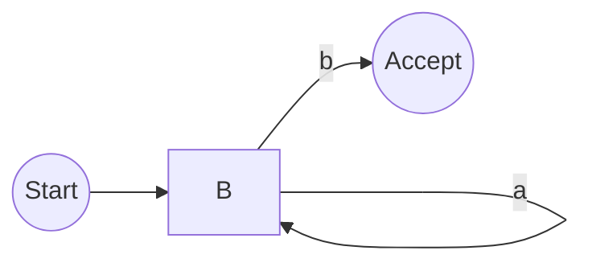
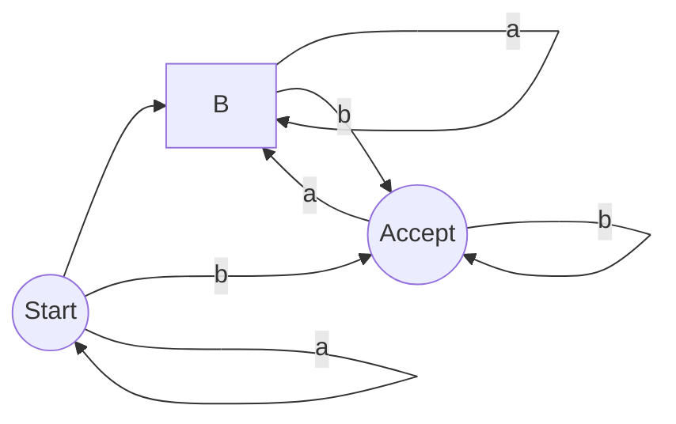

# 2.1 Regular Expressions and Finite Automata: A Comprehensive Tutorial

This tutorial provides a comprehensive guide to regular expressions and finite automata, two fundamental concepts in computer science, particularly in areas like compiler design, text processing, and network security. We'll explore their theoretical foundations, practical implementations, and advanced applications.

## 1. Introduction

### Brief Overview of Regular Expressions and Finite Automata

**Regular expressions (regex)** are patterns used to match sequences of characters in a string. They provide a concise and flexible means for identifying strings of text, such as particular characters, words, or patterns of characters.  **Finite automata (FA)**, also known as finite state machines (FSM), are abstract machines that have a finite number of states and transitions between those states based on input symbols.  They can be used to recognize patterns described by regular expressions. In essence, finite automata are the *implementations* of regular expressions.

### Why It's Important

Understanding regular expressions and finite automata is crucial for several reasons:

*   **Text Processing:**  Essential for tasks like searching, replacing, and validating text in various applications.
*   **Compiler Design:** Used in lexical analysis to identify tokens in programming languages.
*   **Network Security:**  Employed in intrusion detection systems and network traffic analysis.
*   **Data Validation:**  Used to validate user input and ensure data integrity.
*   **Bioinformatics:**  Used to analyze DNA sequences and identify patterns.

### Prerequisites (if any)

While not strictly required, a basic understanding of:

*   Set theory concepts (union, intersection, complement)
*   Basic programming concepts (variables, loops, conditional statements)
*   Basic data structures (strings)

would be helpful.

### Learning Objectives

By the end of this tutorial, you will be able to:

*   Understand the fundamental concepts of regular expressions and finite automata.
*   Write regular expressions to match specific patterns.
*   Construct finite automata that recognize languages defined by regular expressions.
*   Convert between regular expressions and finite automata.
*   Apply regular expressions and finite automata in practical applications.
*   Understand the limitations of regular expressions and finite automata.

## 2. Core Concepts

### Key Theoretical Foundations

The theoretical foundation of regular expressions and finite automata lies in **formal language theory**.  A language is a set of strings formed from a finite alphabet.  Regular expressions and finite automata are tools for defining and recognizing **regular languages**.  Key concepts include:

*   **Alphabet (Σ):**  A finite set of symbols (e.g., {0, 1}, {a, b, c}).
*   **String:** A finite sequence of symbols from an alphabet (e.g., "0110", "abc").
*   **Language:**  A set of strings over an alphabet (e.g., the set of all strings containing "00").
*   **Regular Language:** A language that can be defined by a regular expression or recognized by a finite automaton.

### Important Terminology

*   **Regular Expression (Regex):**  A pattern used to match strings.
*   **Finite Automaton (FA):** An abstract machine that recognizes a language.
*   **Deterministic Finite Automaton (DFA):**  A finite automaton where each state has exactly one transition for each input symbol.
*   **Non-deterministic Finite Automaton (NFA):**  A finite automaton where a state can have multiple transitions for a single input symbol, or no transition at all (epsilon transition).
*   **State:**  A condition of the automaton at a particular point in time.
*   **Transition:** A move from one state to another based on an input symbol.
*   **Start State:**  The initial state of the automaton.
*   **Accept State (Final State):**  A state that indicates the input string is accepted by the automaton.
*   **Epsilon Transition (ε-transition):** A transition between states without consuming any input symbol.
*   **Language Recognized by an Automaton:**  The set of all strings that the automaton accepts.

### Fundamental Principles

*   **Equivalence:** Regular expressions and finite automata are equivalent in terms of expressive power.  Any language that can be described by a regular expression can also be recognized by a finite automaton, and vice versa.
*   **Kleene's Theorem:** Formally proves the equivalence of regular expressions and finite automata.
*   **Construction Algorithms:** Algorithms exist for converting regular expressions to NFAs (Thompson's Construction), NFAs to DFAs (Subset Construction), and DFAs to regular expressions (using state elimination).

### Visual Explanations where applicable

**Example Regular Expression:**  `a*b` (zero or more 'a's followed by a 'b')

**Corresponding NFA (Non-deterministic Finite Automaton):**



*   **A:** Start State
*   **B:** Intermediate state (can loop back to itself with 'a')
*   **C:** Accept State (reached after seeing a 'b')
*   `a` labels a transition from B to B.
*   `b` labels a transition from B to C.

**Corresponding DFA (Deterministic Finite Automaton):**



*   **A:** Start state (has transitions for both 'a' and 'b')
*   **B:** State representing seeing at least one 'a' before a 'b'
*   **C:** Accept state representing strings ending in 'b'

## 3. Practical Implementation

### Step-by-step examples

Let's start with a simple example: verifying email addresses.

1.  **Regular Expression:** `^[a-zA-Z0-9._%+-]+@[a-zA-Z0-9.-]+\.[a-zA-Z]{2,}$`

    *   `^`: Matches the beginning of the string.
    *   `[a-zA-Z0-9._%+-]+`: Matches one or more alphanumeric characters, dots, underscores, percent signs, plus signs, or hyphens.
    *   `@`: Matches the "@" symbol.
    *   `[a-zA-Z0-9.-]+`: Matches one or more alphanumeric characters, dots, or hyphens.
    *   `\.`: Matches a literal dot ".".  The backslash escapes the special meaning of the dot in regex.
    *   `[a-zA-Z]{2,}`: Matches two or more alphabetic characters (the top-level domain).
    *   `$`: Matches the end of the string.

2.  **Implementation in Python:**

    ```python
    import re

    def is_valid_email(email):
        pattern = r"^[a-zA-Z0-9._%+-]+@[a-zA-Z0-9.-]+\.[a-zA-Z]{2,}$"
        return re.match(pattern, email) is not None

    email1 = "test@example.com"
    email2 = "invalid-email"

    print(f"{email1}: {is_valid_email(email1)}")  # Output: test@example.com: True
    print(f"{email2}: {is_valid_email(email2)}")  # Output: invalid-email: False
    ```

    *   We use the `re` module in Python to work with regular expressions.
    *   `re.match()` attempts to match the pattern at the beginning of the string.
    *   The `r` prefix before the string indicates a raw string, which prevents backslashes from being interpreted as escape sequences by Python.

3.  **Implementation in Javascript:**

    ```javascript
    function isValidEmail(email) {
      const pattern = /^[a-zA-Z0-9._%+-]+@[a-zA-Z0-9.-]+\.[a-zA-Z]{2,}$/;
      return pattern.test(email);
    }

    const email1 = "test@example.com";
    const email2 = "invalid-email";

    console.log(`${email1}: ${isValidEmail(email1)}`); // Output: test@example.com: true
    console.log(`${email2}: ${isValidEmail(email2)}`); // Output: invalid-email: false
    ```

    *   Javascript uses the `test()` method of the `RegExp` object to check for a match.
    *   Regular expression literals are enclosed in forward slashes `/`.

### Code snippets with explanations

**Example: Extracting phone numbers from a string**

```python
import re

text = "Please contact me at 555-123-4567 or (555) 987-6543."
pattern = r"\(?\d{3}\)?[-.\s]?\d{3}[-.\s]?\d{4}" # Allows for optional parentheses, hyphens, dots, or spaces as separators.
matches = re.findall(pattern, text)

print(matches)  # Output: ['555-123-4567', '(555) 987-6543']
```

*   `\(?\d{3}\)?`:  Matches an optional opening parenthesis, followed by three digits, followed by an optional closing parenthesis. The backslashes escape the special meaning of parentheses in regex.
*   `[-.\s]?`: Matches an optional hyphen, dot, or whitespace character. `\s` represents any whitespace character.
*   `\d{3}`: Matches exactly three digits.
*   `\d{4}`: Matches exactly four digits.

### Common use cases

*   **Data Validation:** Validating user input (e.g., email addresses, phone numbers, dates).
*   **Search and Replace:** Finding and replacing text in documents or code.
*   **Text Extraction:** Extracting specific information from unstructured text (e.g., dates, prices, names).
*   **Log Analysis:** Analyzing log files to identify errors or patterns.
*   **Web Scraping:** Extracting data from web pages.
*   **Tokenization:** Breaking text into smaller units for further processing (e.g., in natural language processing).

### Best practices

*   **Keep it Simple:**  Complex regular expressions can be difficult to read and maintain.  Break them down into smaller, more manageable parts if possible.
*   **Use Anchors:** Use `^` (beginning of string) and `$` (end of string) to ensure that the entire string matches the pattern.  Without anchors, the regex can match anywhere *within* the string.
*   **Escape Special Characters:**  Characters like `.` `*` `+` `?` `(` `)` `[` `]` `\` `^` `$` `{` `}` `|` have special meanings in regular expressions and must be escaped with a backslash if you want to match them literally.
*   **Test Thoroughly:**  Test your regular expressions with a variety of inputs to ensure they work as expected.  Use online regex testers like [regex101.com](https://regex101.com/) or [regexr.com](https://regexr.com/) for testing and debugging.
*   **Comment Your Regex:**  Add comments to explain what each part of the regular expression does. This is especially important for complex expressions.
*   **Choose the Right Tool:**  Different programming languages and tools have different regular expression engines with slightly different syntax and features.  Choose the appropriate tool for your task.
*   **Be Aware of Performance:**  Complex regular expressions can be slow.  Optimize your expressions for performance if necessary.  Avoid unnecessary backtracking.
*   **Prefer Specificity:** Be as specific as possible with your patterns to avoid false positives.  For instance, `\d+` matches any sequence of one or more digits, whereas `\d{3}-\d{2}-\d{4}` is much more specific to date format.

## 4. Advanced Topics

### Advanced Techniques

*   **Lookarounds (Zero-Width Assertions):**  Match a position in the string without consuming any characters.
    *   **Positive Lookahead:** `(?=...)` Matches if the subpattern matches at the current position.
    *   **Negative Lookahead:** `(?!...)` Matches if the subpattern does *not* match at the current position.
    *   **Positive Lookbehind:** `(?<=...)` Matches if the subpattern matches before the current position.
    *   **Negative Lookbehind:** `(?<!...)` Matches if the subpattern does *not* match before the current position.
*   **Backreferences:**  Refer to a previously captured group.  Useful for finding repeated patterns. Example: `(.)\1+` matches any character followed by one or more occurrences of the same character (e.g., "aa", "bbb").
*   **Conditional Matching:**  Match different patterns based on whether a previous group matched.
*   **Atomic Grouping:** `(?>...)` Prevents backtracking within the group, improving performance.

### Real-world applications

*   **Network Intrusion Detection:** Analyzing network traffic for malicious patterns (e.g., SQL injection attacks, cross-site scripting attacks).
*   **Data Loss Prevention (DLP):**  Preventing sensitive data (e.g., credit card numbers, social security numbers) from leaving the organization.
*   **Bioinformatics:** Analyzing DNA sequences, identifying genes, and predicting protein structures.
*   **Natural Language Processing (NLP):** Tokenizing text, identifying parts of speech, and extracting entities.

### Common challenges and solutions

*   **Backtracking:**  A common performance bottleneck in regular expressions.  It occurs when the regex engine tries different possible matches for a part of the pattern.  Can be mitigated by:
    *   Using more specific patterns.
    *   Avoiding unnecessary quantifiers (e.g., `.*`).
    *   Using atomic grouping.
*   **Greedy vs. Lazy Matching:**  Quantifiers like `*` and `+` are greedy by default, meaning they try to match as much as possible.  You can make them lazy by adding a `?` after them (e.g., `*?` `+?`).
*   **Unicode Support:**  Regular expression engines may have different levels of Unicode support.  Make sure your engine supports the Unicode characters you need to match.
*   **Catastrophic Backtracking:**  Occurs when the regex engine gets stuck in an exponential number of possible matches. Can occur with nested quantifiers. Mitigate using atomic grouping or rewriting the regex to be more efficient.

### Performance considerations

*   **Avoid Complex Lookarounds:**  Lookarounds can be expensive in terms of performance, especially negative lookarounds.
*   **Minimize Backtracking:** As described above, backtracking is a performance killer.
*   **Compile Regular Expressions:**  Compiling a regular expression can improve performance if you use it multiple times.  In Python:

    ```python
    import re

    pattern = re.compile(r"some_regex") # Compile the regex
    for line in lines:
        if pattern.match(line):
            # Process the line
            pass
    ```

## 5. Advanced Topics

### Cutting-edge techniques and approaches

*   **Regular Expression Engines and JIT compilation:** Modern regex engines (e.g., PCRE, RE2) often use Just-In-Time (JIT) compilation to convert regular expressions into machine code, resulting in significant performance improvements.
*   **Vectorized Regular Expressions:** Libraries like `stringr` in R provide vectorized functions for applying regular expressions to multiple strings simultaneously, leveraging parallel processing for improved performance.
*   **Regular Expression Synthesis:**  Automated generation of regular expressions from examples using machine learning techniques.  This is an active area of research that aims to simplify the process of creating complex regular expressions.
*   **Fuzzy Regular Expressions:**  Regular expressions that allow for approximate matching, such as those used in spell checking and search engines.  These techniques typically involve edit distance algorithms and approximate string matching.
*   **Context-Free Grammars and Parsing:** While regular expressions can describe regular languages, more complex languages require context-free grammars (CFGs) and parsing techniques. Tools like ANTLR are used to generate parsers from CFGs.

### Complex real-world applications

*   **Security Information and Event Management (SIEM):** Analyzing security logs from various sources (e.g., firewalls, intrusion detection systems, servers) to detect security incidents.  This often involves complex regular expressions to identify specific attack patterns.
*   **Fraud Detection:** Identifying fraudulent transactions by analyzing patterns in transaction data.  This can involve complex regular expressions to detect suspicious activities.
*   **Medical Record Analysis:** Extracting information from unstructured medical records, such as patient diagnoses, medications, and procedures.  This requires complex regular expressions and NLP techniques to handle the variability in medical language.
*   **Financial Data Analysis:** Analyzing financial data to identify trends, patterns, and anomalies. This can involve regular expressions to extract specific information from financial reports and news articles.

### System design considerations

*   **Scalability:**  When dealing with large volumes of data, consider using techniques like parallel processing and caching to improve performance.  Choose regex engines optimized for performance (e.g., RE2 for large datasets).
*   **Maintainability:** Keep regular expressions simple and well-documented. Use modular design to break down complex tasks into smaller, more manageable parts.
*   **Error Handling:**  Handle errors gracefully when regular expressions fail to match or encounter unexpected input. Provide informative error messages to the user.

### Scalability and performance optimization

*   **Reduce Backtracking:** As mentioned before, backtracking can significantly impact performance. Avoid unnecessary quantifiers and use atomic grouping.
*   **Anchor Patterns:** Using `^` and `$` anchors can reduce the number of possible matches and improve performance.
*   **Pre-compile Regular Expressions:** Pre-compiling regular expressions can improve performance if they are used multiple times.
*   **Limit the Scope:** Limit the scope of the regular expression to the specific data you need to match.
*   **Use Specialized Libraries:** Use specialized libraries for specific tasks, such as string processing or data validation.

### Security considerations

*   **Regular Expression Denial of Service (ReDoS):**  Malicious actors can craft regular expressions that cause a regex engine to enter a state of catastrophic backtracking, consuming excessive CPU resources and potentially crashing the system.
    *   **Mitigation:**  Use regex engines that have built-in ReDoS protection mechanisms (e.g., RE2).  Carefully review regular expressions for potential backtracking vulnerabilities.  Set time limits on regex execution.
*   **Input Validation:**  Validate all user input to prevent malicious code from being injected into regular expressions.
*   **Principle of Least Privilege:**  Grant users only the permissions they need to perform their tasks.

### Integration with other technologies

*   **Databases:**  Regular expressions are often used in databases for data validation, search, and replacement.  SQL databases typically provide built-in functions for working with regular expressions.
*   **Scripting Languages:**  Regular expressions are widely used in scripting languages like Python, Perl, and Ruby for text processing and data manipulation.
*   **Cloud Computing:**  Regular expressions can be used in cloud computing environments for log analysis, security monitoring, and data processing.
*   **Big Data Technologies:**  Regular expressions are used in big data technologies like Hadoop and Spark for data cleaning, transformation, and analysis.

### Advanced patterns and architectures

*   **State Machine Replication:**  Replicating finite automata across multiple servers to improve performance and scalability.
*   **Distributed Regular Expression Matching:**  Distributing the task of regular expression matching across multiple nodes in a cluster.
*   **Hardware Acceleration:** Using specialized hardware (e.g., FPGAs) to accelerate regular expression matching.
*   **Content-Aware Routing:**  Using regular expressions to route network traffic based on the content of the packets.

### Industry-specific applications

*   **Finance:** Fraud detection, algorithmic trading, risk management.
*   **Healthcare:** Medical record analysis, drug discovery, clinical trial management.
*   **Retail:** Customer relationship management, marketing automation, supply chain optimization.
*   **Manufacturing:** Process control, quality assurance, predictive maintenance.

## 6. Hands-on Exercises

These exercises progress in difficulty, building upon the concepts learned in previous sections.

### Progressive difficulty levels

**Level 1: Basic Matching**

1.  **Problem:** Write a regular expression to match a valid US zip code (5 digits).
    *   **Hint:** Use `\d{5}`.
    *   **Solution (Python):**

        ```python
        import re
        def is_valid_zip(zip_code):
            pattern = r"^\d{5}$"
            return re.match(pattern, zip_code) is not None

        print(is_valid_zip("12345"))  # True
        print(is_valid_zip("1234"))   # False
        print(is_valid_zip("12345-6789")) # False
        ```

2.  **Problem:** Write a regular expression to match a string that starts with "abc".
    *   **Hint:** Use `^abc`.
    *   **Solution (Python):**

        ```python
        import re
        def starts_with_abc(text):
            pattern = r"^abc"
            return re.match(pattern, text) is not None

        print(starts_with_abc("abcdefg")) # True
        print(starts_with_abc("defabc"))  # False
        ```

**Level 2: Grouping and Character Classes**

1.  **Problem:** Write a regular expression to match a date in the format MM/DD/YYYY.
    *   **Hint:** Use character classes (`\d`) and grouping.  Consider date range limits (e.g. month cannot be 13).  A simplified solution is acceptable to focus on the regex part.
    *   **Solution (Python - simplified):**

        ```python
        import re

        def is_valid_date(date_str):
            pattern = r"^(0[1-9]|1[0-2])/(0[1-9]|[12][0-9]|3[01])/\d{4}$"
            return re.match(pattern, date_str) is not None

        print(is_valid_date("01/01/2023"))  # True
        print(is_valid_date("12/31/2023"))  # True
        print(is_valid_date("13/01/2023"))  # False
        print(is_valid_date("01/32/2023"))  # False
        ```

        *   `(0[1-9]|1[0-2])`:  Matches months 01-09 or 10-12.
        *   `(0[1-9]|[12][0-9]|3[01])`: Matches days 01-09, 10-29, or 30-31.
        *   `\d{4}`: Matches four digits (year).
2.  **Problem:** Write a regular expression to match a string that contains the word "hello" or "world".
    *   **Hint:** Use the `|` (OR) operator.
    *   **Solution (Python):**

        ```python
        import re

        def contains_hello_or_world(text):
            pattern = r"hello|world"
            return re.search(pattern, text) is not None  # Use search to find anywhere in the string

        print(contains_hello_or_world("hello there"))  # True
        print(contains_hello_or_world("world peace"))  # True
        print(contains_hello_or_world("goodbye"))     # False
        ```

**Level 3: Advanced Matching and Lookarounds**

1.  **Problem:** Write a regular expression to extract all email addresses from a string.
    *   **Hint:** Use the email regex from earlier examples and `re.findall`.
    *   **Solution (Python):**

        ```python
        import re

        def extract_emails(text):
            pattern = r"[a-zA-Z0-9._%+-]+@[a-zA-Z0-9.-]+\.[a-zA-Z]{2,}"
            return re.findall(pattern, text)

        text = "Contact us at support@example.com or sales@example.org."
        emails = extract_emails(text)
        print(emails)  # Output: ['support@example.com', 'sales@example.org']
        ```

2.  **Problem:** Write a regular expression to find all words that are followed by the word "is".
    *   **Hint:** Use a positive lookahead assertion.
    *   **Solution (Python):**

        ```python
        import re

        def find_words_followed_by_is(text):
            pattern = r"\w+(?=\sis)" # \w+ matches one or more word characters. (?=\sis) is a positive lookahead asserting that the matched word is followed by " is".
            return re.findall(pattern, text)

        text = "The sky is blue. What is this?"
        words = find_words_followed_by_is(text)
        print(words)  # Output: ['sky', 'What']
        ```

### Real-world scenario-based problems

Imagine you are processing log files for a web server.

1.  **Problem:**  Write a regular expression to extract all IP addresses from the log file.  Assume the IP addresses are in the standard IPv4 format (e.g., 192.168.1.1).
    *   **Hint:**  Use the pattern `\d{1,3}\.\d{1,3}\.\d{1,3}\.\d{1,3}`. You may want to improve the validation to ensure that each octet is between 0 and 255, but focus on basic extraction first.
2.  **Problem:** Write a regular expression to identify all lines in the log file that indicate a 404 error (page not found).  Assume the log file contains lines like: `[2023-10-27 10:00:00] ERROR: Page not found - /missing-page`.

### Step-by-step guided exercises

1.  **Goal:** Create a Python program that reads a text file and counts the number of occurrences of a specific word.
    *   **Steps:**
        1.  Open the text file.
        2.  Read the contents of the file into a string.
        3.  Define a regular expression pattern to match the word you want to count (e.g., `\bword\b` to match the whole word "word").
        4.  Use `re.findall()` to find all occurrences of the word in the string.
        5.  Print the number of occurrences.
    *   **Example (Python):**

        ```python
        import re

        def count_word_occurrences(filename, word):
            try:
                with open(filename, 'r') as file:
                    text = file.read()
            except FileNotFoundError:
                return "File not found."

            pattern = r"\b" + re.escape(word) + r"\b" # escape the search word so special characters are treated literally.
            matches = re.findall(pattern, text, re.IGNORECASE) # Ignore case sensitivity
            return len(matches)

        filename = "my_text_file.txt"  # Replace with your file name. Create this file.
        word_to_count = "example"
        count = count_word_occurrences(filename, word_to_count)
        print(f"The word '{word_to_count}' appears {count} times in {filename}")
        ```

### Challenge exercises with hints

1.  **Challenge:** Write a regular expression to validate a password that meets the following criteria:
    *   At least 8 characters long.
    *   Contains at least one uppercase letter.
    *   Contains at least one lowercase letter.
    *   Contains at least one digit.
    *   Contains at least one special character (e.g., !@#$%^&*).
    *   **Hint:** Use lookahead assertions to check for each requirement independently.
2.  **Challenge:** Implement a simple search engine that uses regular expressions to find documents that match a given query.

### Project ideas for practice

1.  **Log Analyzer:**  Create a tool that analyzes log files and extracts relevant information, such as error messages, IP addresses, and timestamps.
2.  **Data Validator:**  Develop a data validation library that uses regular expressions to validate user input.
3.  **Web Scraper:**  Build a web scraper that extracts data from web pages using regular expressions.

### Sample solutions and explanations

Solutions for the challenge exercises will vary depending on the implementation. However, here's a solution for the password validation challenge:

```python
import re

def is_valid_password(password):
    pattern = r"^(?=.*[a-z])(?=.*[A-Z])(?=.*\d)(?=.*[!@#$%^&*])[a-zA-Z\d!@#$%^&*]{8,}$"
    return re.match(pattern, password) is not None

print(is_valid_password("P@sswOrd123")) # True
print(is_valid_password("Password"))     # False (missing digit and special character)
print(is_valid_password("password123"))  # False (missing uppercase and special character)
print(is_valid_password("P@ssword"))     # False (missing digit)
print(is_valid_password("Pass123"))      # False (missing special character)
```

*   `^`: Matches the beginning of the string.
*   `(?=.*[a-z])`: Positive lookahead assertion that requires at least one lowercase letter.
*   `(?=.*[A-Z])`: Positive lookahead assertion that requires at least one uppercase letter.
*   `(?=.*\d)`: Positive lookahead assertion that requires at least one digit.
*   `(?=.*[!@#$%^&*])`: Positive lookahead assertion that requires at least one special character.
*   `[a-zA-Z\d!@#$%^&*]{8,}`: Matches eight or more alphanumeric characters or special characters.
*   `$`: Matches the end of the string.

### Common mistakes to watch for

*   **Forgetting to escape special characters.**
*   **Using greedy quantifiers when you need lazy quantifiers.**
*   **Not anchoring the pattern when you want to match the entire string.**
*   **Over-complicating the regular expression.**
*   **Not testing the regular expression thoroughly.**
*   **Assuming the regex engine supports all features (e.g., lookarounds may not be supported in all engines).**

## 7. Best Practices and Guidelines

### Industry-standard conventions

*   **Follow the syntax of the regex engine you are using:**  Different engines may have slightly different syntax.
*   **Use clear and concise regular expressions:**  Avoid unnecessary complexity.
*   **Comment your regular expressions:**  Explain what each part of the expression does.

### Code quality and maintainability

*   **Use meaningful variable names:**  Give your regular expression variables descriptive names.
*   **Break down complex regular expressions into smaller, more manageable parts:** Use functions or classes to encapsulate regular expressions.
*   **Write unit tests to verify that your regular expressions work correctly:**  Use a testing framework like pytest (Python) or Jest (JavaScript).

### Performance optimization guidelines

*   **Avoid backtracking:**  Use more specific patterns and avoid unnecessary quantifiers.
*   **Pre-compile regular expressions:** Compile regular expressions that are used multiple times.
*   **Use appropriate regex engine:** Choose regex engines designed for performance (e.g., RE2 for large datasets).

### Security best practices

*   **Validate all user input:** Prevent malicious code from being injected into regular expressions.
*   **Be aware of ReDoS vulnerabilities:** Avoid complex regular expressions that can cause catastrophic backtracking.
*   **Set time limits on regex execution:** Prevent regular expressions from running for too long.

### Scalability considerations

*   **Use parallel processing:** Distribute the task of regular expression matching across multiple threads or processes.
*   **Use caching:** Cache the results of regular expression matching to avoid recomputing them.
*   **Use distributed regular expression matching:** Distribute the task of regular expression matching across multiple nodes in a cluster.

### Testing and documentation

*   **Write unit tests to verify that your regular expressions work correctly.**
*   **Document your regular expressions clearly.**
*   **Provide examples of how to use your regular expressions.**

### Team collaboration aspects

*   **Use a version control system (e.g., Git) to track changes to your regular expressions.**
*   **Collaborate with other developers to review your regular expressions.**
*   **Use a consistent coding style.**

## 8. Troubleshooting and Common Issues

### Common problems and solutions

*   **Regular expression doesn't match:**
    *   **Solution:**  Double-check the regular expression for errors.  Use a regex tester to test the expression with different inputs.  Make sure you are using the correct flags (e.g., `re.IGNORECASE`).
*   **Regular expression matches too much:**
    *   **Solution:**  Use more specific patterns.  Use lazy quantifiers instead of greedy quantifiers.
*   **Regular expression is slow:**
    *   **Solution:**  Avoid backtracking.  Pre-compile the regular expression.  Use a more efficient regex engine.
*   **ReDoS vulnerability:**
    *   **Solution:**  Simplify the regular expression.  Use atomic grouping.  Set a time limit on regex execution.

### Debugging strategies

*   **Use a regex tester:**  Test your regular expressions with different inputs and see how they match.
*   **Print the matches:**  Print the matches found by the regular expression to see if they are what you expect.
*   **Step through the code:**  Use a debugger to step through the code and see how the regular expression is being evaluated.
*   **Break down the regular expression:** Divide the regular expression into smaller parts and test each part separately.

### Performance bottlenecks

*   **Backtracking:**  A common performance bottleneck.  Avoid unnecessary quantifiers and use atomic grouping.
*   **Complex lookarounds:**  Lookarounds can be expensive in terms of performance.
*   **Large input strings:**  Regular expression matching can be slow on large input strings.

### Error messages and their meaning

*   `re.error: bad escape`:  Indicates an invalid escape sequence in the regular expression.
*   `re.error: unbalanced parenthesis`:  Indicates that a parenthesis is not closed.
*   `re.error: nothing to repeat`: Indicates that you are trying to repeat something that cannot be repeated (e.g., `*` without a preceding character).

### Edge cases to consider

*   **Empty strings:**  How does the regular expression behave when the input string is empty?
*   **Null values:** How does the regex engine handle null values?
*   **Unicode characters:**  Does the regex engine support Unicode characters correctly?
*   **Very long strings:**  Does the regex engine handle very long strings efficiently?

### Tools and techniques for diagnosis

*   **Regex testers:**  [regex101.com](https://regex101.com/), [regexr.com](https://regexr.com/)
*   **Debuggers:**  Python debugger (pdb), JavaScript debugger (in browser developer tools)
*   **Profiling tools:**  Tools for measuring the performance of regular expression matching.

## 9. Conclusion and Next Steps

### Comprehensive summary of key concepts

This tutorial covered the fundamental concepts of regular expressions and finite automata, including:

*   Regular expression syntax and semantics.
*   Finite automata as implementations of regular expressions.
*   Construction algorithms for converting between regular expressions and finite automata.
*   Practical applications of regular expressions in text processing, data validation, and security.
*   Advanced techniques such as lookarounds and backreferences.
*   Performance considerations and security best practices.

### Practical application guidelines

*   Use regular expressions to solve real-world problems in text processing, data validation,