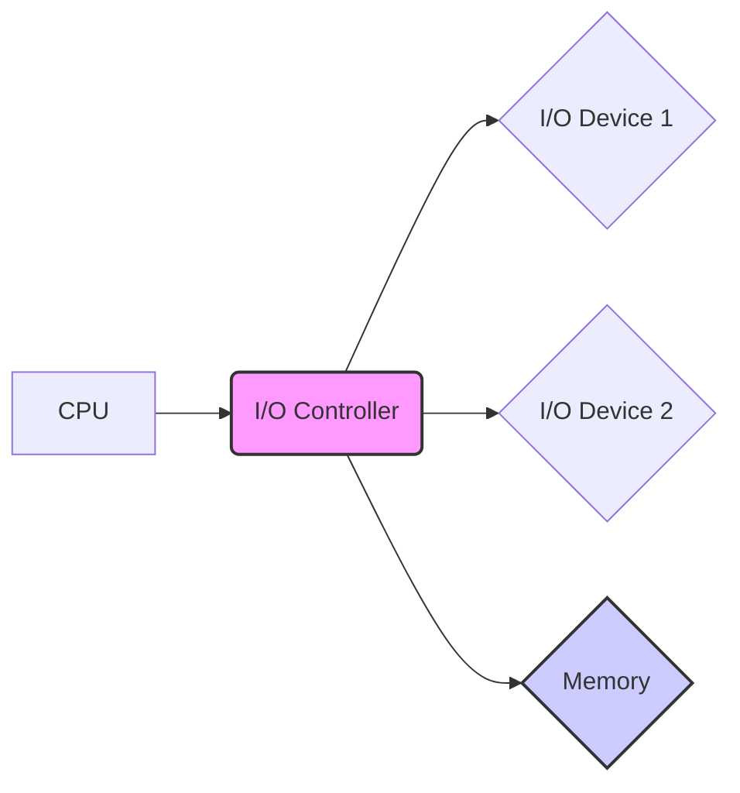

# 5.0 Input/Output (I/O) Systems: A Comprehensive Tutorial

## 1. Introduction

This tutorial delves into the world of **5.0 Input/Output (I/O) Systems**.  While the specific "5.0" designation might refer to a particular version or standard within a larger I/O context (e.g., PCIe 5.0, USB 5.0), we'll focus on the fundamental principles of I/O systems and then explore how these principles are implemented and optimized, considering advancements reflected in technologies often associated with "5.0" (e.g., increased bandwidth, lower latency). We'll cover both theoretical foundations and practical implementation, with a strong emphasis on hands-on learning.

**Why it's Important:** Understanding I/O systems is crucial for anyone working with computers, embedded systems, or data centers. I/O performance directly impacts overall system responsiveness, data transfer speeds, and application performance. As data volumes continue to grow, efficient I/O strategies become increasingly vital.

**Prerequisites:**

*   Basic understanding of computer architecture (CPU, memory, storage).
*   Familiarity with operating systems concepts (processes, threads).
*   Basic programming knowledge (any language will do, but examples will be primarily in C and Python).

**Learning Objectives:**

*   Understand the fundamental principles of I/O systems.
*   Learn about different I/O devices and their characteristics.
*   Explore various I/O techniques and protocols.
*   Implement basic I/O operations in code.
*   Identify common I/O bottlenecks and optimization strategies.
*   Grasp advanced I/O concepts such as DMA, interrupts, and caching.
*   Understand the role of I/O in system performance and scalability.

## 2. Core Concepts

### 2.1. Key Theoretical Foundations

The core function of any I/O system is to facilitate communication between the CPU and external devices.  This involves:

*   **Data Transfer:** Moving data between the CPU's memory and I/O devices.
*   **Device Control:** Managing and controlling the operation of I/O devices.
*   **Interrupt Handling:** Responding to interrupts generated by I/O devices.

### 2.2. Important Terminology

*   **I/O Device:** Any peripheral device connected to the computer system (e.g., hard drive, network card, keyboard, monitor).
*   **I/O Interface:** The hardware and software that connect the I/O device to the system bus.
*   **I/O Controller:** A dedicated processor that manages the communication between the CPU and one or more I/O devices.
*   **Port:** A physical connection point for I/O devices.
*   **Address Space:** The range of memory addresses that the CPU can access. I/O devices can be memory-mapped, occupying a portion of the address space.
*   **Interrupt:** A signal from an I/O device to the CPU indicating that it requires attention.
*   **DMA (Direct Memory Access):**  A mechanism that allows I/O devices to directly access system memory without CPU intervention, improving performance.
*   **Latency:** The delay between initiating an I/O operation and receiving the first byte of data.
*   **Throughput:** The rate at which data can be transferred between the CPU and an I/O device (e.g., MB/s, GB/s).
*   **Bus:** A set of electrical conductors used for data transfer between components of a computer system.  Examples include PCI, PCIe, USB.
*   **Polling:** A method of checking the status of an I/O device by repeatedly querying its status register.

### 2.3. Fundamental Principles

*   **Abstraction:** I/O systems abstract away the complexities of interacting with specific devices, providing a uniform interface for applications.  This is often done through device drivers.
*   **Synchronization:** Mechanisms are needed to synchronize the CPU's operations with the slower operations of I/O devices. This often involves interrupts or polling.
*   **Resource Management:** The operating system manages access to I/O devices, preventing conflicts between different processes.
*   **Error Handling:** I/O systems must detect and handle errors that may occur during data transfer.

### 2.4. Visual Explanation (Diagram)



This diagram illustrates the basic components of an I/O system. The CPU interacts with I/O devices through an I/O controller. The I/O controller handles communication and data transfer between the CPU, memory, and I/O devices.  DMA enables the I/O controller to access memory directly.

## 3. Practical Implementation

### 3.1. Step-by-Step Examples (Python)

This example demonstrates reading from a file (a common I/O operation) in Python.

```python
# Open a file for reading
try:
    with open("my_file.txt", "r") as file:
        # Read the entire file content
        content = file.read()
        print(content)

except FileNotFoundError:
    print("File not found!")
except IOError as e:
    print(f"An error occurred: {e}")
```

**Explanation:**

1.  `with open("my_file.txt", "r") as file:`: Opens the file "my\_file.txt" in read mode (`"r"`). The `with` statement ensures that the file is automatically closed, even if errors occur.
2.  `content = file.read()`: Reads the entire content of the file into the `content` variable.
3.  `print(content)`: Prints the content to the console.
4.  The `try...except` block handles potential errors such as `FileNotFoundError` and generic `IOError`.

### 3.2. Code Snippets with Explanations (C)

This example shows how to read input from the keyboard using `scanf` in C.

```c
#include <stdio.h>

int main() {
  int age;

  printf("Enter your age: ");
  scanf("%d", &age);

  printf("You are %d years old.\n", age);

  return 0;
}
```

**Explanation:**

1.  `#include <stdio.h>`: Includes the standard input/output library, which provides functions like `printf` and `scanf`.
2.  `printf("Enter your age: ");`: Prints a prompt to the console, asking the user to enter their age.
3.  `scanf("%d", &age);`: Reads an integer from the console and stores it in the `age` variable.  `%d` is a format specifier for integers, and `&age` is the address of the `age` variable.
4.  `printf("You are %d years old.\n", age);`: Prints the entered age back to the console.

### 3.3. Common Use Cases

*   **File I/O:** Reading from and writing to files on a hard drive or SSD.
*   **Network I/O:** Sending and receiving data over a network connection.
*   **Console I/O:** Reading input from the keyboard and displaying output on the screen.
*   **Database I/O:** Reading and writing data to a database server.
*   **Device I/O:** Interacting with hardware devices such as sensors, actuators, and cameras.

### 3.4. Best Practices

*   **Buffer I/O:** Using buffers to reduce the number of system calls and improve performance.
*   **Asynchronous I/O:** Performing I/O operations in the background to prevent blocking the main thread. This can significantly improve responsiveness, especially in network-intensive applications.
*   **Error Handling:** Implementing robust error handling to gracefully handle I/O failures.
*   **Resource Management:** Properly closing files and releasing resources to prevent memory leaks and other issues.
*   **Data Validation:** Validating input data to prevent security vulnerabilities and data corruption.

## 4. Advanced Topics

### 4.1. Advanced Techniques

*   **DMA (Direct Memory Access):**  As mentioned, DMA allows devices to transfer data directly to/from memory without CPU intervention. This frees the CPU to perform other tasks, significantly improving I/O performance.  Implementing DMA requires careful consideration of memory protection and cache coherency.
*   **Interrupts:** Interrupts allow I/O devices to signal the CPU when they require attention. This is more efficient than polling, as the CPU doesn't need to constantly check the status of devices.  Interrupt handling involves setting up interrupt handlers (ISRs) and configuring the interrupt controller.
*   **Memory-Mapped I/O:**  Assigning memory addresses to I/O device registers, allowing the CPU to access them using standard memory access instructions.  This simplifies device control and data transfer.
*   **Buffering and Caching:**  Using buffers and caches to store frequently accessed data in memory, reducing the need to access slower I/O devices.  Effective cache management is crucial for optimizing I/O performance.
*   **Asynchronous I/O (AIO):** Enables the application to continue processing while an I/O operation is in progress.  This improves responsiveness and concurrency.  Libraries like `libaio` in Linux provide AIO capabilities.

### 4.2. Real-World Applications

*   **High-Performance Computing (HPC):**  Efficient I/O is critical for HPC applications that process large datasets. Techniques like parallel I/O and RDMA (Remote Direct Memory Access) are used to maximize I/O throughput.
*   **Databases:** Databases rely heavily on I/O for storing and retrieving data. Optimizing I/O performance is essential for achieving fast query response times.
*   **Cloud Computing:** Cloud platforms use sophisticated I/O virtualization techniques to provide scalable and reliable I/O services to virtual machines.
*   **Operating Systems:** OS kernels are responsible for managing all I/O operations in the system.  The OS I/O scheduler plays a crucial role in optimizing I/O performance.
*   **Multimedia Applications:**  Video editing, streaming, and gaming applications require high I/O bandwidth and low latency to deliver a smooth user experience.

### 4.3. Common Challenges and Solutions

*   **I/O Bottlenecks:** Identifying and resolving I/O bottlenecks is a common challenge.  Tools like `iostat`, `iotop`, and profiling tools can help pinpoint the source of the bottleneck. Solutions include optimizing file system configurations, upgrading to faster storage devices, and implementing asynchronous I/O.
*   **Data Consistency:** Ensuring data consistency when multiple processes or threads are accessing the same I/O devices.  Locking mechanisms and atomic operations can be used to maintain data integrity.
*   **Device Driver Issues:**  Faulty or outdated device drivers can cause I/O errors and system instability. Keeping device drivers up to date is crucial for reliability.
*   **Security Vulnerabilities:**  I/O systems can be vulnerable to security exploits, such as buffer overflows and denial-of-service attacks.  Implementing proper security measures, such as input validation and access control, is essential.

### 4.4. Performance Considerations

*   **Disk Scheduling Algorithms:** Optimize the order in which disk access requests are serviced to minimize seek time and rotational latency. Common algorithms include FIFO, SSTF, SCAN, and C-SCAN.
*   **File System Optimization:** Choosing the right file system (e.g., ext4, XFS, ZFS) and configuring it appropriately can significantly impact I/O performance.
*   **RAID (Redundant Array of Independent Disks):** Using RAID to improve I/O performance and data redundancy. Different RAID levels (e.g., RAID 0, RAID 1, RAID 5, RAID 10) offer different trade-offs between performance, redundancy, and cost.
*   **Solid State Drives (SSDs):**  SSDs offer significantly faster access times and higher throughput compared to traditional hard drives. Using SSDs can dramatically improve I/O performance.

## 5.  Advanced I/O (Beyond the Basics, and Linking to "5.0" Implications)

This section builds upon the previous one and explicitly considers implications of advancements in I/O technologies often referenced when talking about "5.0" - typically PCIe 5.0, USB 5.0 or similar.  The core principles remain, but the *scale* and *implementation details* shift significantly.

### 5.1. Cutting-Edge Techniques and Approaches

*   **NVMe (Non-Volatile Memory Express):** A modern storage protocol designed specifically for SSDs, offering significantly lower latency and higher throughput than traditional SATA.  NVMe leverages the PCIe bus for direct access to storage devices.  `5.0` versions of PCIe and other I/O standards have pushed NVMe performance even higher.  Key benefits:
    *   **Lower Latency:** Reduces the overhead associated with traditional storage protocols.
    *   **Higher Throughput:** Utilizes the bandwidth of the PCIe bus for faster data transfer.
    *   **Parallelism:** Supports multiple queues and command processing for increased parallelism.
*   **RDMA (Remote Direct Memory Access):** Allows direct memory access between computers over a network, bypassing the CPU and operating system. RDMA is commonly used in high-performance computing and data centers to improve network I/O performance.  RoCE (RDMA over Converged Ethernet) is a popular implementation.  `5.0` level technologies increase the bandwidth for RDMA even further.
*   **Storage Class Memory (SCM):** A new type of memory that offers a combination of high performance and non-volatility. Examples include Intel Optane and Samsung Z-NAND.  SCM can be used as a caching layer or as a primary storage device for applications requiring extremely low latency. The increasing speeds related to newer I/O versions allow SCM to function at closer-to-memory speeds than ever before.
*   **Computational Storage:** Integrating processing capabilities directly into storage devices, allowing data to be processed closer to the source. This reduces data movement and improves overall performance.  For example, filtering data on the storage device before sending it to the CPU. This will become more prevalent to efficiently manage data flowing through high bandwidth "5.0" I/O channels.
*   **CXL (Compute Express Link):** An open standard interconnect for high-performance I/O, memory expansion, and accelerators. CXL enables coherent memory sharing between the CPU, GPUs, and other devices, improving performance and efficiency.  Key benefits include:
    *   **Cache Coherency:** Ensures that all devices have access to the latest version of data in memory.
    *   **Memory Expansion:** Allows the CPU to access additional memory resources from other devices.
    *   **Heterogeneous Computing:** Enables tight integration of CPUs, GPUs, and other accelerators. CXL is crucial for fully leveraging the bandwidths afforded by PCIe `5.0` and beyond.

### 5.2. Complex Real-World Applications

*   **AI/ML Training:**  Training deep learning models requires massive amounts of data to be transferred between storage, memory, and GPUs.  Fast I/O is critical for reducing training time.  Techniques like RDMA, NVMe, and GPU Direct Storage are used to optimize I/O performance. PCIe `5.0` and similar technologies allow for faster, more efficient transfer of training data, leading to quicker model development.
*   **Real-Time Analytics:**  Analyzing streaming data in real-time requires low-latency I/O to process incoming data as quickly as possible. SCM and computational storage can be used to accelerate data processing.
*   **High-Frequency Trading (HFT):**  HFT systems require extremely low-latency I/O to execute trades quickly.  NVMe, RDMA, and custom hardware solutions are used to minimize latency. Even a few nanoseconds improvement in I/O can lead to a significant competitive advantage.
*   **Autonomous Vehicles:**  Autonomous vehicles generate large amounts of sensor data that must be processed in real-time. Fast I/O is critical for enabling safe and reliable operation. PCIe `5.0` and similar technologies enable faster processing of this data.
*   **Large Scale Scientific Simulations:** Simulations often require moving large amounts of data between compute nodes and storage. RDMA and parallel file systems are used to improve I/O performance.

### 5.3. System Design Considerations

*   **Bus Selection:** Choosing the appropriate bus technology (e.g., PCIe, USB, Thunderbolt) based on the bandwidth and latency requirements of the application.  **PCIe 5.0** offers significantly higher bandwidth than previous generations, making it suitable for demanding applications.  Similarly, **USB4** offers dramatically improved speeds compared to USB 3.x.
*   **I/O Topology:** Designing the I/O topology to minimize latency and maximize throughput.  Consider factors such as the number of I/O devices, the distance between devices, and the routing of data.
*   **Controller Selection:** Choosing the appropriate I/O controller based on the performance and features required.
*   **Memory Hierarchy:**  Optimizing the memory hierarchy to minimize the need to access slow storage devices.  Using caching and prefetching techniques to improve performance.
*   **Power Consumption:**  Considering the power consumption of I/O devices and controllers.  Using power management techniques to reduce power consumption when devices are idle.

### 5.4. Scalability and Performance Optimization

*   **Parallel I/O:**  Distributing I/O operations across multiple devices to improve throughput.  Using techniques such as striping and mirroring to increase performance and redundancy.
*   **Asynchronous I/O:** Using asynchronous I/O to prevent blocking the main thread.
*   **Zero-Copy Techniques:**  Minimizing the number of times data is copied between memory and I/O devices.  Techniques such as DMA and scatter-gather I/O can be used to eliminate unnecessary data copies.
*   **I/O Scheduling:**  Optimizing the order in which I/O requests are serviced to minimize latency and maximize throughput.
*   **Profiling and Monitoring:**  Using profiling and monitoring tools to identify I/O bottlenecks and optimize performance.

### 5.5. Security Considerations

*   **Data Encryption:** Encrypting data at rest and in transit to protect it from unauthorized access.
*   **Access Control:**  Implementing access control mechanisms to restrict access to I/O devices and data.
*   **Input Validation:**  Validating input data to prevent security vulnerabilities such as buffer overflows and SQL injection.
*   **Firmware Security:**  Ensuring that the firmware of I/O devices is secure and up-to-date.
*   **Secure Boot:**  Using secure boot to prevent unauthorized code from running on I/O devices.

### 5.6. Integration with Other Technologies

*   **Cloud Computing:** I/O virtualization is used to provide scalable and reliable I/O services to virtual machines in the cloud.
*   **Containerization:**  Containers rely on efficient I/O for running applications in isolated environments.
*   **Edge Computing:**  Edge computing devices require fast and reliable I/O for processing data closer to the source.
*   **Internet of Things (IoT):** IoT devices generate large amounts of data that must be processed and transmitted efficiently.

### 5.7. Advanced Patterns and Architectures

*   **Event-Driven Architectures:**  Using event-driven architectures to handle asynchronous I/O operations.
*   **Microservices:** Breaking down applications into smaller, independent services that communicate with each other over a network.
*   **Data Streaming Platforms:**  Using data streaming platforms such as Apache Kafka and Apache Pulsar to handle high volumes of streaming data.

### 5.8. Industry-Specific Applications

*   **Financial Services:**  Low-latency I/O is critical for high-frequency trading and other financial applications.
*   **Healthcare:**  Fast I/O is needed for processing medical images and patient data.
*   **Manufacturing:**  Real-time data analysis and control require efficient I/O in manufacturing environments.
*   **Media and Entertainment:**  High-bandwidth I/O is essential for video editing, streaming, and gaming applications.

## 6. Hands-on Exercises

### 6.1. Easy: File Reading and Writing

**Scenario:** Write a Python script that reads a text file, converts all characters to uppercase, and writes the result to a new file.

**Steps:**

1.  Create a text file named `input.txt` with some sample text.
2.  Open `input.txt` for reading.
3.  Read the content of the file.
4.  Convert the content to uppercase using the `.upper()` method.
5.  Open a new file named `output.txt` for writing.
6.  Write the uppercase content to `output.txt`.
7.  Close both files.

**Challenge:** Add error handling to catch `FileNotFoundError` and `IOError`.

**Sample Solution:**

```python
try:
    with open("input.txt", "r") as infile, open("output.txt", "w") as outfile:
        content = infile.read()
        uppercase_content = content.upper()
        outfile.write(uppercase_content)
    print("File converted successfully!")
except FileNotFoundError:
    print("Input file not found!")
except IOError as e:
    print(f"An error occurred: {e}")
```

### 6.2. Medium: Asynchronous File I/O

**Scenario:**  Write a Python program that reads a large file asynchronously using the `asyncio` library.  Use a separate task to process each chunk of data read from the file.

**Steps:**

1.  Create a large text file (e.g., using `dd if=/dev/urandom of=large_file.txt bs=1M count=100`).
2.  Import the `asyncio` library.
3.  Define an asynchronous function `process_chunk(chunk)` that simulates processing the chunk (e.g., by sleeping for a short time).
4.  Define an asynchronous function `read_file_async(filename)` that opens the file, reads it in chunks, and spawns a `process_chunk` task for each chunk.
5.  Use `asyncio.run()` to execute the `read_file_async` function.

**Hint:** Use `asyncio.create_task()` to create the `process_chunk` tasks.

**Challenge:** Measure the time it takes to read and process the file both synchronously and asynchronously.

**Sample Solution:**

```python
import asyncio
import time

async def process_chunk(chunk):
    # Simulate processing the chunk
    await asyncio.sleep(0.1)
    #print(f"Processed chunk: {chunk[:20]}...")

async def read_file_async(filename):
    try:
        with open(filename, "r") as file:
            while True:
                chunk = file.read(4096)  # Read in 4KB chunks
                if not chunk:
                    break
                asyncio.create_task(process_chunk(chunk))
    except FileNotFoundError:
        print("File not found!")
    except IOError as e:
        print(f"An error occurred: {e}")

async def main():
    start_time = time.time()
    await read_file_async("large_file.txt")
    end_time = time.time()
    print(f"Async I/O Time: {end_time - start_time:.2f} seconds")

if __name__ == "__main__":
    asyncio.run(main())
```

### 6.3. Hard:  Socket-Based Communication

**Scenario:** Create a simple client-server application using sockets in Python. The server should listen for incoming connections, receive data from the client, and send a response back.

**Steps:**

1.  **Server:**
    *   Create a socket.
    *   Bind the socket to an address and port.
    *   Listen for incoming connections.
    *   Accept a connection from a client.
    *   Receive data from the client.
    *   Send a response back to the client.
    *   Close the connection.
2.  **Client:**
    *   Create a socket.
    *   Connect to the server's address and port.
    *   Send data to the server.
    *   Receive the response from the server.
    *   Close the connection.

**Hint:** Use the `socket` module in Python. Consider using threading or asynchronous programming to handle multiple client connections concurrently.

**Challenge:** Implement error handling and add support for multiple clients.  Implement a simple protocol for communication (e.g., message length prefix).

**Sample Server Solution:**

```python
import socket
import threading

def handle_client(client_socket, client_address):
    try:
        print(f"Accepted connection from {client_address}")
        while True:
            data = client_socket.recv(1024).decode()
            if not data:
                break
            print(f"Received from {client_address}: {data}")
            response = f"Server received: {data}".encode()
            client_socket.sendall(response)
    except Exception as e:
        print(f"Error handling client {client_address}: {e}")
    finally:
        print(f"Closing connection from {client_address}")
        client_socket.close()

def server_main():
    HOST = '127.0.0.1'  # Standard loopback interface address (localhost)
    PORT = 65432        # Port to listen on (non-privileged ports are > 1023)

    with socket.socket(socket.AF_INET, socket.SOCK_STREAM) as s:
        s.bind((HOST, PORT))
        s.listen()
        print(f"Server listening on {HOST}:{PORT}")
        while True:
            conn, addr = s.accept()
            threading.Thread(target=handle_client, args=(conn, addr)).start()

if __name__ == "__main__":
    server_main()
```

**Sample Client Solution:**

```python
import socket

def client_main():
    HOST = '127.0.0.1'  # The server's hostname or IP address
    PORT = 65432        # The port used by the server

    with socket.socket(socket.AF_INET, socket.SOCK_STREAM) as s:
        try:
            s.connect((HOST, PORT))
            message = "Hello, server!"
            s.sendall(message.encode())
            data = s.recv(1024).decode()
            print(f"Received: {data}")
        except Exception as e:
            print(f"Error during communication: {e}")

if __name__ == "__main__":
    client_main()
```

### 6.4. Project Ideas for Practice

*   **Log Analyzer:** Develop a tool that analyzes log files and identifies performance bottlenecks or errors.
*   **Web Server:** Create a simple web server that can serve static files and handle basic HTTP requests.
*   **File Transfer Application:** Build a file transfer application that can transfer files between two computers over a network.
*   **Database Interface:** Design a program that interfaces with a database to read and write data.
*   **Sensor Data Logger:** Create a system that collects data from sensors and logs it to a file or database.

### 6.5. Common Mistakes to Watch For

*   **Forgetting to close files:**  Always close files after you are finished using them to release resources.
*   **Ignoring errors:**  Handle I/O errors gracefully to prevent unexpected program termination.
*   **Using blocking I/O for long-running operations:**  Use asynchronous I/O to prevent blocking the main thread.
*   **Not validating input data:**  Validate input data to prevent security vulnerabilities.
*   **Not using buffering:** Using buffering to reduce the number of system calls.

## 7. Best Practices and Guidelines

### 7.1. Industry-Standard Conventions

*   **POSIX Standard:** Adhering to the POSIX standard for file I/O ensures portability across different operating systems.  This includes using standard system calls like `open()`, `read()`, `write()`, and `close()`.
*   **Device Tree (Embedded Systems):** Using device trees to describe the hardware configuration in embedded systems.  This allows the operating system to automatically configure I/O devices.
*   **ACPI (Advanced Configuration and Power Interface):** Using ACPI to manage power consumption of I/O devices.

### 7.2. Code Quality and Maintainability

*   **Descriptive Variable Names:**  Using descriptive variable names to improve code readability.
*   **Code Comments:**  Adding comments to explain complex logic and design decisions.
*   **Modularity:**  Breaking down code into smaller, reusable modules.
*   **Error Handling:**  Implementing robust error handling to prevent unexpected program termination.
*   **Unit Tests:**  Writing unit tests to verify the correctness of I/O operations.

### 7.3. Performance Optimization Guidelines

*   **Minimize System Calls:**  Reducing the number of system calls by using buffering and caching techniques.
*   **Use DMA:** Using DMA to bypass the CPU for large data transfers.
*   **Optimize Disk Scheduling:**  Choosing an appropriate disk scheduling algorithm.
*   **Use Asynchronous I/O:**  Using asynchronous I/O to prevent blocking the main thread.
*   **Profile Your Code:** Using profiling tools to identify I/O bottlenecks and optimize performance.

### 7.4. Security Best Practices

*   **Input Validation:**  Validating input data to prevent security vulnerabilities.
*   **Access Control:**  Implementing access control mechanisms to restrict access to I/O devices and data.
*   **Data Encryption:**  Encrypting data at rest and in transit.
*   **Secure Boot:**  Using secure boot to prevent unauthorized code from running on I/O devices.
*   **Regular Security Audits:** Conducting regular security audits to identify and address vulnerabilities.

### 7.5. Scalability Considerations

*   **Parallel I/O:** Distributing I/O operations across multiple devices.
*   **Load Balancing:** Load balancing I/O requests across multiple servers.
*   **Caching:** Using caching to reduce the load on storage devices.
*   **Asynchronous I/O:** Using asynchronous I/O to handle a large number of concurrent requests.

### 7.6. Testing and Documentation

*   **Unit Tests:** Writing unit tests to verify the correctness of I/O operations.
*   **Integration Tests:**  Testing the interaction between different components of the I/O system.
*   **Performance Tests:** Measuring the performance of the I/O system under different workloads.
*   **Documentation:** Writing clear and concise documentation to explain the design and usage of the I/O system.

### 7.7. Team Collaboration Aspects

*   **Code Reviews:** Conducting code reviews to ensure code quality and security.
*   **Version Control:** Using version control systems (e.g., Git) to manage code changes.
*   **Communication:**  Communicating effectively with team members to coordinate development efforts.
*   **Shared Documentation:** Maintaining shared documentation to ensure everyone is on the same page.
*   **Continuous Integration:**  Using continuous integration systems to automate the build and test process.

## 8. Troubleshooting and Common Issues

### 8.1. Common Problems and Solutions

| Problem                       | Solution                                                                                                                    |
| ----------------------------- | --------------------------------------------------------------------------------------------------------------------------- |
| File Not Found               | Verify the file path, ensure the file exists, and check permissions.                                                      |
| Permission Denied            | Check file permissions, run the program with elevated privileges (if necessary), or change the file ownership.                 |
| I/O Error (General)          | Inspect the error message for details, check disk space, ensure the disk is not corrupted, and try restarting the system.   |
| Slow I/O Performance          | Identify the bottleneck (disk, network, CPU), optimize file system settings, upgrade hardware, or implement asynchronous I/O. |
| Network Connection Issues    | Verify network connectivity, check firewall settings, ensure the server is running, and check DNS resolution.            |
| Device Driver Problems       | Update or reinstall device drivers, check for hardware conflicts, or replace the device.                                  |
| Disk Full                    | Free up disk space by deleting unnecessary files, moving files to another drive, or increasing the disk capacity.          |

### 8.2. Debugging Strategies

*   **Print Statements:**  Using print statements to trace the execution flow and inspect variable values.
*   **Debuggers:** Using debuggers (e.g., GDB, Python Debugger) to step through the code and examine the state of the program.
*   **Log Files:** Logging I/O operations and errors to a log file for later analysis.
*   **Profiling Tools:** Using profiling tools to identify I/O bottlenecks and optimize performance.

### 8.3. Performance Bottlenecks

*   **Disk I/O:**  Slow disk access times can be a major bottleneck. Solutions include upgrading to SSDs, optimizing disk scheduling, and using caching.
*   **Network I/O:**  Network latency and bandwidth limitations can impact I/O performance. Solutions include optimizing network configuration, using compression, and implementing asynchronous I/O.
*   **CPU Bottlenecks:**  The CPU may become a bottleneck if it is overloaded with I/O processing. Solutions include using DMA and offloading I/O tasks to dedicated hardware.

### 8.4. Error Messages and Their Meaning

*   `FileNotFoundError`:  The specified file does not exist.
*   `PermissionError`:  The program does not have the necessary permissions to access the file.
*   `IOError`:  A general I/O error occurred. Check the error message for more details.
*   `OSError`:  An operating system error occurred.  This can indicate a problem with the underlying hardware or operating system.
*   `TimeoutError`:  An I/O operation timed out.  This can indicate a network problem or a slow device.

### 8.5. Edge Cases to Consider

*   **Handling large files:**  Using buffering and asynchronous I/O to efficiently process large files.
*   **Handling concurrent access:**  Using locking mechanisms to prevent data corruption when multiple processes or threads access the same I/O devices.
*   **Handling network failures:**  Implementing error handling to gracefully handle network failures and reconnect to the server.
*   **Handling resource exhaustion:**  Releasing resources promptly to prevent memory leaks and other issues.

### 8.6. Tools and Techniques for Diagnosis

*   **iostat:** A command-line utility for monitoring disk I/O statistics.
*   **iotop:** A command-line utility for displaying I/O activity by process.
*   **netstat:** A command-line utility for monitoring network connections.
*   **tcpdump:** A command-line utility for capturing network traffic.
*   **Wireshark:** A graphical network packet analyzer.
*   **Profiling Tools:**  Using profiling tools to identify I/O bottlenecks in your code.

## 9. Conclusion and Next Steps

### 9.1. Comprehensive Summary of Key Concepts

This tutorial has covered the fundamental principles of I/O systems, including data transfer, device control, and interrupt handling. We explored various I/O techniques, such as DMA, interrupts, and caching, and discussed common challenges and solutions. We also delved into advanced I/O concepts and explored the implications of new technologies such as PCIe 5.0 and NVMe.

### 9.2. Practical Application Guidelines

*   Choose the appropriate I/O techniques based on the requirements of your application.
*   Optimize I/O performance by minimizing system calls, using DMA, and implementing caching.
*   Implement robust error handling to gracefully handle I/O failures.
*   Validate input data to prevent security vulnerabilities.
*   Monitor I/O performance and identify bottlenecks.
*   Keep device drivers up to date.
*   Follow industry-standard conventions and best practices.

### 9.3. Advanced Learning Resources

*   **Operating Systems Concepts** by Abraham Silberschatz, Peter Baer Galvin, and Greg Gagne: A comprehensive textbook on operating systems, including detailed coverage of I/O systems.
*   **Computer Organization and Design** by David A. Patterson and John L. Hennessy: A classic textbook on computer architecture, including detailed coverage of I/O buses and interfaces.
*   **Linux Device Drivers** by Jonathan Corbet, Alessandro Rubini, and Greg Kroah