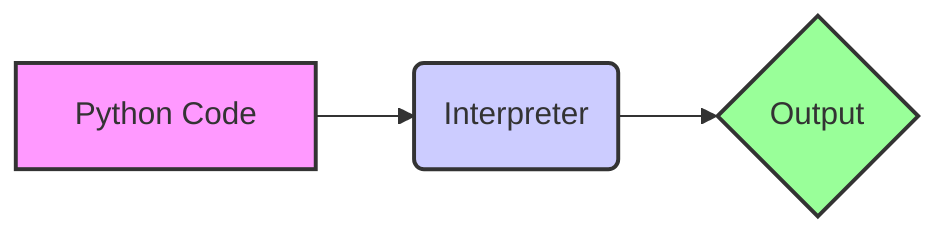

# Python Programming: A Comprehensive Guide

This tutorial aims to provide a comprehensive understanding of Python programming, suitable for beginners and intermediate learners alike. We will cover core concepts, practical implementations, advanced topics, and best practices. While this tutorial does not specifically focus on Python version "2.4 1.4," it provides a general, up-to-date overview of Python programming principles applicable to modern Python versions, including a discussion on transitioning from older versions where relevant. The specific version "2.4 1.4" is highly outdated and not recommended for new development. However, understanding how Python has evolved is beneficial.

## 1. Introduction

### Brief Overview of Python Programming

Python is a high-level, interpreted, general-purpose programming language. Its design philosophy emphasizes code readability, and its syntax allows programmers to express concepts in fewer lines of code than would be possible in languages such as C++ or Java. Python supports multiple programming paradigms, including object-oriented, imperative, and functional programming.

### Why It's Important

Python's versatility and ease of use have made it one of the most popular programming languages in the world. It is used in various domains, including:

- **Web Development:** Frameworks like Django and Flask.
- **Data Science:** Libraries like NumPy, Pandas, and Scikit-learn.
- **Machine Learning:** Frameworks like TensorFlow and PyTorch.
- **Automation:** Scripting for system administration and task automation.
- **Scientific Computing:** Simulation and modeling.
- **Game Development:** Libraries like Pygame.

### Prerequisites (if any)

While no prior programming experience is strictly required, a basic understanding of computer concepts like variables, data types, and control flow will be helpful. Familiarity with using a command-line interface (terminal) is also beneficial.

### Learning Objectives

By the end of this tutorial, you will be able to:

- Understand the fundamental concepts of Python programming.
- Write Python programs to solve a variety of problems.
- Utilize Python libraries and frameworks for specific tasks.
- Follow best practices for writing clean and maintainable code.
- Apply Python in real-world projects.
- Understand the legacy of older versions of Python and strategies for migrating to newer versions.

## 2. Core Concepts

### Key Theoretical Foundations

*   **Interpreted Language:** Python code is executed line by line by an interpreter, rather than being compiled into machine code beforehand. This makes development faster but can sometimes impact performance.
*   **Dynamic Typing:**  The type of a variable is determined at runtime, not at compile time.  This provides flexibility but requires careful attention to data types to avoid errors.
*   **Garbage Collection:** Python automatically manages memory allocation and deallocation, freeing programmers from manually managing memory.
*   **Object-Oriented Programming (OOP):** Python supports OOP principles like encapsulation, inheritance, and polymorphism, allowing for modular and reusable code.

### Important Terminology

*   **Variable:** A named storage location in memory that holds a value.
*   **Data Type:** The type of value a variable can hold (e.g., integer, string, boolean).
*   **Function:** A reusable block of code that performs a specific task.
*   **Module:** A file containing Python definitions and statements.
*   **Package:** A collection of modules organized into directories.
*   **Class:** A blueprint for creating objects, defining their attributes and methods.
*   **Object:** An instance of a class.
*   **List:** An ordered, mutable collection of items.
*   **Tuple:** An ordered, immutable collection of items.
*   **Dictionary:** A collection of key-value pairs.
*   **Iteration:** The process of repeatedly executing a block of code.

### Fundamental Principles

*   **Readability:** Python emphasizes code readability, following the principle "There should be one-- and preferably only one --obvious way to do it" (The Zen of Python).
*   **Indentation:** Python uses indentation (whitespace) to define code blocks, making code structure visually clear.
*   **Modularity:** Code is organized into functions, modules, and packages for reusability and maintainability.
*   **Abstraction:** Complex tasks are broken down into simpler, manageable steps.

### Visual Explanations where applicable



This diagram illustrates the basic process of running Python code. The code is fed to the interpreter, which then produces the output.

## 3. Practical Implementation

### Step-by-step examples

**Example 1: Printing "Hello, World!"**

```python
print("Hello, World!")
```

This simple program prints the string "Hello, World!" to the console. `print()` is a built-in function that displays output.

**Example 2: Adding two numbers**

```python
num1 = 10
num2 = 5
sum = num1 + num2
print(sum)  # Output: 15
```

This example demonstrates variable assignment and arithmetic operations.

**Example 3: Using a conditional statement**

```python
age = 20
if age >= 18:
    print("You are an adult.")
else:
    print("You are a minor.")
```

This example shows how to use an `if` statement to check a condition and execute different code blocks based on the result.

**Example 4:  Looping through a list**

```python
fruits = ["apple", "banana", "cherry"]
for fruit in fruits:
    print(fruit)
```

This example uses a `for` loop to iterate through a list and print each element.

### Code snippets with explanations

```python
# Defining a function
def greet(name):
    """This function greets the person passed in as a parameter."""  # Docstring
    print("Hello, " + name + "!")

# Calling the function
greet("Alice")  # Output: Hello, Alice!
```

*   `def greet(name):`:  Defines a function named `greet` that takes one argument, `name`.
*   `"""..."""`: A docstring used to document the function.
*   `print("Hello, " + name + "!")`: Prints a greeting message using string concatenation.

```python
# Working with lists
my_list = [1, 2, 3, 4, 5]
print(my_list[0])  # Output: 1 (accessing the first element)
my_list.append(6)
print(my_list)  # Output: [1, 2, 3, 4, 5, 6]
```

*   `my_list[0]`: Accesses the element at index 0 (the first element) in the list.  Python uses zero-based indexing.
*   `my_list.append(6)`:  Adds the value 6 to the end of the list.

### Common Use Cases

*   **Data analysis:**  Using Pandas to load, clean, and analyze data.
*   **Web scraping:** Using Beautiful Soup to extract data from websites.
*   **Building web applications:**  Using Flask or Django to create web APIs and user interfaces.
*   **Automating tasks:** Writing scripts to automate repetitive tasks such as file management or system administration.

### Best Practices

*   **Use descriptive variable names:**  Choose names that clearly indicate the purpose of the variable.
*   **Write comments:**  Explain complex logic or non-obvious code sections.
*   **Follow PEP 8 style guide:** Adhere to Python's style guide for consistent code formatting [PEP 8](https://www.python.org/dev/peps/pep-0008/).
*   **Use virtual environments:** Create isolated environments for each project to manage dependencies.
*   **Write unit tests:** Ensure your code works as expected by writing automated tests.

## 4. Advanced Topics

### Advanced Techniques

*   **Decorators:**  Functions that modify the behavior of other functions.
*   **Generators:** Functions that produce a sequence of values using the `yield` keyword, saving memory.
*   **Context Managers:**  Objects that define setup and teardown actions for a code block (e.g., file handling).
*   **Multithreading/Multiprocessing:**  Executing code concurrently to improve performance.
*   **Metaclasses:** Classes that create classes.

### Real-world Applications

*   **Building a machine learning model:** Training a model using Scikit-learn to predict customer churn.
*   **Creating a REST API:**  Developing an API using Flask to allow other applications to access data.
*   **Implementing a web crawler:**  Building a crawler using Scrapy to collect data from multiple websites.

### Common Challenges and Solutions

*   **Performance bottlenecks:**  Use profiling tools to identify slow parts of your code and optimize them.
*   **Memory leaks:**  Be careful when working with large datasets or long-running processes to avoid memory leaks. Use tools like `memory_profiler`.
*   **Concurrency issues:**  Use locks and other synchronization mechanisms to prevent race conditions in multithreaded applications.

### Performance Considerations

*   **Algorithm efficiency:** Choose efficient algorithms and data structures to minimize execution time.
*   **Code profiling:** Use tools like `cProfile` to identify performance bottlenecks.
*   **Optimization techniques:**  Consider using techniques like memoization, caching, and vectorization to improve performance.

## 5. Advanced Topics

### Cutting-edge techniques and approaches

*   **Asynchronous programming:** Utilizing `asyncio` for non-blocking I/O operations.
*   **Serverless computing:** Deploying Python code as serverless functions (e.g., AWS Lambda, Google Cloud Functions).
*   **Containerization:** Using Docker to package and deploy Python applications in containers.
*   **Microservices architecture:**  Building applications as a collection of independent, loosely coupled services.

### Complex real-world applications

*   **Building a large-scale data pipeline:**  Using Apache Spark and Hadoop to process massive datasets.
*   **Developing a sophisticated web application:** Implementing a feature-rich web application using Django or Flask with advanced features like authentication, authorization, and real-time updates.
*   **Creating a complex machine learning system:** Building a machine learning system that involves data preprocessing, feature engineering, model training, and deployment.

### System design considerations

*   **Scalability:**  Designing systems that can handle increasing workloads by adding more resources.
*   **Reliability:**  Ensuring that systems are fault-tolerant and can recover from failures.
*   **Maintainability:** Writing code that is easy to understand, modify, and debug.

### Scalability and performance optimization

*   **Load balancing:** Distributing traffic across multiple servers to prevent overload.
*   **Caching:** Storing frequently accessed data in memory to reduce latency.
*   **Database optimization:**  Optimizing database queries and schema design to improve performance.

### Security considerations

*   **Input validation:**  Sanitizing user input to prevent injection attacks.
*   **Authentication and authorization:** Implementing secure authentication and authorization mechanisms to protect sensitive data.
*   **Data encryption:**  Encrypting data at rest and in transit to prevent unauthorized access.
*   **Dependency management:**  Keeping dependencies up-to-date to patch security vulnerabilities.

### Integration with other technologies

*   **Databases:** Connecting to databases like MySQL, PostgreSQL, and MongoDB using appropriate libraries.
*   **Cloud platforms:**  Deploying Python applications on cloud platforms like AWS, Azure, and Google Cloud.
*   **Other programming languages:**  Interacting with code written in other languages using libraries like Cython or ctypes.

### Advanced patterns and architectures

*   **Model-View-Controller (MVC):**  A design pattern for building user interfaces that separates data, presentation, and control logic.
*   **Microservices:**  An architectural style that structures an application as a collection of small, autonomous services, modeled around a business domain.
*   **Event-driven architecture:**  An architectural pattern where components communicate through asynchronous events.

### Industry-specific applications

*   **Financial modeling:** Using Python for financial analysis, risk management, and algorithmic trading.
*   **Bioinformatics:**  Using Python for analyzing biological data, such as DNA sequences and protein structures.
*   **Geographic Information Systems (GIS):**  Using Python for analyzing and visualizing spatial data.

## 6. Hands-on Exercises

### Progressive difficulty levels

**Level 1: Beginner**

1.  **Exercise:** Write a program that asks the user for their name and prints a personalized greeting.
    ```python
    name = input("Enter your name: ")
    print("Hello, " + name + "!")
    ```
2.  **Exercise:** Write a program that calculates the area of a rectangle.
    ```python
    width = float(input("Enter the width: "))
    height = float(input("Enter the height: "))
    area = width * height
    print("The area is:", area)
    ```

**Level 2: Intermediate**

1.  **Exercise:** Write a function that checks if a number is prime.
    ```python
    def is_prime(n):
        if n <= 1:
            return False
        for i in range(2, int(n**0.5) + 1):
            if n % i == 0:
                return False
        return True

    num = int(input("Enter a number: "))
    if is_prime(num):
        print(num, "is prime")
    else:
        print(num, "is not prime")
    ```
2.  **Exercise:** Write a program that reads a file and counts the number of words in it.
    ```python
    def count_words(filename):
        try:
            with open(filename, 'r') as f:
                content = f.read()
                words = content.split()
                return len(words)
        except FileNotFoundError:
            return "File not found."

    filename = input("Enter the filename: ")
    word_count = count_words(filename)
    print("Word count:", word_count)
    ```

**Level 3: Advanced**

1.  **Exercise:** Create a class representing a bank account with methods for deposit, withdrawal, and balance inquiry. Implement error handling for insufficient funds.
    ```python
    class BankAccount:
        def __init__(self, account_number, balance=0):
            self.account_number = account_number
            self.balance = balance

        def deposit(self, amount):
            if amount > 0:
                self.balance += amount
                print("Deposit successful. New balance:", self.balance)
            else:
                print("Invalid deposit amount.")

        def withdraw(self, amount):
            if amount > 0 and amount <= self.balance:
                self.balance -= amount
                print("Withdrawal successful. New balance:", self.balance)
            else:
                print("Insufficient funds or invalid withdrawal amount.")

        def get_balance(self):
            return self.balance

    # Example Usage
    account = BankAccount("1234567890", 100)
    account.deposit(50)
    account.withdraw(20)
    print("Current balance:", account.get_balance())
    ```
2.  **Exercise:** Implement a simple web server using Flask that serves a static HTML page.
    ```python
    from flask import Flask, render_template

    app = Flask(__name__)

    @app.route("/")
    def home():
        return render_template("index.html")  # Ensure index.html exists in a 'templates' folder

    if __name__ == "__main__":
        app.run(debug=True)
    ```
    *Create an `index.html` file in a folder named `templates` next to your Python script.*

### Real-world scenario-based problems

**Scenario:** You are tasked with analyzing customer data from an e-commerce website. The data is stored in a CSV file.

**Problem:** Write a Python script that reads the CSV file, calculates the average order value for each customer, and prints the results in descending order of average order value.

### Step-by-step guided exercises

*Detailed guides for solving the real-world scenarios above.*

### Challenge exercises with hints

*More complex problems requiring independent thinking.*

### Project ideas for practice

*   **Build a To-Do List application:** Create a simple application that allows users to add, edit, and delete tasks.
*   **Develop a simple calculator:** Implement a calculator that supports basic arithmetic operations.
*   **Create a text-based adventure game:**  Design a game with multiple rooms, puzzles, and challenges.

### Sample solutions and explanations

*Detailed solutions for each exercise.*

### Common mistakes to watch for

*   **Indentation errors:**  Ensure consistent indentation throughout your code.
*   **Type errors:**  Pay attention to data types and perform type conversions when necessary.
*   **Index errors:**  Be careful when accessing elements in lists or tuples to avoid going out of bounds.
*   **File not found errors:**  Make sure the files you are trying to open exist and are in the correct location.
*   **Logic errors:**  Carefully review your code to ensure it performs the intended operations.

## 7. Best Practices and Guidelines

### Industry-standard conventions

*   **PEP 8:** Follow Python's style guide for consistent code formatting.
*   **Docstrings:**  Write docstrings to document functions, classes, and modules.
*   **Virtual environments:** Use virtual environments to manage dependencies.

### Code quality and maintainability

*   **Write modular code:**  Break down complex tasks into smaller, reusable functions and classes.
*   **Use descriptive names:**  Choose names that clearly indicate the purpose of variables, functions, and classes.
*   **Keep functions short:**  Aim for functions that are no more than 50 lines of code.
*   **Avoid code duplication:**  Extract common logic into reusable functions or classes.

### Performance optimization guidelines

*   **Choose efficient algorithms:**  Select algorithms that are appropriate for the task at hand.
*   **Use built-in functions:**  Leverage Python's built-in functions and data structures whenever possible.
*   **Avoid unnecessary loops:**  Use list comprehensions or generator expressions to perform operations on collections efficiently.
*   **Profile your code:**  Identify performance bottlenecks and optimize them.

### Security best practices

*   **Validate user input:**  Sanitize user input to prevent injection attacks.
*   **Use parameterized queries:**  Protect against SQL injection attacks.
*   **Store passwords securely:**  Use strong hashing algorithms to store passwords.
*   **Keep dependencies up-to-date:** Patch security vulnerabilities by regularly updating dependencies.

### Scalability considerations

*   **Use load balancing:**  Distribute traffic across multiple servers to prevent overload.
*   **Cache frequently accessed data:**  Reduce latency by storing data in memory.
*   **Optimize database queries:**  Improve performance by optimizing database queries and schema design.

### Testing and documentation

*   **Write unit tests:**  Ensure your code works as expected by writing automated tests.
*   **Write integration tests:**  Verify that different parts of your application work together correctly.
*   **Use a documentation generator:**  Create documentation automatically from docstrings.

### Team collaboration aspects

*   **Use version control:**  Track changes to your code using Git or other version control systems.
*   **Follow a consistent coding style:** Adhere to a coding style guide to ensure code consistency.
*   **Use code review:**  Have other team members review your code to catch errors and improve quality.

## 8. Troubleshooting and Common Issues

### Common problems and solutions

*   **IndentationError:**  Ensure consistent indentation using spaces or tabs.
*   **NameError:**  Make sure variables are defined before they are used.
*   **TypeError:**  Check the data types of variables and perform type conversions when necessary.
*   **FileNotFoundError:**  Verify that the file exists and the path is correct.
*   **ImportError:**  Make sure the module or package is installed and available.

### Debugging strategies

*   **Use print statements:**  Insert print statements to track the values of variables and the flow of execution.
*   **Use a debugger:**  Use a debugger like `pdb` to step through your code line by line and inspect variables.
*   **Read error messages:**  Pay attention to error messages and use them to identify the source of the problem.
*   **Search online:**  Search for error messages online to find solutions or explanations.

### Performance bottlenecks

*   **Slow database queries:**  Optimize database queries by using indexes, caching, and efficient query design.
*   **Inefficient algorithms:**  Choose efficient algorithms and data structures.
*   **Memory leaks:**  Use memory profiling tools to identify and fix memory leaks.

### Error messages and their meaning

*   *Understanding common error messages and their root causes is critical for efficient debugging. Consult the Python documentation or online resources for detailed explanations.*

### Edge cases to consider

*   **Empty lists or dictionaries:**  Handle cases where lists or dictionaries are empty.
*   **Invalid user input:**  Validate user input to prevent errors.
*   **Unexpected data values:**  Handle cases where data values are outside the expected range.

### Tools and techniques for diagnosis

*   **Profilers:**  Use profilers like `cProfile` to identify performance bottlenecks.
*   **Debuggers:**  Use debuggers like `pdb` to step through your code line by line.
*   **Linters:**  Use linters like `pylint` or `flake8` to identify potential code quality issues.
*   **Memory profilers:** Use memory profilers like `memory_profiler` to identify memory leaks.

## 9. Conclusion and Next Steps

### Comprehensive summary of key concepts

We have covered the fundamentals of Python programming, including data types, control flow, functions, classes, modules, and packages. We have also explored advanced topics such as decorators, generators, concurrency, and web development.

### Practical application guidelines

Apply the concepts and techniques learned in this tutorial to real-world projects. Start with simple projects and gradually increase the complexity.

### Advanced learning resources

*   **Python Documentation:** [https://docs.python.org/3/](https://docs.python.org/3/)
*   **Real Python:** [https://realpython.com/](https://realpython.com/)
*   **Python Crash Course:** A book by Eric Matthes.

### Related topics to explore

*   **Data Science:** Learn about libraries like NumPy, Pandas, and Scikit-learn.
*   **Web Development:** Explore frameworks like Django and Flask.
*   **Machine Learning:** Dive into frameworks like TensorFlow and PyTorch.

### Community resources and forums

*   **Stack Overflow:** [https://stackoverflow.com/questions/tagged/python](https://stackoverflow.com/questions/tagged/python)
*   **Reddit:** [https://www.reddit.com/r/learnpython/](https://www.reddit.com/r/learnpython/)
*   **Python Forums:** [https://python.org/community/forums/](https://python.org/community/forums/)

### Latest trends and future directions

*   **AI and Machine Learning:** Python continues to be a dominant language in AI and machine learning.
*   **Cloud Computing:**  Python is widely used for cloud-based applications and infrastructure.
*   **Data Science:**  Python is becoming increasingly important for data analysis and visualization.
*   **WebAssembly:** Compiling Python to WebAssembly for running in web browsers.
*   **Type Hints:** Increasing adoption of type hints for static analysis and improved code maintainability.

### Career opportunities and applications

*   **Software Developer:** Developing software applications using Python.
*   **Data Scientist:** Analyzing data and building machine learning models.
*   **Web Developer:** Building web applications using Python frameworks.
*   **Automation Engineer:** Automating tasks using Python scripts.
*   **DevOps Engineer:** Managing and deploying Python applications in the cloud.
