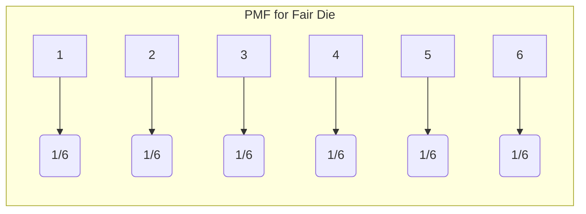
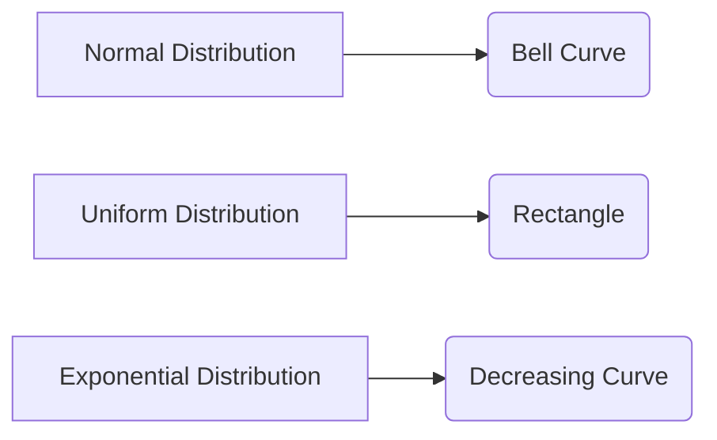
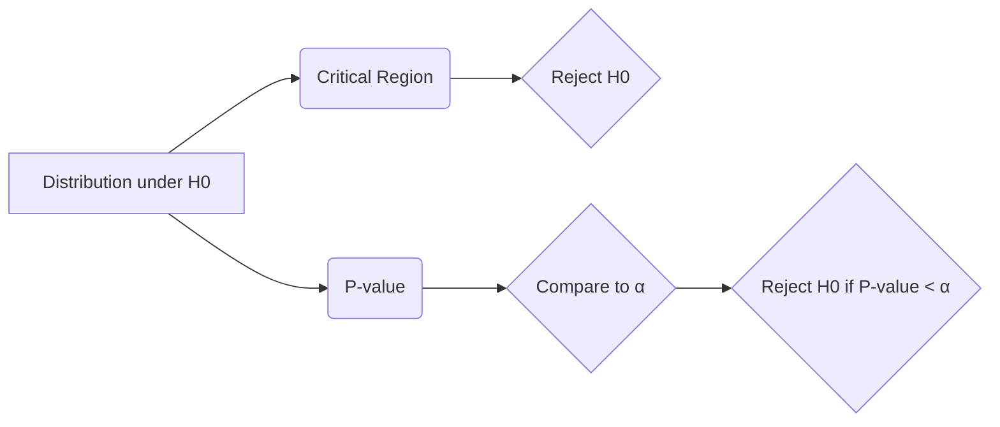

# Probability and Statistics: A Comprehensive Guide

📝 This tutorial provides a comprehensive overview of probability and statistics, covering fundamental concepts, practical applications, and advanced techniques.

## 1. Introduction

### Comprehensive Overview

Probability and statistics are essential tools for understanding and interpreting data in a variety of fields. **Probability** quantifies the likelihood of events occurring, while **statistics** provides methods for collecting, analyzing, interpreting, and presenting data. They are intertwined, as statistical inference often relies on probability models to draw conclusions about populations based on sample data.  Think of probability as predicting the *future* based on a known model, and statistics as inferring the *past* model based on observed data.

### Real-World Applications and Industry Relevance

Probability and statistics are used extensively in:

*   **Finance:** Risk assessment, portfolio management, option pricing.
*   **Healthcare:** Clinical trials, epidemiology, disease modeling.
*   **Engineering:** Quality control, reliability analysis, signal processing.
*   **Marketing:** Customer segmentation, A/B testing, market research.
*   **Data Science:** Machine learning, data analysis, predictive modeling.
*   **Gaming:** Game design, simulations, fairness and odds calculations.
*   **Weather Forecasting:** Predicting precipitation, temperature, and other weather events.

### Detailed Prerequisites and Required Background

*   **Basic Algebra:** Proficiency in algebraic manipulations, solving equations, and working with inequalities.
*   **Basic Calculus (Optional but Recommended):** Understanding of derivatives and integrals for continuous probability distributions.
*   **Set Theory (Helpful):** Familiarity with sets, unions, intersections, and complements.
*   **Familiarity with Python (for practical implementation):** Basic understanding of data structures, functions, and libraries like NumPy and Pandas.

### Clear, Measurable Learning Objectives

By the end of this tutorial, you will be able to:

*   Understand fundamental probability concepts such as sample spaces, events, and probability axioms.
*   Calculate probabilities using various techniques, including conditional probability and Bayes' theorem.
*   Describe different types of random variables and their probability distributions (e.g., Bernoulli, binomial, normal).
*   Calculate descriptive statistics such as mean, median, mode, variance, and standard deviation.
*   Perform hypothesis testing and construct confidence intervals.
*   Apply statistical techniques to real-world datasets using Python libraries.
*   Identify and address common pitfalls in statistical analysis.

### Roadmap of What Will Be Covered

1.  **Theoretical Foundation:** Core principles, terminology, and history.
2.  **Core Concepts Deep Dive:** Probability, random variables, distributions, descriptive statistics, inferential statistics.
3.  **Practical Implementation:** Using Python (NumPy, Pandas, SciPy) for data analysis.
4.  **Advanced Topics:** Bayesian statistics, time series analysis, regression analysis.
5.  **Hands-on Exercises:** Practice problems and projects.
6.  **Best Practices and Guidelines:** Industry standards and conventions.
7.  **Troubleshooting and Common Issues:** Debugging and error handling.
8.  **Conclusion and Next Steps:** Summary and further learning resources.

### Target Audience and Skill Level

This tutorial is designed for:

*   Students learning probability and statistics.
*   Data science enthusiasts.
*   Professionals who need to apply statistical methods in their work.
*   Beginners with some mathematical background.

Skill Level: Beginner to Intermediate.

---

## 2. Theoretical Foundation

### Core Principles and Fundamental Concepts

The foundation of probability and statistics rests on the following principles:

*   **Randomness:** The inherent uncertainty in events.
*   **Data:**  Collected observations or measurements.
*   **Probability:** A numerical measure of the likelihood of an event.
*   **Distribution:** How data is spread across possible values.
*   **Inference:** Drawing conclusions about a population based on a sample.

### Key Terminology and Definitions

*   **Experiment:** A process with a well-defined set of possible outcomes.
*   **Sample Space (S):** The set of all possible outcomes of an experiment.
*   **Event (E):** A subset of the sample space.
*   **Probability (P(E)):** A number between 0 and 1 representing the likelihood of an event E.
*   **Random Variable:** A variable whose value is a numerical outcome of a random phenomenon.
*   **Population:** The entire group of individuals or objects of interest.
*   **Sample:** A subset of the population used for analysis.

### Mathematical Foundations

Probability theory is based on axioms:

1.  **Non-negativity:**  P(E) ≥ 0 for any event E.
2.  **Normalization:** P(S) = 1, where S is the sample space.
3.  **Additivity:** For mutually exclusive events E1, E2, ..., P(E1 ∪ E2 ∪ ...) = P(E1) + P(E2) + ...

### Historical Context and Evolution

Probability theory has roots in games of chance in the 17th century. Key figures include:

*   **Gerolamo Cardano:** Early work on probability in gambling.
*   **Pierre de Fermat and Blaise Pascal:** Developed probability theory in correspondence about dice games.
*   **Jacob Bernoulli:** Published "Ars Conjectandi," a foundational work on probability.
*   **Abraham de Moivre:** Developed the normal distribution as an approximation to the binomial distribution.
*   **Thomas Bayes:** Formulated Bayes' theorem.
*   **Ronald Fisher:** A pioneer in modern statistics and experimental design.

### Relationship to Other Related Concepts

*   **Calculus:** Used in continuous probability distributions.
*   **Linear Algebra:** Used in multivariate statistics and machine learning.
*   **Set Theory:** Provides the basis for defining events and sample spaces.
*   **Information Theory:** Related to entropy and uncertainty.

### Visual Explanations and Diagrams

Imagine rolling a fair six-sided die.

*   **Experiment:** Rolling the die.
*   **Sample Space (S):** {1, 2, 3, 4, 5, 6}
*   **Event (E):** Rolling an even number = {2, 4, 6}
*   **Probability (P(E)):** P(E) = 3/6 = 0.5

```mermaid
graph LR
    A[Experiment: Rolling a die] --> B(Sample Space: {1, 2, 3, 4, 5, 6})
    B --> C{Event: Rolling an even number}
    C --> D(Event: {2, 4, 6})
    D --> E(Probability: 3/6 = 0.5)
```

### Common Misconceptions Addressed

*   **The Gambler's Fallacy:** The belief that past events influence independent future events (e.g., "I've lost five times in a row, so I'm due for a win").  Each flip of a fair coin is independent.
*   **Correlation Implies Causation:** Just because two variables are correlated doesn't mean one causes the other.
*   **Ignoring Sample Size:**  Small samples are more prone to random variation and may not accurately represent the population.

---

## 3. Core Concepts Deep Dive

### Probability

#### Detailed Explanation

Probability is a measure of the likelihood of an event occurring. It's expressed as a number between 0 and 1, where 0 indicates impossibility and 1 indicates certainty.

#### Working Principles and Mechanisms

*   **Classical Probability:** Assumes all outcomes in the sample space are equally likely.  P(E) = (Number of favorable outcomes) / (Total number of outcomes).
*   **Empirical Probability:** Based on observed frequencies of events. P(E) ≈ (Number of times E occurred) / (Total number of trials).
*   **Subjective Probability:**  Based on personal belief or judgment.

#### Theoretical Models and Frameworks

*   **Probability Space:** (Ω, F, P), where Ω is the sample space, F is the set of events (a sigma-algebra), and P is the probability measure.
*   **Conditional Probability:** The probability of an event E given that another event F has occurred. P(E|F) = P(E ∩ F) / P(F), provided P(F) > 0.
*   **Bayes' Theorem:** Relates conditional probabilities.  P(A|B) = [P(B|A) * P(A)] / P(B)

#### Visual Aids and Diagrams

A Venn diagram can illustrate conditional probability and event intersections.

```mermaid
vennDiagram
  diagramType venn3
  sets a b c
  labelStyle letter
  aLabel Event A
  bLabel Event B
  cLabel Intersection of A and B
  aSize 0.6
  bSize 0.5
  cSize 0.2
  areaText 28%
```

#### Step-by-Step Breakdowns

**Example: Conditional Probability**

What is the probability of rolling a 6 on a fair die given that you rolled an even number?

1.  Event A: Rolling a 6. P(A) = 1/6
2.  Event B: Rolling an even number. P(B) = 3/6 = 1/2
3.  A ∩ B: Rolling a 6 and an even number = {6}. P(A ∩ B) = 1/6
4.  P(A|B) = P(A ∩ B) / P(B) = (1/6) / (1/2) = 1/3

#### Common Pitfalls and How to Avoid Them

*   **Incorrectly assuming independence:** Make sure events are truly independent before applying independence formulas.
*   **Confusing conditional probability:** P(A|B) is not the same as P(B|A).
*   **Ignoring the base rate fallacy:**  Overemphasizing conditional probability without considering the prior probability (P(A) in Bayes' theorem).

#### Best Practices and Conventions

*   Clearly define events and sample spaces.
*   Use consistent notation.
*   Check that probabilities sum to 1 for mutually exclusive and exhaustive events.

---

### Random Variables

#### Detailed Explanation

A random variable is a variable whose value is a numerical outcome of a random phenomenon. It can be discrete or continuous.

#### Working Principles and Mechanisms

*   **Discrete Random Variable:** Can only take on a finite number of values or a countably infinite number of values (e.g., number of coin flips until a head, number of defective items in a batch).
*   **Continuous Random Variable:** Can take on any value within a given range (e.g., height, temperature).

#### Theoretical Models and Frameworks

*   **Probability Mass Function (PMF):** For discrete random variables, gives the probability of each specific value.
*   **Probability Density Function (PDF):** For continuous random variables, describes the relative likelihood of a value. The integral of the PDF over a range gives the probability of the variable falling within that range.
*   **Cumulative Distribution Function (CDF):** Gives the probability that the random variable is less than or equal to a certain value. F(x) = P(X ≤ x).

#### Visual Aids and Diagrams

Example of PMF (Probability Mass Function) for rolling a fair six-sided die:



#### Step-by-Step Breakdowns

**Example: Discrete Random Variable (Binomial Distribution)**

Consider flipping a coin 10 times.  Let X be the number of heads. X follows a binomial distribution with n=10 and p=0.5 (assuming a fair coin).  P(X = k) = (n choose k) * p^k * (1-p)^(n-k).

To calculate the probability of getting exactly 5 heads:
P(X=5) = (10 choose 5) * (0.5)^5 * (0.5)^5 = 252 * (0.5)^10 ≈ 0.246

#### Common Pitfalls and How to Avoid Them

*   **Using the wrong distribution:** Selecting the correct distribution is crucial for accurate modeling. Consider the properties of the random variable and the experiment.
*   **Confusing PMF and PDF:** Use PMF for discrete random variables and PDF for continuous random variables.

#### Best Practices and Conventions

*   Clearly define the random variable and its possible values.
*   Specify the distribution and its parameters.
*   Use appropriate notation.

---

### Distributions

#### Detailed Explanation
A probability distribution describes how the values of a random variable are distributed.

#### Working Principles and Mechanisms

* **Discrete Distributions**:
    *   **Bernoulli Distribution**: Models the probability of success or failure in a single trial (e.g., coin flip). Parameter: *p* (probability of success).
    *   **Binomial Distribution**: Models the number of successes in a fixed number of independent trials (e.g., number of heads in 10 coin flips). Parameters: *n* (number of trials), *p* (probability of success).
    *   **Poisson Distribution**: Models the number of events occurring in a fixed interval of time or space (e.g., number of customers arriving at a store in an hour). Parameter: *λ* (average rate of events).
* **Continuous Distributions**:
    *   **Normal Distribution**: A symmetric, bell-shaped distribution commonly used to model many natural phenomena (e.g., height, weight). Parameters: *μ* (mean), *σ* (standard deviation).
    *   **Uniform Distribution**: All values within a given range are equally likely (e.g., random number generator). Parameters: *a* (minimum), *b* (maximum).
    *   **Exponential Distribution**: Models the time until an event occurs (e.g., time until a machine failure). Parameter: *λ* (rate parameter).

#### Theoretical Models and Frameworks

* **Probability Density Function (PDF)**: Mathematical function that describes the relative likelihood of a continuous random variable taking on a specific value.
* **Cumulative Distribution Function (CDF)**: The probability that a random variable X takes on a value less than or equal to a given value *x*.

#### Visual Aids and Diagrams



#### Step-by-Step Breakdowns

**Example: Calculating Probability using Normal Distribution**

Let X be a normally distributed random variable with mean μ = 70 and standard deviation σ = 10.  What is the probability that X is between 60 and 80?

1.  **Standardize the values:**
    *   Z1 = (60 - 70) / 10 = -1
    *   Z2 = (80 - 70) / 10 = 1
2.  **Find the probabilities using a Z-table or calculator:**
    *   P(Z ≤ 1) ≈ 0.8413
    *   P(Z ≤ -1) ≈ 0.1587
3.  **Calculate the probability:**
    *   P(60 ≤ X ≤ 80) = P(-1 ≤ Z ≤ 1) = P(Z ≤ 1) - P(Z ≤ -1) ≈ 0.8413 - 0.1587 ≈ 0.6826

#### Common Pitfalls and How to Avoid Them

*   **Using the normal distribution for non-normal data**: Check for normality using histograms or statistical tests before applying normal distribution-based techniques.
*   **Incorrectly applying the continuity correction**: When approximating a discrete distribution with a continuous one, adjust the boundaries to improve accuracy.

#### Best Practices and Conventions
*   Always specify the distribution and its parameters.
*   Use visualizations to check assumptions about the data's distribution.
*   Choose the distribution that best fits the characteristics of the random variable.

---

### Descriptive Statistics

#### Detailed Explanation
Descriptive statistics are measures that summarize and describe the main features of a dataset.

#### Working Principles and Mechanisms

*   **Measures of Central Tendency**:
    *   **Mean**: The average value of the data.
    *   **Median**: The middle value of the data when it's sorted.
    *   **Mode**: The value that appears most frequently in the data.
*   **Measures of Dispersion**:
    *   **Variance**: The average squared deviation from the mean.
    *   **Standard Deviation**: The square root of the variance, measuring the spread of the data around the mean.
    *   **Range**: The difference between the maximum and minimum values.
    *   **Interquartile Range (IQR)**: The difference between the 75th percentile (Q3) and the 25th percentile (Q1), representing the spread of the middle 50% of the data.

#### Theoretical Models and Frameworks

*   **Sample Mean (x̄)**: An estimate of the population mean (μ).
*   **Sample Variance (s^2)**: An estimate of the population variance (σ^2).

#### Visual Aids and Diagrams

A box plot is a useful visualization to display the distribution of data, including the median, quartiles, and outliers.

```mermaid
graph LR
  A[Minimum] --> B(Q1)
  B --> C(Median)
  C --> D(Q3)
  D --> E[Maximum]
  subgraph Box Plot
    B --- C --- D
    A --. B
    D --. E
  end
```

#### Step-by-Step Breakdowns

**Example: Calculating Descriptive Statistics**

Consider the following dataset: 2, 4, 6, 8, 10

1.  **Mean**: (2 + 4 + 6 + 8 + 10) / 5 = 6
2.  **Median**: The middle value is 6.
3.  **Mode**: No mode, since each value appears only once.
4.  **Variance**:  ((2-6)^2 + (4-6)^2 + (6-6)^2 + (8-6)^2 + (10-6)^2) / (5-1) = (16 + 4 + 0 + 4 + 16) / 4 = 10
5.  **Standard Deviation**: √10 ≈ 3.16

#### Common Pitfalls and How to Avoid Them

*   **Using the mean for skewed data**: The mean can be misleading when the data is skewed or has outliers. Consider using the median instead.
*   **Incorrectly calculating variance and standard deviation**: Ensure you're using the correct formula for sample or population variance.

#### Best Practices and Conventions
*   Always label your measures and provide context.
*   Consider the shape of the data when choosing appropriate descriptive statistics.
*   Use visualizations to aid in understanding the data's distribution.

---

### Inferential Statistics

#### Detailed Explanation
Inferential statistics involve using sample data to draw conclusions or make predictions about a larger population.

#### Working Principles and Mechanisms

*   **Hypothesis Testing**: A formal procedure for testing a claim about a population parameter.
*   **Confidence Intervals**: A range of values that is likely to contain the true population parameter with a certain level of confidence.
*   **Regression Analysis**: A statistical method for modeling the relationship between a dependent variable and one or more independent variables.

#### Theoretical Models and Frameworks

*   **Null Hypothesis (H0)**: A statement that there is no effect or difference.
*   **Alternative Hypothesis (H1)**: A statement that there is an effect or difference.
*   **P-value**: The probability of observing data as extreme as, or more extreme than, the observed data, assuming the null hypothesis is true.
*   **Significance Level (α)**: The probability of rejecting the null hypothesis when it is true (Type I error). Common values are 0.05 or 0.01.

#### Visual Aids and Diagrams

A visual representation of a hypothesis test, showing the rejection region and the p-value.



#### Step-by-Step Breakdowns

**Example: Hypothesis Testing (t-test)**

A company claims that the average lifespan of their light bulbs is 1000 hours. A sample of 30 bulbs has a mean lifespan of 950 hours and a standard deviation of 80 hours.  Test the hypothesis at a significance level of 0.05.

1.  **Null Hypothesis (H0)**: μ = 1000
2.  **Alternative Hypothesis (H1)**: μ ≠ 1000
3.  **Test Statistic**: t = (x̄ - μ) / (s / √n) = (950 - 1000) / (80 / √30) ≈ -3.42
4.  **Degrees of Freedom**: df = n - 1 = 29
5.  **P-value**: Using a t-table or calculator, the p-value for t = -3.42 and df = 29 is approximately 0.0019.
6.  **Decision**: Since the p-value (0.0019) is less than the significance level (0.05), we reject the null hypothesis.

**Conclusion**: There is sufficient evidence to conclude that the average lifespan of the light bulbs is different from 1000 hours.

#### Common Pitfalls and How to Avoid Them

*   **Misinterpreting the p-value**: The p-value is *not* the probability that the null hypothesis is true.
*   **Type I and Type II Errors**: Understanding the risks of incorrectly rejecting the null hypothesis (Type I) or failing to reject a false null hypothesis (Type II).
*   **Multiple Testing**: Performing multiple hypothesis tests increases the chance of making a Type I error. Use methods like Bonferroni correction to adjust the significance level.

#### Best Practices and Conventions
*   Clearly state the hypotheses before conducting the test.
*   Choose the appropriate statistical test based on the type of data and the research question.
*   Report the p-value, test statistic, and degrees of freedom.
*   Interpret the results in the context of the research question.
*   Consider the power of the test (the probability of correctly rejecting a false null hypothesis).

---

## 4. Practical Implementation

This section demonstrates how to use Python and popular libraries like NumPy, Pandas, and SciPy for probability and statistics.

### Detailed Step-by-Step Examples

#### Example 1: Calculating Descriptive Statistics with Pandas

```python
import pandas as pd

# Sample dataset
data = [10, 12, 14, 16, 18, 20, 22, 24, 26, 28]

# Create a Pandas Series
series = pd.Series(data)

# Calculate descriptive statistics
mean = series.mean()
median = series.median()
mode = series.mode()
variance = series.var()
std_dev = series.std()

print(f"Mean: {mean}")
print(f"Median: {median}")
print(f"Mode: {mode}")
print(f"Variance: {variance}")
print(f"Standard Deviation: {std_dev}")
```

#### Example 2: Generating Random Numbers and Visualizing Distributions with NumPy and Matplotlib

```python
import numpy as np
import matplotlib.pyplot as plt

# Generate 1000 random numbers from a normal distribution
mean = 0
std_dev = 1
data = np.random.normal(mean, std_dev, 1000)

# Plot the histogram
plt.hist(data, bins=30, density=True, alpha=0.6, color='g')

# Add labels and title
plt.xlabel('Value')
plt.ylabel('Frequency')
plt.title('Normal Distribution')

# Show the plot
plt.show()
```

#### Example 3: Performing a t-test with SciPy

```python
import scipy.stats as stats

# Sample data
sample1 = [10, 12, 14, 16, 18]
sample2 = [11, 13, 15, 17, 19]

# Perform independent samples t-test
t_statistic, p_value = stats.ttest_ind(sample1, sample2)

print(f"T-statistic: {t_statistic}")
print(f"P-value: {p_value}")

# Check for significance
alpha = 0.05
if p_value < alpha:
    print("Reject the null hypothesis")
else:
    print("Fail to reject the null hypothesis")
```

### Multiple Code Examples with Different Scenarios

#### Scenario 1: Simulating Coin Flips

```python
import numpy as np

def simulate_coin_flips(num_flips, prob_head=0.5):
    """Simulates coin flips and returns an array of results (1 for head, 0 for tail)."""
    results = np.random.choice([0, 1], size=num_flips, p=[1 - prob_head, prob_head])
    return results

def calculate_head_proportion(results):
    """Calculates the proportion of heads in the results."""
    return np.mean(results)

# Example usage
num_flips = 1000
flips = simulate_coin_flips(num_flips)
proportion_heads = calculate_head_proportion(flips)

print(f"Simulated {num_flips} coin flips. Proportion of heads: {proportion_heads}")
```

#### Scenario 2: Calculating Probabilities using SciPy's `binom` for Binomial Distribution

```python
import scipy.stats as stats

# Parameters for the binomial distribution
n = 10  # Number of trials
p = 0.3  # Probability of success

# Calculate the probability of getting exactly 3 successes
probability_3_successes = stats.binom.pmf(3, n, p)
print(f"Probability of exactly 3 successes: {probability_3_successes}")

# Calculate the probability of getting at most 3 successes
probability_at_most_3_successes = stats.binom.cdf(3, n, p)
print(f"Probability of at most 3 successes: {probability_at_most_3_successes}")

#Calculate the probability of getting at least 3 successes
probability_at_least_3_successes = 1 - stats.binom.cdf(2, n, p)
print(f"Probability of at least 3 successes: {probability_at_least_3_successes}")
```

#### Scenario 3: Calculating Z-scores and Probabilities

```python
import scipy.stats as stats

data_point = 75
mean = 70
std_dev = 5

# Calculate the Z-score
z_score = (data_point - mean) / std_dev
print(f"Z-score: {z_score}")

# Calculate the probability of observing a value less than the data point
probability_less_than = stats.norm.cdf(z_score)
print(f"Probability of observing a value less than {data_point}: {probability_less_than}")

# Calculate the probability of observing a value greater than the data point
probability_greater_than = 1 - stats.norm.cdf(z_score)
print(f"Probability of observing a value greater than {data_point}: {probability_greater_than}")
```

### Industry Best Practices and Patterns

*   **Data Cleaning**: Always clean and preprocess your data before analysis.  Handle missing values, outliers, and inconsistencies.
*   **Data Visualization**: Use visualizations to explore your data and communicate your findings.
*   **Reproducible Code**: Write code that is easy to understand, maintain, and reproduce.  Use comments, docstrings, and version control.
*   **Statistical Rigor**: Choose appropriate statistical methods and interpret your results carefully. Be aware of the assumptions and limitations of each method.

### Error Handling and Edge Cases

```python
import numpy as np
import pandas as pd

def calculate_mean(data):
    """Calculates the mean of a list of numbers, handling potential errors."""
    try:
        if not isinstance(data, list):
            raise TypeError("Input must be a list.")
        if not data:
            raise ValueError("List cannot be empty.")
        if not all(isinstance(x, (int, float)) for x in data):
            raise TypeError("All elements of the list must be numbers.")
        return np.mean(data)
    except TypeError as e:
        print(f"Error: {e}")
        return None
    except ValueError as e:
        print(f"Error: {e}")
        return None

# Example Usage with different scenarios
data1 = [1, 2, 3, 4, 5]
data2 = []  # Empty list
data3 = [1, 2, "a", 4, 5]  # Invalid data type
data4 = 123 #Invalid data type

print(f"Mean of data1: {calculate_mean(data1)}")
print(f"Mean of data2: {calculate_mean(data2)}")
print(f"Mean of data3: {calculate_mean(data3)}")
print(f"Mean of data4: {calculate_mean(data4)}")
```

### Performance Optimization Techniques

*   **Vectorization**: Use NumPy's vectorized operations instead of loops for faster calculations.
*   **Pandas DataFrames**: Use Pandas DataFrames for efficient data manipulation and analysis.
*   **Caching**: Cache intermediate results to avoid redundant calculations.
*   **Profiling**: Use profiling tools to identify performance bottlenecks and optimize your code.

### Testing and Validation Approaches

*   **Unit Tests**: Write unit tests to verify that your code is working correctly.  Use libraries like `unittest` or `pytest`.
*   **Integration Tests**: Test how different parts of your code work together.
*   **Statistical Tests**: Validate your results using statistical tests and simulations.

### Debugging Tips and Troubleshooting

*   **Print Statements**: Use print statements to inspect the values of variables and track the flow of your code.
*   **Debuggers**: Use debuggers (e.g., `pdb` in Python) to step through your code and examine the state of your program.
*   **Error Messages**: Read error messages carefully and use them to identify the source of the problem.
*   **Logging**: Use logging to record events and errors in your code.

### Code Organization and Structure

*   **Modular Code**: Break your code into smaller, reusable functions and classes.
*   **Comments and Docstrings**: Document your code with comments and docstrings to explain what it does.
*   **Naming Conventions**: Use consistent naming conventions for variables, functions, and classes.
*   **Version Control**: Use version control (e.g., Git) to track changes to your code.

---

## 5. Advanced Topics

### Cutting-Edge Techniques and Approaches

*   **Bayesian Statistics**: A statistical approach that incorporates prior knowledge into the analysis.
*   **Time Series Analysis**: Methods for analyzing data that is collected over time.
*   **Machine Learning**: Using statistical models to learn from data and make predictions.
*   **Causal Inference**: Methods for determining cause-and-effect relationships.
*   **Spatial Statistics**: Analyzing data that is collected in space.

### Complex Real-World Applications

*   **Fraud Detection**: Using machine learning to identify fraudulent transactions.
*   **Recommendation Systems**: Using statistical models to recommend products or services to users.
*   **Natural Language Processing**: Using statistical methods to analyze and understand human language.
*   **Image Recognition**: Using machine learning to identify objects in images.
*   **Financial Modeling**: Using statistical models to forecast financial markets and manage risk.

### System Design Considerations

When designing systems that use probability and statistics, consider the following:

*   **Data Quality**: Ensure that your data is accurate, complete, and consistent.
*   **Scalability**: Design your system to handle large volumes of data and high traffic.
*   **Performance**: Optimize your code and algorithms for performance.
*   **Security**: Protect your data and systems from unauthorized access.
*   **Maintainability**: Design your system to be easy to maintain and update.

### Scalability and Performance Optimization

*   **Distributed Computing**: Use distributed computing frameworks (e.g., Spark, Hadoop) to process large datasets.
*   **Parallel Processing**: Use parallel processing to speed up calculations.
*   **Database Optimization**: Optimize your database queries for performance.
*   **Caching**: Use caching to store frequently accessed data.

### Security Considerations

*   **Data Encryption**: Encrypt sensitive data to protect it from unauthorized access.
*   **Access Control**: Implement access control policies to restrict access to data and systems.
*   **Vulnerability Scanning**: Regularly scan your systems for security vulnerabilities.
*   **Incident Response**: Develop an incident response plan to handle security breaches.

### Integration with Other Technologies

*   **Cloud Computing**: Integrate with cloud computing platforms (e.g., AWS, Azure, GCP) to scale your systems and access cloud services.
*   **Databases**: Integrate with databases (e.g., MySQL, PostgreSQL, MongoDB) to store and manage your data.
*   **APIs**: Integrate with APIs to access external data and services.

### Advanced Patterns and Architectures

*   **Microservices**: Use a microservices architecture to build scalable and maintainable systems.
*   **Event-Driven Architecture**: Use an event-driven architecture to decouple your services and improve responsiveness.
*   **Data Lakes**: Use data lakes to store large volumes of unstructured data.
*   **Machine Learning Pipelines**: Build machine learning pipelines to automate the process of training and deploying models.

### Industry-Specific Applications

*   **Healthcare**: Predictive analytics for patient outcomes, drug discovery, and medical diagnosis.
*   **Finance**: Algorithmic trading, risk management, fraud detection.
*   **Retail**: Customer segmentation, recommendation systems, inventory management.
*   **Manufacturing**: Quality control, predictive maintenance, supply chain optimization.

---

## 6. Hands-on Exercises

### Progressive Difficulty Levels

#### Exercise 1: Basic Probability

A bag contains 5 red balls and 3 blue balls. What is the probability of picking a red ball at random? What is the probability of picking a blue ball?

#### Exercise 2: Conditional Probability

A student takes two tests. The probability of passing the first test is 0.8. The probability of passing the second test is 0.7. The probability of passing both tests is 0.6. What is the probability of passing the second test given that the student passed the first test?

#### Exercise 3: Descriptive Statistics

Calculate the mean, median, mode, variance, and standard deviation for the following dataset: [2, 4, 4, 4, 5, 5, 7, 9]. Use Python and Pandas.

### Real-World Scenario-Based Problems

#### Problem 1: A/B Testing

A marketing team is testing two different versions of an advertisement. They randomly assign users to see either version A or version B. After a week, they collect data on the number of clicks each advertisement received.

*   Version A: 1000 impressions, 50 clicks
*   Version B: 1000 impressions, 70 clicks

Perform a hypothesis test to determine if version B is significantly better than version A. Use a significance level of 0.05.

#### Problem 2: Sales Prediction

You have a dataset of historical sales data for a company. The dataset includes information on the date, product, region, and sales amount. Build a model to predict future sales based on this data. Consider using regression analysis or time series analysis.

### Step-by-Step Guided Exercises

#### Exercise: Hypothesis Testing using Scipy

1.  Import the `scipy.stats` module