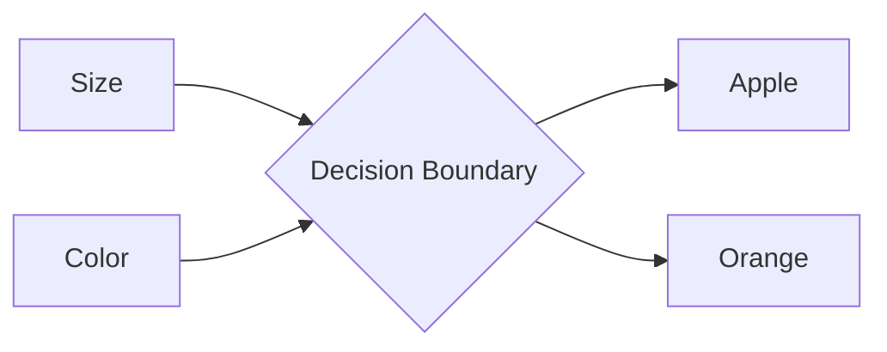

# 1.0 Machine Learning: A Comprehensive Tutorial

## 1. Introduction

### Brief Overview of Machine Learning

Machine Learning (ML) is a subfield of Artificial Intelligence (AI) that focuses on enabling computer systems to learn from data without being explicitly programmed.  Instead of writing specific rules, ML algorithms identify patterns and make predictions based on the data they are trained on.  This allows computers to adapt to new data and improve their performance over time. Think of it as teaching a computer to learn from experience, just like humans do.

This tutorial aims to provide a comprehensive overview of ML, covering both the theoretical foundations and practical implementation.

### Why It's Important

Machine learning is revolutionizing numerous industries, including:

- **Healthcare:** Diagnosis, personalized medicine, drug discovery.
- **Finance:** Fraud detection, risk assessment, algorithmic trading.
- **Retail:** Recommendation systems, targeted advertising, supply chain optimization.
- **Manufacturing:** Predictive maintenance, quality control, process automation.
- **Transportation:** Autonomous vehicles, traffic optimization, logistics.

Its importance lies in its ability to automate complex tasks, derive insights from large datasets, and make data-driven decisions, leading to increased efficiency, reduced costs, and improved outcomes.

### Prerequisites

While this tutorial strives to be beginner-friendly, a basic understanding of the following concepts will be helpful:

- **Basic Programming:** Familiarity with a programming language like Python is essential.
- **Linear Algebra:** Understanding of vectors, matrices, and linear transformations is beneficial.
- **Calculus:** Knowledge of derivatives and gradients is helpful for understanding optimization algorithms.
- **Statistics:** Concepts like mean, median, standard deviation, probability distributions, and hypothesis testing are important.

### Learning Objectives

By the end of this tutorial, you will be able to:

- Understand the core concepts of machine learning.
- Identify different types of machine learning algorithms.
- Implement basic machine learning models using Python libraries like scikit-learn.
- Evaluate the performance of machine learning models.
- Apply machine learning to solve real-world problems.
- Understand the challenges and best practices of machine learning.

## 2. Core Concepts

### Key Theoretical Foundations

Machine learning builds upon several mathematical and statistical foundations:

- **Probability Theory:** Provides the framework for quantifying uncertainty and making predictions based on probabilistic models.
- **Statistics:** Enables us to analyze data, draw inferences, and test hypotheses.  Key concepts include:
    - **Descriptive Statistics:** Measures like mean, median, standard deviation.
    - **Inferential Statistics:** Using sample data to make generalizations about a population.
    - **Hypothesis Testing:** Evaluating the validity of a hypothesis based on data.
- **Linear Algebra:** Used for representing data as vectors and matrices, and for performing operations like linear transformations.
- **Optimization:** Algorithms used to find the best parameters for a machine learning model by minimizing a loss function.  Gradient descent is a common optimization technique.

### Important Terminology

Understanding the following terms is crucial for navigating the world of machine learning:

- **Algorithm:** A step-by-step procedure for solving a problem.  In ML, algorithms are used to learn from data.
- **Model:**  A mathematical representation of the relationships between variables in a dataset.  The output of a machine learning algorithm is a model.
- **Features:** The input variables used to train a model (also called `independent variables` or `predictors`).
- **Labels:** The output variable that the model is trying to predict (also called `dependent variable` or `target`).
- **Training Data:** The dataset used to train the model.
- **Testing Data:** The dataset used to evaluate the performance of the trained model on unseen data.
- **Overfitting:** A situation where a model performs well on the training data but poorly on the testing data.  This indicates that the model has learned the noise in the training data rather than the underlying patterns.
- **Underfitting:** A situation where a model performs poorly on both the training and testing data.  This indicates that the model is too simple to capture the underlying patterns in the data.
- **Loss Function:** A function that measures the difference between the predicted values and the actual values.  The goal of training a machine learning model is to minimize the loss function.
- **Hyperparameters:** Parameters that are set before training a model. Examples include the learning rate in gradient descent or the number of layers in a neural network. Hyperparameter tuning is the process of finding the best values for these parameters.

### Fundamental Principles

Several fundamental principles guide the design and application of machine learning algorithms:

- **Occam's Razor:**  The simplest explanation is usually the best.  In ML, this means preferring simpler models over more complex ones, as long as they achieve similar performance.
- **Bias-Variance Tradeoff:** A fundamental concept in statistical learning.  Bias refers to the error introduced by approximating a real-world problem with a simplified model. Variance refers to the sensitivity of the model to changes in the training data.  There is a tradeoff between bias and variance: reducing bias typically increases variance, and vice versa.
- **Generalization:** The ability of a model to perform well on unseen data. This is the ultimate goal of machine learning.

### Visual Explanations

Consider the example of classifying apples and oranges based on two features: size and color.

| Feature  | Apple | Orange |
| :------- | :---- | :----- |
| Size     | Small | Medium |
| Color    | Red   | Orange |

We can visualize this data on a scatter plot with size on the x-axis and color on the y-axis. A machine learning algorithm could then learn a decision boundary to separate the apples from the oranges.



> **Note:** The decision boundary represents the model's understanding of the relationship between size, color, and the class (apple or orange).

## 3. Practical Implementation

### Step-by-Step Examples

Let's walk through a practical example of building a simple linear regression model using Python and scikit-learn. We'll use a dataset of house prices and their corresponding sizes.

**1. Import Libraries:**

```python
import numpy as np
import pandas as pd
from sklearn.model_selection import train_test_split
from sklearn.linear_model import LinearRegression
from sklearn.metrics import mean_squared_error, r2_score
import matplotlib.pyplot as plt
```

**2. Load and Prepare Data:**

```python
# Create sample data
data = {'Size': [1000, 1500, 2000, 2500, 3000],
        'Price': [200000, 300000, 400000, 500000, 600000]}
df = pd.DataFrame(data)

# Prepare data for the model
X = df[['Size']]  # Features (independent variable)
y = df['Price']   # Target (dependent variable)

# Split data into training and testing sets
X_train, X_test, y_train, y_test = train_test_split(X, y, test_size=0.2, random_state=42)  # 80% training, 20% testing
```

**3. Train the Model:**

```python
# Create a linear regression model
model = LinearRegression()

# Train the model using the training data
model.fit(X_train, y_train)
```

**4. Make Predictions:**

```python
# Make predictions on the testing data
y_pred = model.predict(X_test)
```

**5. Evaluate the Model:**

```python
# Evaluate the model
mse = mean_squared_error(y_test, y_pred)
r2 = r2_score(y_test, y_pred)

print(f"Mean Squared Error: {mse}")
print(f"R-squared: {r2}")
```

**6. Visualize the Results:**

```python
# Visualize the results
plt.scatter(X_test, y_test, color='blue', label='Actual')
plt.plot(X_test, y_pred, color='red', linewidth=2, label='Predicted')
plt.xlabel('Size')
plt.ylabel('Price')
plt.title('Linear Regression: House Price vs. Size')
plt.legend()
plt.show()
```

### Code Snippets with Explanations

- `train_test_split(X, y, test_size=0.2, random_state=42)`:  Splits the data into training and testing sets. `test_size=0.2` means 20% of the data is used for testing. `random_state=42` ensures that the split is reproducible.
- `LinearRegression()`: Creates a linear regression model object.
- `model.fit(X_train, y_train)`: Trains the model using the training data.  The model learns the relationship between the `Size` and `Price` based on this data.
- `model.predict(X_test)`:  Uses the trained model to make predictions on the testing data.
- `mean_squared_error(y_test, y_pred)`: Calculates the mean squared error (MSE), which measures the average squared difference between the predicted and actual values.  Lower MSE indicates better performance.
- `r2_score(y_test, y_pred)`:  Calculates the R-squared score, which represents the proportion of variance in the dependent variable that is predictable from the independent variable(s).  An R-squared score close to 1 indicates a good fit.

### Common Use Cases

- **Regression:** Predicting a continuous value, such as house prices, stock prices, or temperature.
- **Classification:**  Predicting a categorical value, such as spam detection (spam or not spam), image classification (identifying objects in an image), or customer churn prediction (predicting which customers are likely to leave).
- **Clustering:** Grouping similar data points together, such as customer segmentation or anomaly detection.
- **Dimensionality Reduction:** Reducing the number of features in a dataset while preserving the most important information.  This can improve model performance and reduce computational complexity.

### Best Practices

- **Data Preprocessing:** Clean and prepare your data before training a model. This includes handling missing values, scaling features, and encoding categorical variables.
- **Feature Engineering:** Create new features from existing ones that can improve model performance.  This often requires domain expertise.
- **Model Selection:** Choose the appropriate model for your problem. Consider the type of data, the complexity of the problem, and the computational resources available.
- **Hyperparameter Tuning:**  Optimize the hyperparameters of your model to achieve the best performance. Techniques like grid search and random search can be used for hyperparameter tuning.
- **Regularization:**  Use regularization techniques to prevent overfitting. Common regularization techniques include L1 regularization (Lasso), L2 regularization (Ridge), and dropout.
- **Cross-Validation:** Use cross-validation to evaluate the performance of your model on multiple subsets of the data. This provides a more robust estimate of generalization performance.
- **Model Interpretation:** Understand how your model is making predictions.  This can help you identify potential biases and improve the model's trustworthiness.

## 4. Advanced Topics

### Advanced Techniques

- **Neural Networks:** Powerful models that can learn complex patterns from data.  They are widely used in image recognition, natural language processing, and other areas.  Different architectures include Convolutional Neural Networks (CNNs), Recurrent Neural Networks (RNNs), and Transformers.
- **Support Vector Machines (SVMs):** Effective for classification and regression tasks. They find the optimal hyperplane that separates different classes of data.
- **Ensemble Methods:** Combine multiple models to improve performance.  Common ensemble methods include:
    - **Random Forests:** An ensemble of decision trees.
    - **Gradient Boosting:**  A sequential ensemble method that combines weak learners to create a strong learner.  Examples include XGBoost, LightGBM, and CatBoost.
- **Reinforcement Learning:**  An area of ML where an agent learns to make decisions in an environment to maximize a reward.

### Real-World Applications

- **Fraud Detection:** Using machine learning to identify fraudulent transactions.
- **Natural Language Processing (NLP):** Developing models that can understand and process human language. Examples include machine translation, sentiment analysis, and chatbot development.
- **Computer Vision:** Developing models that can "see" and interpret images. Examples include object detection, image classification, and facial recognition.
- **Recommendation Systems:**  Providing personalized recommendations to users based on their past behavior. Examples include recommending products on e-commerce websites or movies on streaming platforms.

### Common Challenges and Solutions

- **Data Scarcity:**  Not having enough data to train a good model.  Solutions include data augmentation (creating new data from existing data), transfer learning (using a model trained on a similar task), and semi-supervised learning (using both labeled and unlabeled data).
- **Imbalanced Data:**  Having a dataset where one class is much more prevalent than the others. Solutions include oversampling the minority class, undersampling the majority class, and using cost-sensitive learning.
- **High Dimensionality:**  Having a dataset with a large number of features. Solutions include dimensionality reduction techniques like Principal Component Analysis (PCA) and feature selection.
- **Model Interpretability:**  Understanding how a model is making predictions. This can be challenging for complex models like neural networks. Solutions include using interpretable models, feature importance analysis, and explainable AI (XAI) techniques.

### Performance Considerations

- **Computational Complexity:**  The amount of time and resources required to train and deploy a model. Consider the trade-off between model accuracy and computational complexity.
- **Scalability:**  The ability of a model to handle large datasets and high traffic.
- **Deployment:**  The process of making a model available for use in a real-world application.  This may involve deploying the model to a server, embedding it in a mobile app, or integrating it with an existing system.

## 5. Conclusion

### Summary of Key Points

This tutorial provided a comprehensive overview of machine learning, covering the following key points:

- Machine learning is a subfield of AI that enables computers to learn from data without being explicitly programmed.
- Understanding the core concepts of machine learning, such as algorithms, models, features, and labels, is crucial.
- Practical implementation involves using Python libraries like scikit-learn to build and evaluate machine learning models.
- Advanced techniques, such as neural networks and ensemble methods, can be used to solve more complex problems.
- Addressing common challenges, such as data scarcity and imbalanced data, is essential for building effective machine learning solutions.

### Next Steps for Learning

- **Deepen your understanding of Python:**  Practice coding and explore advanced Python concepts. [Python Tutorial](https://docs.python.org/3/tutorial/)
- **Explore different machine learning algorithms:** Learn about other algorithms, such as decision trees, support vector machines, and clustering algorithms.
- **Work on real-world projects:**  Apply your knowledge to solve real-world problems.  Kaggle competitions are a great way to gain experience. [Kaggle](https://www.kaggle.com/)
- **Stay up-to-date with the latest research:**  Read research papers and follow industry blogs to stay informed about the latest advancements in machine learning.
- **Contribute to open-source projects:**  Contribute to open-source machine learning projects to improve your skills and collaborate with other developers.

### Additional Resources

- **Scikit-learn documentation:** [scikit-learn](https://scikit-learn.org/stable/documentation.html)
- **TensorFlow documentation:** [TensorFlow](https://www.tensorflow.org/api_docs)
- **PyTorch documentation:** [PyTorch](https://pytorch.org/docs/stable/index.html)
- **"Hands-On Machine Learning with Scikit-Learn, Keras & TensorFlow" by Aurélien Géron:** A comprehensive book covering the fundamentals of machine learning.
- **"The Elements of Statistical Learning" by Hastie, Tibshirani, and Friedman:**  A classic textbook on statistical learning. [The Elements of Statistical Learning](https://web.stanford.edu/~hastie/ElemStatLearn/)

### Practice Exercises

1.  **Classification Task:** Use the Iris dataset (available in scikit-learn) to train a classification model to predict the species of iris flowers based on their sepal and petal measurements.  Experiment with different classification algorithms and evaluate their performance.
2.  **Regression Task:** Find a dataset of your choice and train a regression model to predict a continuous target variable. Explore different feature engineering techniques and evaluate their impact on model performance.
3.  **Clustering Task:** Use the K-means algorithm to cluster customer data based on their demographics and purchasing behavior. Analyze the resulting clusters and identify potential marketing strategies for each cluster.

By working through these exercises and exploring the resources provided, you can solidify your understanding of machine learning and build the skills necessary to apply it to solve real-world problems. Good luck!
