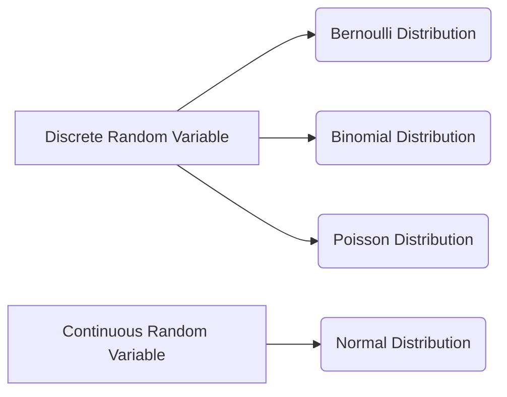

# Probability and Statistics: A Comprehensive Tutorial

## 1. Introduction

This tutorial provides a comprehensive introduction to probability and statistics, crucial tools for analyzing data, making informed decisions, and understanding uncertainty. We'll cover fundamental concepts, practical implementations, and advanced techniques, equipping you with the knowledge to tackle real-world problems.

**Why it's important:** Probability and statistics are fundamental to numerous fields, including:

*   **Data Science:**  Analyzing and interpreting large datasets.
*   **Machine Learning:** Building predictive models.
*   **Finance:** Assessing risk and making investment decisions.
*   **Science & Engineering:**  Analyzing experimental data and drawing conclusions.
*   **Business:** Understanding customer behavior and improving marketing strategies.

**Prerequisites:**

*   Basic algebra.
*   Familiarity with set theory (helpful but not mandatory).
*   Basic understanding of programming (for practical implementation).

**Learning Objectives:**

By the end of this tutorial, you will be able to:

*   Understand fundamental probability concepts like events, sample spaces, and probability distributions.
*   Calculate probabilities of simple and complex events.
*   Apply statistical measures like mean, median, mode, and standard deviation.
*   Perform basic statistical inference, including hypothesis testing and confidence intervals.
*   Implement probability and statistics techniques using Python.
*   Apply these techniques to solve real-world problems.

## 2. Core Concepts

### 2.1 Probability

**Probability** is a measure of the likelihood that an event will occur. It's a number between 0 and 1, where 0 indicates impossibility and 1 indicates certainty.

*   **Sample Space (S):** The set of all possible outcomes of an experiment. For example, when flipping a coin, the sample space is `{Heads, Tails}`.
*   **Event (E):** A subset of the sample space.  For example, getting `Heads` when flipping a coin.
*   **Probability of an Event:**  P(E) = Number of outcomes in E / Number of outcomes in S, assuming all outcomes are equally likely.

**Example:**  What is the probability of rolling a 4 on a fair six-sided die?

*   Sample space: S = {1, 2, 3, 4, 5, 6}
*   Event: E = {4}
*   P(E) = 1/6

**Types of Events:**

*   **Independent Events:** The outcome of one event does not affect the outcome of another event.  Example: Flipping a coin twice.
*   **Dependent Events:** The outcome of one event affects the outcome of another event. Example: Drawing cards from a deck without replacement.
*   **Mutually Exclusive Events:** Events that cannot occur at the same time. Example: Rolling a 1 and a 2 on a single die roll.

**Key Formulas:**

*   **P(A or B) (for mutually exclusive events):** P(A) + P(B)
*   **P(A and B) (for independent events):** P(A) * P(B)
*   **Conditional Probability: P(A|B):**  The probability of event A occurring given that event B has already occurred. P(A|B) = P(A and B) / P(B)

### 2.2 Random Variables and Probability Distributions

A **random variable** is a variable whose value is a numerical outcome of a random phenomenon.

*   **Discrete Random Variable:** A variable that can only take on a finite number of values or a countably infinite number of values.  Example: Number of heads in 3 coin flips (0, 1, 2, or 3).
*   **Continuous Random Variable:** A variable that can take on any value within a given range. Example: Height of a person.

A **probability distribution** describes the probabilities of all possible values of a random variable.

**Common Probability Distributions:**

*   **Bernoulli Distribution:** Models the probability of success or failure in a single trial.
*   **Binomial Distribution:** Models the number of successes in a fixed number of independent trials.
*   **Poisson Distribution:** Models the number of events occurring in a fixed interval of time or space.
*   **Normal Distribution (Gaussian Distribution):**  A continuous distribution characterized by its bell-shaped curve.  It's defined by its mean (μ) and standard deviation (σ).



### 2.3 Statistics

**Statistics** is the science of collecting, organizing, analyzing, interpreting, and presenting data.

**Descriptive Statistics:** Methods for summarizing and describing the main features of a dataset.

*   **Measures of Central Tendency:**
    *   **Mean:** The average value of a dataset.
    *   **Median:** The middle value of a dataset when sorted.
    *   **Mode:** The value that appears most frequently in a dataset.
*   **Measures of Dispersion (Variability):**
    *   **Range:** The difference between the maximum and minimum values.
    *   **Variance:** The average of the squared differences from the mean.
    *   **Standard Deviation:** The square root of the variance. It measures the spread of data around the mean.

**Inferential Statistics:** Methods for drawing conclusions about a population based on a sample of data.

*   **Hypothesis Testing:**  A statistical method used to determine whether there is enough evidence to reject a null hypothesis.
    *   **Null Hypothesis (H0):** A statement about the population that we are trying to disprove.
    *   **Alternative Hypothesis (H1):** A statement that contradicts the null hypothesis.
    *   **P-value:** The probability of observing data as extreme as, or more extreme than, the observed data, assuming the null hypothesis is true.  A small p-value (typically < 0.05) indicates strong evidence against the null hypothesis.
*   **Confidence Intervals:**  A range of values that is likely to contain the true population parameter with a certain level of confidence (e.g., 95% confidence interval).

>   **Important Note:** Correlation does not imply causation.  Just because two variables are correlated does not mean that one causes the other. There may be other confounding factors at play.

## 3. Practical Implementation

We'll use Python with the `NumPy`, `SciPy`, and `Statsmodels` libraries for practical implementation.

```python
import numpy as np
import scipy.stats as stats
import statsmodels.api as sm
import statsmodels.formula.api as smf

# Sample Data
data = np.array([10, 12, 15, 18, 20, 22, 25, 28, 30, 35])

# Descriptive Statistics
mean = np.mean(data)
median = np.median(data)
std_dev = np.std(data)

print(f"Mean: {mean}")       # Output: Mean: 21.5
print(f"Median: {median}")   # Output: Median: 21.0
print(f"Standard Deviation: {std_dev}")  # Output: Standard Deviation: 7.762604498847341
```

**Example: Hypothesis Testing (T-test)**

Let's test the hypothesis that the mean of the data is different from 20.

```python
# One-sample t-test
t_statistic, p_value = stats.ttest_1samp(data, 20)

print(f"T-statistic: {t_statistic}") # Output: T-statistic: 0.6123724356957946
print(f"P-value: {p_value}")       # Output: P-value: 0.5558343155063826

alpha = 0.05 # Significance level

if p_value < alpha:
    print("Reject the null hypothesis")
else:
    print("Fail to reject the null hypothesis") #Output: Fail to reject the null hypothesis
```

**Example: Linear Regression**

```python
# Sample Data
x = np.array([1, 2, 3, 4, 5])
y = np.array([2, 4, 5, 4, 5])

# Linear Regression using Statsmodels
model = smf.ols('y ~ x', data={'x': x, 'y': y})
results = model.fit()

print(results.summary())
```

**Common Use Cases:**

*   **A/B Testing:** Determining which version of a website or application performs better.
*   **Fraud Detection:** Identifying fraudulent transactions.
*   **Medical Diagnosis:** Diagnosing diseases based on symptoms and test results.
*   **Risk Management:** Assessing and managing financial risks.
*   **Predictive Maintenance:** Predicting when equipment is likely to fail.

**Best Practices:**

*   **Clearly define your research question.**
*   **Collect high-quality data.**
*   **Choose appropriate statistical methods.**
*   **Interpret results cautiously.**
*   **Visualize your data to gain insights.**

## 4. Advanced Topics

### 4.1 Bayesian Statistics

**Bayesian statistics** is a statistical approach that updates prior beliefs based on observed evidence. It uses Bayes' theorem to calculate the posterior probability of a hypothesis given the data.

**Bayes' Theorem:**

P(H|D) = [P(D|H) * P(H)] / P(D)

Where:

*   P(H|D) is the posterior probability of the hypothesis H given the data D.
*   P(D|H) is the likelihood of observing the data D given the hypothesis H.
*   P(H) is the prior probability of the hypothesis H.
*   P(D) is the probability of the data D.

**Example:**  Consider a medical test for a rare disease. The test is 99% accurate, meaning that it correctly identifies 99% of people who have the disease and correctly identifies 99% of people who do not have the disease.  The disease affects 0.1% of the population. If a person tests positive, what is the probability that they actually have the disease?

```python
# Probabilities
P_Disease = 0.001    # Prior probability of having the disease
P_NoDisease = 0.999  # Prior probability of not having the disease
P_Positive_Given_Disease = 0.99  # Probability of testing positive given you have the disease (sensitivity)
P_Negative_Given_NoDisease = 0.99 # Probability of testing negative given you don't have the disease (specificity)

# Calculate probability of testing positive
P_Positive = (P_Positive_Given_Disease * P_Disease) + ((1 - P_Negative_Given_NoDisease) * P_NoDisease)

# Calculate posterior probability using Bayes' Theorem
P_Disease_Given_Positive = (P_Positive_Given_Disease * P_Disease) / P_Positive

print(f"Probability of having the disease given a positive test: {P_Disease_Given_Positive}") # Output: Probability of having the disease given a positive test: 0.09016393442622951
```

Even though the test is 99% accurate, the probability of having the disease given a positive test is only about 9%, because the disease is so rare.

### 4.2 Time Series Analysis

**Time series analysis** is a statistical method for analyzing data points indexed in time order.  It's used to identify patterns, forecast future values, and understand the underlying processes that generate the data.

**Common Time Series Models:**

*   **ARIMA (Autoregressive Integrated Moving Average):**  A class of models that captures the correlation between past and present values in a time series.
*   **Exponential Smoothing:** A class of models that assigns exponentially decreasing weights to past observations.

### 4.3 Survival Analysis

**Survival analysis** is a statistical method for analyzing the time until an event occurs. It's commonly used in medical research to analyze the time until a patient dies or experiences a specific outcome.

**Common Survival Analysis Techniques:**

*   **Kaplan-Meier Estimator:**  A non-parametric method for estimating the survival function.
*   **Cox Proportional Hazards Model:** A semi-parametric method for analyzing the relationship between covariates and survival time.

### 4.4 Common Challenges and Solutions

*   **Missing Data:**  Impute missing values using techniques like mean imputation, median imputation, or regression imputation.
*   **Outliers:**  Identify and handle outliers using techniques like Z-score analysis or IQR analysis.  Consider whether the outliers are genuine data points or errors.
*   **Non-Normality:**  Transform data to achieve normality using techniques like logarithmic transformation or Box-Cox transformation.  Consider using non-parametric statistical tests if normality cannot be achieved.
*   **Overfitting:**  Use techniques like cross-validation or regularization to prevent overfitting in machine learning models.

### 4.5 Performance Considerations

*   **Algorithm Selection:**  Choose algorithms that are appropriate for the size and structure of your data.
*   **Data Preprocessing:**  Optimize data preprocessing steps to improve performance.
*   **Parallel Processing:** Use parallel processing to speed up computations.
*   **Memory Management:**  Optimize memory management to avoid memory errors.

## 5. Conclusion

### 5.1 Summary of Key Points

*   Probability and statistics are essential tools for data analysis and decision-making.
*   Probability deals with the likelihood of events occurring.
*   Statistics involves collecting, analyzing, and interpreting data.
*   Descriptive statistics summarize the main features of a dataset.
*   Inferential statistics draw conclusions about a population based on a sample.
*   Python with NumPy, SciPy, and Statsmodels provides powerful tools for implementing probability and statistics techniques.

### 5.2 Next Steps for Learning

*   **Deepen your understanding of specific statistical methods:**  Explore topics like ANOVA, regression analysis, and time series analysis in more detail.
*   **Learn more about machine learning:**  Apply probability and statistics to build predictive models.
*   **Practice with real-world datasets:**  Download datasets from sources like Kaggle or UCI Machine Learning Repository and apply your knowledge to solve practical problems.
*   **Contribute to open-source projects:**  Contribute to open-source projects related to probability and statistics.

### 5.3 Additional Resources

*   **Books:**
    *   "Probability and Statistics for Engineers and Scientists" by Ronald E. Walpole, Raymond H. Myers, Sharon L. Myers, and Keying Ye
    *   "OpenIntro Statistics" by David Diez, Christopher Barr, and Mine Çetinkaya-Rundel ([https://www.openintro.org/book/os/](https://www.openintro.org/book/os/))
    *   "Think Stats" by Allen B. Downey ([http://greenteapress.com/wp/think-stats-2e/](http://greenteapress.com/wp/think-stats-2e/))
*   **Online Courses:**
    *   Coursera:  "Statistics with Python" specialization.
    *   edX: "Probability and Statistics" Micromasters program.
    *   Khan Academy:  Statistics and probability courses.
*   **Python Libraries Documentation:**
    *   NumPy: [https://numpy.org/doc/](https://numpy.org/doc/)
    *   SciPy: [https://docs.scipy.org/doc/](https://docs.scipy.org/doc/)
    *   Statsmodels: [https://www.statsmodels.org/stable/index.html](https://www.statsmodels.org/stable/index.html)

### 5.4 Practice Exercises

1.  **Coin Flips:** What is the probability of getting exactly 3 heads in 5 coin flips?
2.  **Dice Rolls:** What is the probability of rolling a sum of 7 with two fair six-sided dice?
3.  **Calculate Descriptive Statistics:** Calculate the mean, median, standard deviation, and variance for the following dataset: `[5, 10, 15, 20, 25, 30, 35, 40, 45, 50]` using Python.
4.  **Hypothesis Testing:** Perform a t-test to determine if the mean of the dataset `[12, 15, 18, 20, 22, 25, 28, 30]` is significantly different from 21.
5.  **Linear Regression:**  Using the data `x = [1, 2, 3, 4, 5]` and `y = [3, 5, 7, 9, 11]`, perform a linear regression and predict the value of y when x = 6.
