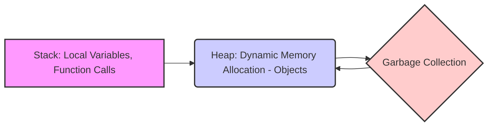

# 4.0 Memory Management: A Comprehensive Tutorial

## 1. Introduction

This tutorial provides a comprehensive guide to memory management, a crucial aspect of software development, particularly relevant in environments like .NET Framework 4.0 and beyond. Effective memory management is essential for creating robust, efficient, and scalable applications.  This document covers the theoretical underpinnings, practical implementations, advanced techniques, and best practices of memory management, aimed at both beginners and experienced developers.

**Why it's important:** Inefficient memory management can lead to various issues, including memory leaks, increased resource consumption, performance degradation, and application crashes. Understanding memory management enables developers to optimize application performance, improve stability, and ensure efficient resource utilization.

**Prerequisites:**

*   Basic understanding of programming concepts (variables, data types, etc.).
*   Familiarity with a programming language like C# (for .NET examples).
*   Basic knowledge of operating systems.

**Learning objectives:** Upon completion of this tutorial, you will be able to:

*   Understand the core concepts of memory management.
*   Identify and prevent memory leaks.
*   Use garbage collection effectively.
*   Implement advanced memory management techniques.
*   Optimize memory usage in applications.
*   Troubleshoot memory-related issues.

## 2. Core Concepts

### 2.1 Key Theoretical Foundations

Memory management involves allocating and deallocating memory resources to programs and processes. It aims to ensure efficient use of available memory and prevent conflicts between different parts of the system. There are two primary types of memory management:

*   **Automatic Memory Management:** Relies on a garbage collector (GC) to reclaim memory that is no longer in use.  This is common in languages like C#, Java, and Python.
*   **Manual Memory Management:** Requires the programmer to explicitly allocate and deallocate memory.  C and C++ are examples of languages where manual memory management is common.

### 2.2 Important Terminology

*   **Heap:** A region of memory used for dynamic memory allocation. Objects created with `new` are typically stored on the heap.
*   **Stack:** A region of memory used for storing local variables and function call information. Memory on the stack is automatically managed.
*   **Garbage Collection (GC):** An automatic memory management process that reclaims memory occupied by objects that are no longer referenced.
*   **Memory Leak:** Occurs when memory is allocated but never deallocated, leading to a gradual depletion of available memory.
*   **Pointers:** Variables that hold the memory address of another variable. Used extensively in manual memory management.  Less common but still present in C# through features like `unsafe` code and `IntPtr`.
*   **Managed Resources:** Resources that are under the control of the CLR's garbage collector, like objects created with `new`.
*   **Unmanaged Resources:** Resources not under the control of the CLR's garbage collector, such as file handles, network connections, and database connections.  These often require explicit cleanup.
*   **Finalizer:** A special method in a class that is automatically called by the garbage collector before an object is reclaimed. Used for releasing unmanaged resources.
*   **Dispose Pattern:** A design pattern used to ensure that unmanaged resources are released deterministically.  It involves implementing the `IDisposable` interface.

### 2.3 Fundamental Principles

*   **Allocation:** The process of reserving a portion of memory for a program or process.
*   **Deallocation:** The process of releasing allocated memory back to the system.
*   **Referencing:** Maintaining connections or pointers to allocated memory locations.
*   **Reachability:** Determining whether an allocated memory location is still accessible or reachable by the program.

### 2.4 Visual Explanation: Memory Layout



This diagram illustrates the relationship between the stack, heap, and garbage collector. Local variables and function calls are managed on the stack, while dynamically allocated objects reside on the heap. The garbage collector reclaims memory from the heap when objects are no longer reachable from the stack or other reachable objects.

## 3. Practical Implementation

### 3.1 Step-by-Step Examples

**Example 1: Allocating and Deallocating Memory (C# - demonstrates Garbage Collection)**

```csharp
public class MyObject
{
    // Some data
    public string Data { get; set; }

    // Finalizer (called by the GC)
    ~MyObject()
    {
        Console.WriteLine("MyObject finalized!");
        // Release unmanaged resources here
    }
}

public class Example
{
    public static void Main(string[] args)
    {
        // Allocate memory
        MyObject obj = new MyObject();
        obj.Data = "Hello, World!";

        // ... use the object ...

        // Set the reference to null to make the object eligible for garbage collection
        obj = null;

        // Force garbage collection (not recommended for production code)
        GC.Collect();
        GC.WaitForPendingFinalizers(); // Wait for finalizers to complete

        Console.WriteLine("Garbage collection triggered.");
    }
}
```

**Explanation:**

*   The `MyObject` class represents a simple object that can be allocated in memory.
*   The `new` keyword allocates memory on the heap for a new instance of `MyObject`.
*   Setting `obj = null` removes the reference to the object, making it eligible for garbage collection.
*   `GC.Collect()` forces a garbage collection cycle (primarily for demonstration purposes). **Note:** Manually forcing garbage collection in production code is generally discouraged as it can disrupt performance. Let the CLR handle garbage collection based on its internal algorithms.
*   The finalizer `~MyObject()` is called by the garbage collector before reclaiming the object's memory.  This is the *last* chance to clean up unmanaged resources held by the object.

**Example 2: Implementing the Dispose Pattern (C# - deterministic cleanup)**

```csharp
using System;

public class MyResource : IDisposable
{
    private bool disposed = false;
    // Simulate an unmanaged resource
    private IntPtr handle;

    public MyResource()
    {
        // Allocate unmanaged resource
        handle = new IntPtr(1); // Dummy handle value
        Console.WriteLine("Resource allocated.");
    }

    // Dispose method
    public void Dispose()
    {
        Dispose(true);
        GC.SuppressFinalize(this); // Prevent finalizer from being called
    }

    // Protected virtual dispose method
    protected virtual void Dispose(bool disposing)
    {
        if (!disposed)
        {
            if (disposing)
            {
                // Dispose managed resources (if any)
                // This is where you would dispose of other IDisposable objects
            }

            // Release unmanaged resources
            if (handle != IntPtr.Zero)
            {
                Console.WriteLine("Releasing unmanaged resource.");
                // Free the unmanaged resource (e.g., CloseHandle(handle))
                handle = IntPtr.Zero; // In a real scenario, you'd call a function to release the handle
            }

            disposed = true;
        }
    }

    // Finalizer
    ~MyResource()
    {
        Console.WriteLine("Finalizer called.");
        Dispose(false); // Dispose only unmanaged resources
    }

    public void UseResource()
    {
        if (disposed)
        {
            throw new ObjectDisposedException("MyResource", "Cannot use disposed resource.");
        }
        Console.WriteLine("Using resource...");
    }
}

public class Example2
{
    public static void Main(string[] args)
    {
        // Using statement ensures Dispose is called even if exceptions occur
        using (MyResource resource = new MyResource())
        {
            resource.UseResource();
        } // Dispose() is automatically called here

        Console.WriteLine("Resource disposed.");
    }
}
```

**Explanation:**

*   The `MyResource` class implements the `IDisposable` interface.
*   The `Dispose()` method releases both managed and unmanaged resources.
*   The `Dispose(bool disposing)` method separates the disposal of managed and unmanaged resources.
*   The finalizer `~MyResource()` is a safety net to release unmanaged resources if `Dispose()` is not called explicitly.
*   `GC.SuppressFinalize(this)` prevents the finalizer from being called if `Dispose()` has already been called. This improves performance, as the object doesn't need to be kept alive until the finalizer runs.
*   The `using` statement ensures that `Dispose()` is always called, even if exceptions occur.  This guarantees deterministic disposal.

### 3.2 Code Snippets with Explanations

*   **Creating a large object:**

    ```csharp
    byte[] largeArray = new byte[1024 * 1024 * 100]; // 100 MB
    ```

    This allocates a large chunk of memory (100 MB) on the heap. Large objects are allocated on the Large Object Heap (LOH), which is handled differently by the garbage collector and can lead to fragmentation if not managed carefully.

*   **Using `StringBuilder`:**

    ```csharp
    StringBuilder sb = new StringBuilder();
    for (int i = 0; i < 1000; i++)
    {
        sb.Append("Some text ");
    }
    string result = sb.ToString();
    ```

    `StringBuilder` is more efficient than repeated string concatenation (`string += "..."`) because it avoids creating multiple intermediate string objects.

*   **Weak References:**

    ```csharp
    MyObject obj = new MyObject();
    WeakReference weakRef = new WeakReference(obj);

    obj = null; // Remove the strong reference

    // ... later ...

    MyObject recoveredObj = weakRef.Target as MyObject;
    if (recoveredObj != null)
    {
        // Object is still alive
        Console.WriteLine("Object is still alive.");
    }
    else
    {
        // Object has been garbage collected
        Console.WriteLine("Object has been garbage collected.");
    }
    ```

    A `WeakReference` allows you to reference an object without preventing it from being garbage collected. Useful for caching scenarios.  If the garbage collector needs memory, it can reclaim the object even if a weak reference exists.  Check `weakRef.Target` to see if the object is still alive.

### 3.3 Common Use Cases

*   **Resource management:**  Ensuring proper disposal of unmanaged resources like file handles, network connections, and database connections.
*   **Caching:** Implementing caching mechanisms to store frequently accessed data in memory for faster retrieval.  Weak references can be helpful here.
*   **Large data processing:** Optimizing memory usage when processing large datasets to avoid out-of-memory exceptions. Consider using streams and processing data in chunks.
*   **Event handlers:** Detaching event handlers when they are no longer needed to prevent memory leaks.  Event handlers can create strong references to objects, preventing them from being garbage collected.

### 3.4 Best Practices

*   **Implement the Dispose pattern for unmanaged resources:**  Use `IDisposable` and the `using` statement to ensure deterministic disposal.
*   **Avoid creating unnecessary objects:**  Minimize object creation to reduce the load on the garbage collector.  Reuse objects where possible.
*   **Use `StringBuilder` for string manipulation:**  Avoid repeated string concatenation.
*   **Detach event handlers when no longer needed:**  Prevent memory leaks caused by event handlers.
*   **Avoid finalizers unless absolutely necessary:**  Finalizers add overhead to the garbage collection process. Only use them for releasing unmanaged resources when deterministic disposal is not possible.
*   **Be mindful of large objects:**  Large objects are allocated on the LOH, which is handled differently by the garbage collector.  Try to avoid creating large objects if possible, or manage them carefully.
*   **Profile your code:** Use profiling tools to identify memory bottlenecks and leaks.

## 4. Advanced Topics

### 4.1 Advanced Techniques

*   **Object Pooling:**  Reusing objects instead of creating new ones.  This can reduce the overhead of object creation and garbage collection.
*   **Memory Mapping:**  Mapping files or portions of files into memory.  This allows you to access large files as if they were in memory, without loading the entire file into RAM.  Especially useful when processing large files sequentially.
*   **Unsafe Code:**  Allows you to use pointers and perform direct memory manipulation.  Requires the `unsafe` keyword and comes with significant risks.  Use with extreme caution and only when necessary for performance-critical operations.
*   **Span<T> and Memory<T>:** Provides a safe and efficient way to work with contiguous regions of memory without unnecessary copying. Introduced in .NET Core and .NET Standard 2.1. Can improve performance when dealing with arrays and strings.
*   **Custom Memory Allocators:** Implementing custom memory allocation strategies for specific use cases. This can provide fine-grained control over memory allocation and deallocation, but requires a deep understanding of memory management.

### 4.2 Real-World Applications

*   **Game development:**  Optimizing memory usage to achieve high frame rates and avoid memory leaks in complex game environments.
*   **High-performance computing:**  Managing memory efficiently in scientific simulations and data analysis applications.
*   **Web servers:**  Handling a large number of concurrent requests without exhausting memory resources.  Object pooling and caching are commonly used techniques.
*   **Database systems:**  Optimizing memory usage for query processing and data storage.

### 4.3 Common Challenges and Solutions

*   **Memory Leaks:** Identify and fix memory leaks by using profiling tools and carefully reviewing code for unreleased resources and detached event handlers.
*   **Fragmentation:**  Reduce memory fragmentation by using object pooling and avoiding frequent allocation and deallocation of small objects.  The LOH is particularly susceptible to fragmentation.
*   **Performance Bottlenecks:** Optimize memory usage by using efficient data structures, minimizing object creation, and using `StringBuilder` for string manipulation.
*   **Garbage Collection Pauses:**  Minimize garbage collection pauses by reducing the number of objects on the heap and using techniques like object pooling.

### 4.4 Performance Considerations

*   **Minimize object creation:**  Reducing the number of objects created reduces the workload of the garbage collector.
*   **Use efficient data structures:**  Choosing the right data structure can significantly impact memory usage and performance.
*   **Avoid boxing and unboxing:**  Boxing and unboxing can create unnecessary objects on the heap.
*   **Use structs for small, value-type objects:**  Structs are allocated on the stack, which is faster than allocating objects on the heap.
*   **Profile your code:**  Use profiling tools to identify memory bottlenecks and optimize performance.

## 5. Advanced Memory Management Techniques

### 5.1 Cutting-Edge Techniques and Approaches

*   **Region-Based Memory Management:** Allocating objects into specific regions of memory that can be reclaimed as a unit, reducing fragmentation and improving performance.
*   **Non-Blocking Data Structures:** Using data structures that avoid locks and contention, allowing for more efficient concurrent access to memory.
*   **Hardware-Assisted Memory Management:** Leveraging hardware features such as Intel Memory Protection Extensions (MPX) to improve memory safety and security.

### 5.2 Complex Real-World Applications

*   **Operating Systems:** Managing memory for multiple processes, ensuring isolation and preventing memory corruption.
*   **Virtual Machines:** Implementing garbage collection and memory management for guest operating systems and applications.
*   **Large-Scale Data Processing Frameworks (e.g., Apache Spark):** Efficiently managing memory for distributed data processing tasks, handling terabytes or petabytes of data.

### 5.3 System Design Considerations

*   **Memory Footprint:** Designing applications with a minimal memory footprint to improve performance and scalability.
*   **Memory Allocation Strategies:** Choosing appropriate memory allocation strategies based on the application's requirements and usage patterns.
*   **Concurrency and Thread Safety:** Ensuring that memory access is thread-safe to prevent data corruption and race conditions.

### 5.4 Scalability and Performance Optimization

*   **Horizontal Scaling:** Distributing memory management across multiple machines to handle increased load.
*   **Memory Caching:** Implementing caching mechanisms to reduce the need to access slower storage devices.
*   **Just-In-Time (JIT) Compilation:** Optimizing memory usage and performance during runtime through JIT compilation.

### 5.5 Security Considerations

*   **Buffer Overflows:** Preventing buffer overflows by validating input and using safe memory manipulation techniques.
*   **Memory Corruption:** Detecting and preventing memory corruption caused by programming errors or malicious attacks.
*   **Data Encryption:** Encrypting sensitive data in memory to protect it from unauthorized access.

### 5.6 Integration with Other Technologies

*   **Cloud Computing:** Integrating memory management with cloud-based services for scalability and cost optimization.
*   **Big Data Analytics:** Using specialized memory management techniques for processing large datasets in big data analytics applications.
*   **Artificial Intelligence:** Optimizing memory usage for machine learning models and algorithms.

### 5.7 Advanced Patterns and Architectures

*   **Memory-Mapped Files:** Using memory-mapped files to efficiently access large files or share data between processes.
*   **Lock-Free Data Structures:** Implementing data structures that avoid locks and contention, allowing for more efficient concurrent access to memory.
*   **Data Locality:** Designing applications to improve data locality, reducing cache misses and improving performance.

### 5.8 Industry-Specific Applications

*   **Financial Services:** Managing memory for high-frequency trading systems, requiring low latency and high throughput.
*   **Healthcare:** Optimizing memory usage for medical imaging applications, handling large datasets and complex algorithms.
*   **Aerospace:** Managing memory for real-time control systems, requiring high reliability and deterministic behavior.

## 6. Hands-on Exercises

### 6.1 Progressive Difficulty Levels

**Level 1: Basic Allocation and Deallocation**

*   Create a program that allocates a simple object (e.g., a string or an integer array) and then sets the reference to null. Observe the garbage collector's behavior.

**Level 2: Implementing IDisposable**

*   Create a class that encapsulates an unmanaged resource (e.g., a file handle). Implement the `IDisposable` interface to ensure proper disposal.

**Level 3: Detecting Memory Leaks**

*   Write a program that intentionally creates a memory leak by allocating memory but never deallocating it. Use a profiling tool to detect the leak.

### 6.2 Real-World Scenario-Based Problems

**Scenario 1: Caching System**

*   Design a caching system that stores frequently accessed data in memory. Use weak references to allow the garbage collector to reclaim cached objects when memory is low.

**Scenario 2: Image Processing**

*   Write a program that processes large images. Optimize memory usage by processing the image in chunks and using memory mapping.

### 6.3 Step-by-Step Guided Exercises

**Exercise: Implementing Object Pooling**

1.  Create a class for the objects you want to pool (e.g., a `StringBuilder`).
2.  Create a `Pool` class that manages a collection of objects.
3.  Implement methods for getting an object from the pool and returning an object to the pool.
4.  Test the object pool by allocating and releasing objects multiple times.
5.  Measure the performance improvement compared to creating new objects each time.

### 6.4 Challenge Exercises with Hints

**Challenge: Memory Leak Detection**

*   Write a program that creates a complex object graph with circular references. Use a memory profiler to identify and fix the memory leaks. *Hint: Detach event handlers and break circular references.*

**Challenge: Optimizing String Manipulation**

*   Write a program that performs a large number of string manipulations. Compare the performance of using `string` concatenation vs. `StringBuilder`. *Hint: `StringBuilder` is much more efficient for repeated string modifications.*

### 6.5 Project Ideas for Practice

*   **Custom Memory Allocator:** Implement a custom memory allocator that allocates memory in fixed-size blocks.
*   **Garbage Collection Simulator:** Simulate the behavior of a garbage collector using different algorithms (e.g., mark and sweep).
*   **Memory Profiler:** Develop a simple memory profiler that tracks memory allocation and deallocation.

### 6.6 Sample Solutions and Explanations

(Sample solutions will be provided separately for each exercise, with detailed explanations of the code and the underlying concepts.)

### 6.7 Common Mistakes to Watch For

*   **Forgetting to Dispose Unmanaged Resources:**  Always dispose of unmanaged resources using the `IDisposable` interface and the `using` statement.
*   **Creating Circular References:**  Avoid creating circular references between objects, as this can prevent the garbage collector from reclaiming memory.
*   **Using Too Many Finalizers:**  Finalizers add overhead to the garbage collection process. Only use them when necessary.
*   **Ignoring Memory Profiler Warnings:**  Pay attention to warnings and errors reported by memory profilers. They can help you identify memory leaks and performance bottlenecks.
*   **Premature Optimization:** Don't optimize code until you've identified a performance bottleneck. Premature optimization can lead to complex and hard-to-maintain code.

## 7. Best Practices and Guidelines

### 7.1 Industry-Standard Conventions

*   **Follow the Dispose Pattern:**  Implement the `IDisposable` interface and use the `using` statement for deterministic disposal of unmanaged resources.
*   **Minimize Object Creation:**  Reuse objects where possible and avoid creating unnecessary objects.
*   **Use Efficient Data Structures:**  Choose the right data structure for the task to minimize memory usage and improve performance.

### 7.2 Code Quality and Maintainability

*   **Write Clear and Concise Code:**  Use meaningful variable names and comments to make your code easier to understand and maintain.
*   **Follow Coding Standards:**  Adhere to coding standards to ensure consistency and readability.
*   **Refactor Regularly:**  Refactor your code to improve its structure and maintainability.

### 7.3 Performance Optimization Guidelines

*   **Profile Your Code:**  Use profiling tools to identify memory bottlenecks and optimize performance.
*   **Minimize Object Creation:**  Reducing the number of objects created reduces the workload of the garbage collector.
*   **Avoid Boxing and Unboxing:**  Boxing and unboxing can create unnecessary objects on the heap.
*   **Use Structs for Small, Value-Type Objects:** Structs are allocated on the stack, which is faster than allocating objects on the heap.

### 7.4 Security Best Practices

*   **Validate Input:**  Validate input to prevent buffer overflows and other security vulnerabilities.
*   **Encrypt Sensitive Data:**  Encrypt sensitive data in memory to protect it from unauthorized access.
*   **Use Safe Memory Manipulation Techniques:**  Avoid using unsafe code unless absolutely necessary, and always be careful when manipulating memory directly.

### 7.5 Scalability Considerations

*   **Design for Scalability:**  Design your application to be scalable from the beginning.
*   **Use Load Balancing:**  Distribute the load across multiple machines to improve scalability.
*   **Cache Data:**  Use caching to reduce the load on the database and improve performance.

### 7.6 Testing and Documentation

*   **Write Unit Tests:**  Write unit tests to verify that your code is working correctly.
*   **Write Integration Tests:**  Write integration tests to verify that different parts of your application are working together correctly.
*   **Document Your Code:**  Document your code to make it easier to understand and maintain.

### 7.7 Team Collaboration Aspects

*   **Use Version Control:**  Use version control to track changes to your code.
*   **Follow a Consistent Workflow:**  Establish a consistent workflow for code development and review.
*   **Communicate Effectively:**  Communicate effectively with your team members to avoid misunderstandings and ensure that everyone is on the same page.

## 8. Troubleshooting and Common Issues

### 8.1 Common Problems and Solutions

*   **OutOfMemoryException:**  This exception indicates that the application has run out of memory. Solutions include:
    *   Reducing memory usage by using more efficient data structures or algorithms.
    *   Releasing unmanaged resources.
    *   Increasing the amount of available memory (e.g., by adding more RAM or configuring the virtual memory settings).
*   **Memory Leaks:**  Memory leaks occur when memory is allocated but never deallocated. Solutions include:
    *   Using a memory profiler to identify the source of the leak.
    *   Ensuring that all unmanaged resources are properly disposed of.
    *   Detaching event handlers when they are no longer needed.
*   **Fragmentation:**  Fragmentation occurs when memory is allocated in small, non-contiguous blocks. Solutions include:
    *   Using object pooling to reuse objects.
    *   Avoiding frequent allocation and deallocation of small objects.

### 8.2 Debugging Strategies

*   **Use a Memory Profiler:**  A memory profiler can help you identify memory leaks, fragmentation, and other memory-related issues.
*   **Use Debugging Tools:**  Debugging tools can help you step through your code and inspect the values of variables.
*   **Write Unit Tests:**  Unit tests can help you verify that your code is working correctly and identify potential memory-related issues.

### 8.3 Performance Bottlenecks

*   **Identify Slow Code:** Use profiling tools to pinpoint sections of code consuming excessive memory or causing slowdowns.
*   **Optimize Algorithms and Data Structures:** Choose data structures and algorithmic approaches that minimize memory overhead and processing time.
*   **Reduce Object Creation:** Excessive object allocation can strain garbage collection. Reusing objects can significantly improve performance.

### 8.4 Error Messages and Their Meaning

*   **"System.OutOfMemoryException"**: The application cannot allocate sufficient memory. Requires code optimization or increasing available system memory.
*   **"ObjectDisposedException"**: Indicates that an attempt was made to access an object after it has been disposed of. Ensure that objects are not used after their `Dispose` method is called.

### 8.5 Edge Cases to Consider

*   **Multithreaded Applications:** Memory management becomes more complex in multithreaded applications.  Ensure thread safety when accessing shared memory.  Consider using thread-safe data structures.
*   **Large Object Heap (LOH):**  The LOH is handled differently by the garbage collector than the small object heap. Large object allocations can lead to fragmentation.
*   **Circular References:** Object graphs with circular dependencies can prevent objects from being garbage collected.  Break circular references where possible.

### 8.6 Tools and Techniques for Diagnosis

*   **.NET Memory Profiler:**  A commercial memory profiler that provides detailed information about memory allocation and deallocation.
*   **dotMemory:** Another commercial memory profiler.
*   **PerfView (Microsoft):** A free performance analysis tool that can be used to diagnose memory issues.  [PerfView Download](https://github.com/microsoft/perfview)
*   **Windows Performance Analyzer (WPA):**  Part of the Windows Assessment and Deployment Kit (ADK).  Can be used to analyze memory usage.

## 9. Conclusion and Next Steps

### 9.1 Comprehensive Summary of Key Concepts

Memory management is a critical aspect of software development, influencing application performance, stability, and resource utilization. Key concepts include allocation, deallocation, garbage collection, the Dispose pattern, and the differences between managed and unmanaged resources.  Effective memory management involves understanding the relationship between the stack and heap, minimizing object creation, and properly disposing of unmanaged resources.

### 9.2 Practical Application Guidelines

*   Always implement the Dispose pattern for unmanaged resources.
*   Use the `using` statement to ensure deterministic disposal.
*   Minimize object creation and reuse objects where possible.
*   Use efficient data structures and algorithms.
*   Profile your code to identify memory bottlenecks.

### 9.3 Advanced Learning Resources

*   **CLR via C# by Jeffrey Richter:**  A comprehensive guide to the Common Language Runtime (CLR).
*   **Pro .NET Memory Management: For Better Performance, Reliability, and Scalability by Konrad Kokosa:**  A detailed guide to .NET memory management.
*   **Microsoft Docs on Garbage Collection:** [https://docs.microsoft.com/en-us/dotnet/standard/garbage-collection/](https://docs.microsoft.com/en-us/dotnet/standard/garbage-collection/)

### 9.4 Related Topics to Explore

*   **Concurrency and Threading:**  Memory management in multithreaded applications.
*   **Performance Tuning:**  Techniques for optimizing application performance.
*   **Design Patterns:**  Design patterns for memory management.
*   **.NET Internals:**  Understanding the inner workings of the .NET CLR.

### 9.5 Community Resources and Forums

*   **Stack Overflow:** [https://stackoverflow.com/](https://stackoverflow.com/)
*   **.NET Foundation Forums:** [https://forums.dotnetfoundation.org/](https://forums.dotnetfoundation.org/)
*   **GitHub:**  Search for memory management related projects and libraries.

### 9.6 Latest Trends and Future Directions

*   **Automatic Memory Management Innovations:**  Research into more efficient and less intrusive garbage collection algorithms.
*   **Hardware-Assisted Memory Safety:**  Leveraging hardware features to improve memory safety and security.
*   **Memory-Centric Computing:**  Designing applications and systems around memory as the primary resource.

### 9.7 Career Opportunities and Applications

A strong understanding of memory management is valuable for various software development roles, including:

*   **Software Engineer:**  Developing and maintaining software applications.
*   **Performance Engineer:**  Optimizing application performance.
*   **Systems Programmer:**  Developing and maintaining operating systems and system software.
*   **Game Developer:**  Optimizing memory usage in game development.
