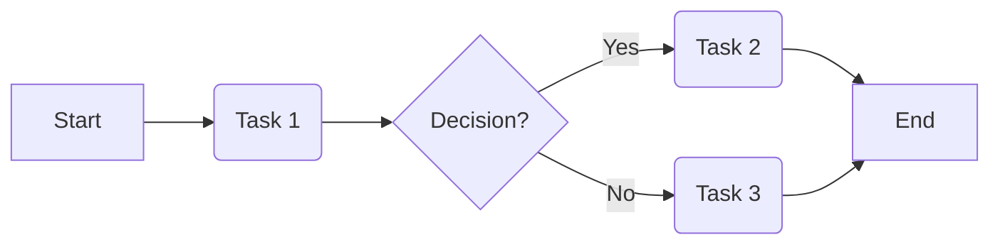

# 3.0 Process Management: A Comprehensive Tutorial

## 1. Introduction

This tutorial provides a comprehensive guide to 3.0 Process Management, covering everything from fundamental concepts to advanced techniques. We'll explore the importance of process management, its theoretical underpinnings, practical implementation, and advanced applications. This guide aims to equip you with the knowledge and skills to effectively manage processes in diverse environments.

**Why is it important?**

Effective process management is crucial for:

*   **Efficiency:** Optimizing resource utilization and reducing waste.
*   **Consistency:** Ensuring predictable and repeatable outcomes.
*   **Quality:** Improving the reliability and quality of products and services.
*   **Compliance:** Adhering to regulatory requirements and industry standards.
*   **Agility:** Adapting to changing business needs and market demands.

**Prerequisites:**

No specific technical prerequisites are required. A basic understanding of business operations, software development lifecycles, or project management principles will be beneficial.

**Learning Objectives:**

By the end of this tutorial, you will be able to:

*   Understand the core concepts of 3.0 Process Management.
*   Apply process management techniques to real-world scenarios.
*   Identify and address common challenges in process implementation.
*   Optimize processes for performance and efficiency.
*   Utilize best practices for process documentation and communication.

## 2. Core Concepts

### Key Theoretical Foundations

Process management draws upon several theoretical foundations, including:

*   **Lean Manufacturing:** Focuses on eliminating waste and maximizing value.
*   **Six Sigma:** Emphasizes reducing variation and improving quality.
*   **Business Process Reengineering (BPR):** Involves fundamentally rethinking and redesigning business processes.
*   **Theory of Constraints (TOC):** Identifies and addresses bottlenecks that limit performance.
*   **Agile Methodologies:** Iterative and incremental approach to process improvement.

### Important Terminology

*   **Process:** A series of actions or steps taken in order to achieve a particular end.
*   **Process Owner:** The individual responsible for the performance and improvement of a specific process.
*   **Process Map:** A visual representation of a process, showing the sequence of activities and decision points.
*   **Workflow:** The sequence of tasks or activities that make up a process.
*   **Bottleneck:** A point in a process where capacity is limited, hindering overall performance.
*   **Key Performance Indicator (KPI):** A measurable value that demonstrates how effectively a process is achieving key business objectives.
*   **Service Level Agreement (SLA):** A contract between a service provider and a customer that defines the level of service expected.
*   **Business Process Management (BPM):** A systematic approach to making an organization's workflow more effective, more efficient, and more capable of adapting to an ever-changing environment.

### Fundamental Principles

*   **Process Thinking:** Viewing the organization as a collection of interconnected processes.
*   **Customer Focus:** Aligning processes with customer needs and expectations.
*   **Continuous Improvement:** Regularly evaluating and refining processes to enhance performance.
*   **Measurement and Analysis:** Tracking key metrics to identify areas for improvement.
*   **Collaboration and Communication:** Fostering teamwork and transparency throughout the process lifecycle.

### Visual Explanations

A simple process map can illustrate these concepts.



This diagram represents a basic process with a starting point, two tasks (Task 1, Task 2/3), a decision point, and an ending point.  Arrows represent the flow of the process.  Process maps help visualize bottlenecks and inefficiencies.

## 3. Practical Implementation

### Step-by-Step Examples

Let's consider a simple example: the process of submitting an expense report.

1.  **Identify the Process:** Define the scope of the process, including the starting point and ending point.
2.  **Map the Process:** Create a process map that outlines the steps involved, such as gathering receipts, completing the expense report form, submitting the report for approval, and receiving reimbursement.
3.  **Analyze the Process:** Identify potential bottlenecks or inefficiencies, such as delays in approval or errors in data entry.
4.  **Improve the Process:** Implement changes to address the identified issues, such as automating the expense report submission process or providing clearer instructions to employees.
5.  **Monitor the Process:** Track key metrics, such as the average time to process an expense report or the number of errors reported, to ensure that the improvements are effective.

### Code Snippets with Explanations

While process management isn't always about code, automating parts of it can be. Here's a Python snippet illustrating a simplified approval workflow using a state machine:

```python
from transitions import Machine

class ExpenseReport(object):
    def __init__(self):
        self.machine = Machine(model=self, states=['draft', 'submitted', 'approved', 'rejected', 'paid'], initial='draft')
        self.machine.add_transition('submit', 'draft', 'submitted')
        self.machine.add_transition('approve', 'submitted', 'approved')
        self.machine.add_transition('reject', 'submitted', 'rejected')
        self.machine.add_transition('pay', 'approved', 'paid')
        self.machine.add_transition('reset', '*', 'draft')  # '*' means any state

report = ExpenseReport()
print(report.state) # Output: draft

report.submit()
print(report.state) # Output: submitted

report.approve()
print(report.state) # Output: approved

report.pay()
print(report.state) # Output: paid

report.reset()
print(report.state) # Output: draft
```

This example uses the `transitions` library to define a state machine for an expense report. The `submit`, `approve`, `reject`, and `pay` methods trigger transitions between different states.  This demonstrates how automation can be used to manage workflows.

### Common Use Cases

*   **Order Fulfillment:** Streamlining the process of receiving, processing, and shipping customer orders.
*   **Customer Service:** Improving the efficiency and effectiveness of customer support interactions.
*   **Software Development:** Optimizing the software development lifecycle, from requirements gathering to deployment.
*   **Financial Reporting:** Ensuring the accuracy and timeliness of financial reports.
*   **Supply Chain Management:** Enhancing the flow of goods and information throughout the supply chain.

### Best Practices

*   **Clearly Define Process Objectives:** Ensure that all stakeholders understand the goals and objectives of each process.
*   **Involve Stakeholders:** Gather input from all relevant parties when designing and improving processes.
*   **Document Processes Thoroughly:** Create detailed process maps and procedures to ensure consistency and clarity.
*   **Use Technology to Automate Processes:** Leverage technology to streamline tasks and reduce manual effort.
*   **Continuously Monitor and Improve Processes:** Regularly evaluate process performance and implement changes as needed.

## 4. Advanced Topics

### Advanced Techniques

*   **Business Process Automation (BPA):** Automating complex business processes using software and robotic process automation (RPA).
*   **Business Process Intelligence (BPI):** Using data analytics to gain insights into process performance and identify areas for improvement.
*   **Dynamic Case Management (DCM):** Managing unstructured and unpredictable processes that require human intervention and decision-making.
*   **Event-Driven Architecture (EDA):** Designing systems that react to real-time events and trigger automated processes.

### Real-World Applications

*   **Healthcare:** Automating patient admission and discharge processes, improving patient care coordination, and reducing administrative costs.
*   **Finance:** Streamlining loan application processing, automating fraud detection, and improving compliance with regulatory requirements.
*   **Manufacturing:** Optimizing production scheduling, automating quality control, and improving supply chain visibility.
*   **Government:** Streamlining citizen services, automating permit application processing, and improving transparency and accountability.

### Common Challenges and Solutions

*   **Resistance to Change:** Engage stakeholders early and communicate the benefits of process improvement.
*   **Lack of Executive Support:** Secure buy-in from senior management and demonstrate the potential ROI of process initiatives.
*   **Inadequate Resources:** Allocate sufficient resources to process improvement projects, including personnel, technology, and training.
*   **Poor Communication:** Establish clear communication channels and ensure that all stakeholders are informed of process changes.
*   **Overly Complex Processes:** Simplify processes and eliminate unnecessary steps to improve efficiency and reduce errors.

### Performance Considerations

*   **Throughput:** Maximize the number of transactions or units processed per unit of time.
*   **Cycle Time:** Minimize the time it takes to complete a process from start to finish.
*   **Error Rate:** Reduce the number of errors or defects produced by a process.
*   **Cost:** Minimize the cost of executing a process.
*   **Customer Satisfaction:** Improve customer satisfaction by delivering high-quality products and services.

## 5. Advanced Topics (Continued)

### Cutting-edge techniques and approaches

*   **AI-Powered Process Automation:** Utilizing artificial intelligence and machine learning to automate more complex and cognitive tasks within processes. Examples include intelligent document processing, predictive maintenance, and personalized customer service.
*   **Blockchain for Process Transparency:** Employing blockchain technology to create immutable and transparent records of process transactions, enhancing trust and accountability. This is particularly useful in supply chain management and financial transactions.
*   **Digital Twins for Process Simulation:** Creating virtual replicas of real-world processes to simulate different scenarios, optimize performance, and identify potential issues before they occur.
*   **Low-Code/No-Code Platforms:** Empowering citizen developers to build and automate processes without extensive coding knowledge, accelerating digital transformation and reducing reliance on IT departments.

### Complex real-world applications

*   **Smart City Management:** Automating traffic management, waste collection, and public safety response using IoT sensors and AI-powered process orchestration.
*   **Personalized Healthcare Delivery:** Tailoring treatment plans and patient care pathways based on individual patient data and preferences, leveraging AI and advanced analytics.
*   **Autonomous Supply Chains:** Enabling self-optimizing supply chains that automatically adjust to changing market conditions and disruptions using AI and machine learning.
*   **Risk Management in Financial Institutions:** Automating risk assessment, fraud detection, and compliance monitoring using AI and big data analytics.

### System design considerations

*   **Microservices Architecture:** Decomposing monolithic processes into smaller, independent microservices that can be developed, deployed, and scaled independently.
*   **API-First Design:** Designing processes as a collection of APIs that can be easily integrated with other systems and applications.
*   **Cloud-Native Architecture:** Deploying processes on cloud platforms to leverage scalability, elasticity, and cost-effectiveness.
*   **Event-Driven Architecture (EDA):** Designing systems that react to real-time events and trigger automated processes, enabling agility and responsiveness.

### Scalability and performance optimization

*   **Horizontal Scaling:** Adding more instances of a process to handle increased workload.
*   **Load Balancing:** Distributing workload evenly across multiple instances of a process.
*   **Caching:** Storing frequently accessed data in memory to reduce latency.
*   **Asynchronous Processing:** Decoupling processes and executing tasks in the background to improve responsiveness.
*   **Database Optimization:** Optimizing database queries and indexing to improve data retrieval performance.

### Security considerations

*   **Access Control:** Implementing strict access control policies to protect sensitive data and prevent unauthorized access.
*   **Encryption:** Encrypting data at rest and in transit to protect against data breaches.
*   **Authentication and Authorization:** Implementing robust authentication and authorization mechanisms to verify user identities and control access to resources.
*   **Security Auditing:** Regularly auditing process logs and activities to detect and prevent security threats.
*   **Compliance with Regulations:** Ensuring that processes comply with relevant security regulations and industry standards.

### Integration with other technologies

*   **Internet of Things (IoT):** Integrating processes with IoT devices to collect real-time data and automate actions based on sensor readings.
*   **Robotic Process Automation (RPA):** Automating repetitive tasks using software robots that mimic human actions.
*   **Artificial Intelligence (AI):** Integrating AI algorithms into processes to automate complex decision-making and cognitive tasks.
*   **Big Data Analytics:** Analyzing large datasets to gain insights into process performance and identify areas for improvement.
*   **Cloud Computing:** Deploying processes on cloud platforms to leverage scalability, elasticity, and cost-effectiveness.

### Advanced patterns and architectures

*   **Saga Pattern:** Managing long-running transactions that span multiple microservices.
*   **CQRS (Command Query Responsibility Segregation):** Separating read and write operations to optimize performance and scalability.
*   **Event Sourcing:** Storing all changes to an application's state as a sequence of events, enabling auditability and replayability.
*   **Strangler Fig Application:** Gradually migrating a legacy system to a new architecture by wrapping existing functionality with a new interface.

### Industry-specific applications

*   **Banking:** Automating loan origination, fraud detection, and customer onboarding.
*   **Insurance:** Automating claims processing, underwriting, and policy administration.
*   **Retail:** Optimizing supply chain management, personalizing customer experiences, and automating order fulfillment.
*   **Manufacturing:** Automating production planning, quality control, and predictive maintenance.
*   **Healthcare:** Automating patient care coordination, appointment scheduling, and electronic health record management.

## 6. Hands-on Exercises

### Exercise 1: Basic Process Mapping (Easy)

**Scenario:** You are tasked with mapping the process of making a cup of coffee.

**Instructions:**

1.  Draw a process map that outlines the steps involved in making a cup of coffee.
2.  Identify at least one potential bottleneck in the process.
3.  Suggest a simple improvement to address the bottleneck.

**Hint:** Consider the different ways to make coffee (e.g., drip, pour-over, espresso). Choose one method and map it out.

**Sample Solution:**


**Potential Bottleneck:** Heating water can be a bottleneck if the kettle is slow.

**Improvement:** Use a faster kettle or pre-heat the water in a microwave.

### Exercise 2: Automated To-Do List (Medium)

**Scenario:** Create a simple Python program to manage a to-do list. The program should allow users to add tasks, mark tasks as complete, and view the list.

**Instructions:**

1.  Create a Python list to store the tasks.
2.  Implement functions to add tasks, mark tasks as complete, and view the list.
3.  Use a loop to present a menu to the user and allow them to interact with the to-do list.

**Code Snippet (Starting Point):**

```python
todo_list = []

def add_task(task):
    todo_list.append(task)
    print(f"Task '{task}' added.")

def mark_complete(task_index):
    try:
        task_index = int(task_index)
        if 0 <= task_index < len(todo_list):
            print(f"Task '{todo_list[task_index]}' marked as complete.")
            todo_list[task_index] = "[DONE] " + todo_list[task_index]
        else:
            print("Invalid task index.")
    except ValueError:
        print("Invalid input. Please enter a number.")

def view_list():
    if not todo_list:
        print("To-do list is empty.")
    else:
        print("To-do List:")
        for i, task in enumerate(todo_list):
            print(f"{i}: {task}")

# Add your menu and loop here

```

**Sample Solution (Completed):**

```python
todo_list = []

def add_task(task):
    todo_list.append(task)
    print(f"Task '{task}' added.")

def mark_complete(task_index):
    try:
        task_index = int(task_index)
        if 0 <= task_index < len(todo_list):
            print(f"Task '{todo_list[task_index]}' marked as complete.")
            todo_list[task_index] = "[DONE] " + todo_list[task_index]
        else:
            print("Invalid task index.")
    except ValueError:
        print("Invalid input. Please enter a number.")

def view_list():
    if not todo_list:
        print("To-do list is empty.")
    else:
        print("To-do List:")
        for i, task in enumerate(todo_list):
            print(f"{i}: {task}")

while True:
    print("\nTo-Do List Menu:")
    print("1. Add Task")
    print("2. Mark Complete")
    print("3. View List")
    print("4. Exit")

    choice = input("Enter your choice: ")

    if choice == '1':
        task = input("Enter task to add: ")
        add_task(task)
    elif choice == '2':
        view_list()
        task_index = input("Enter the index of the task to mark complete: ")
        mark_complete(task_index)
    elif choice == '3':
        view_list()
    elif choice == '4':
        print("Exiting...")
        break
    else:
        print("Invalid choice. Please try again.")
```

**Common Mistakes:**

*   Forgetting to handle invalid input.
*   Not providing clear instructions to the user.
*   Incorrectly indexing the to-do list.

### Exercise 3: State Management with `transitions` Library (Hard)

**Scenario:** Expand on the expense report example to include notifications for different state changes.

**Instructions:**

1.  Modify the `ExpenseReport` class to send email notifications when the report is submitted, approved, rejected, or paid.
2.  Use a mock email sending function (you don't need to actually send emails).

**Code Snippet (Starting Point):**

```python
from transitions import Machine

def send_email(to, subject, body):
    print(f"Sending email to {to} with subject '{subject}': {body}")

class ExpenseReport(object):
    def __init__(self):
        self.machine = Machine(model=self, states=['draft', 'submitted', 'approved', 'rejected', 'paid'], initial='draft')
        self.machine.add_transition('submit', 'draft', 'submitted', after='notify_submitted')
        self.machine.add_transition('approve', 'submitted', 'approved', after='notify_approved')
        self.machine.add_transition('reject', 'submitted', 'rejected', after='notify_rejected')
        self.machine.add_transition('pay', 'approved', 'paid', after='notify_paid')
        self.machine.add_transition('reset', '*', 'draft')

    def notify_submitted(self):
        send_email("employee@example.com", "Expense Report Submitted", "Your expense report has been submitted for approval.")

    # Add notify_approved, notify_rejected and notify_paid

report = ExpenseReport()
report.submit()
report.approve()
report.pay()
```

**Sample Solution (Completed):**

```python
from transitions import Machine

def send_email(to, subject, body):
    print(f"Sending email to {to} with subject '{subject}': {body}")

class ExpenseReport(object):
    def __init__(self):
        self.machine = Machine(model=self, states=['draft', 'submitted', 'approved', 'rejected', 'paid'], initial='draft')
        self.machine.add_transition('submit', 'draft', 'submitted', after='notify_submitted')
        self.machine.add_transition('approve', 'submitted', 'approved', after='notify_approved')
        self.machine.add_transition('reject', 'submitted', 'rejected', after='notify_rejected')
        self.machine.add_transition('pay', 'approved', 'paid', after='notify_paid')
        self.machine.add_transition('reset', '*', 'draft')

    def notify_submitted(self):
        send_email("employee@example.com", "Expense Report Submitted", "Your expense report has been submitted for approval.")

    def notify_approved(self):
        send_email("manager@example.com", "Expense Report Approved", "Expense report has been approved and is awaiting payment.")

    def notify_rejected(self):
        send_email("employee@example.com", "Expense Report Rejected", "Your expense report has been rejected. Please review and resubmit.")

    def notify_paid(self):
        send_email("employee@example.com", "Expense Report Paid", "Your expense report has been paid.")

report = ExpenseReport()
report.submit()
report.approve()
report.pay()
```

### Challenge Exercise with Hints

**Scenario:** Design a process for handling customer complaints in an e-commerce business.  Include steps for logging the complaint, investigating the issue, providing a resolution, and following up with the customer.  Consider using a state machine.

**Hints:**

*   Think about different types of complaints (e.g., product defects, shipping issues, billing errors).
*   Consider different resolution options (e.g., refund, replacement, discount).
*   Use after transitions for sending notifications to the user and the internal team.

### Project Ideas for Practice

*   **Order Management System:** Design and implement a system for managing customer orders, from placement to fulfillment.
*   **Help Desk Ticketing System:** Create a system for tracking and resolving customer support requests.
*   **Project Management Tool:** Develop a tool for managing projects, tasks, and resources.

## 7. Best Practices and Guidelines

*   **Industry-standard conventions:** Familiarize yourself with established process management frameworks, such as BPMN (Business Process Model and Notation).
*   **Code quality and maintainability:**  Write clean, well-documented code.  Use meaningful variable names and comments to explain the logic.
*   **Performance optimization guidelines:** Profile your code and identify bottlenecks. Optimize database queries and use caching where appropriate.
*   **Security best practices:**  Validate all user inputs. Protect against SQL injection and cross-site scripting (XSS) attacks. Use strong passwords and encryption.
*   **Scalability considerations:** Design your system to handle increasing workloads. Use load balancing and horizontal scaling.
*   **Testing and documentation:** Write unit tests to verify the correctness of your code. Document your API endpoints and data models.
*   **Team collaboration aspects:** Use version control (e.g., Git) to manage code changes.  Conduct code reviews to ensure quality and consistency.  Use collaboration tools (e.g., Slack, Microsoft Teams) to communicate effectively.

## 8. Troubleshooting and Common Issues

*   **Common problems and solutions:**
    *   **Process not working as expected:** Double-check the process map and ensure that all steps are correctly implemented.
    *   **Performance issues:** Profile your code and identify bottlenecks.  Optimize database queries and use caching.
    *   **Security vulnerabilities:** Conduct security audits and address any identified vulnerabilities.
*   **Debugging strategies:** Use a debugger to step through your code and identify errors.  Log key events and data values to track the execution flow.
*   **Performance bottlenecks:** Use profiling tools to identify the parts of your code that are consuming the most resources.
*   **Error messages and their meaning:**  Pay close attention to error messages and use them to diagnose the root cause of the problem. Consult the documentation for more information about specific error messages.
*   **Edge cases to consider:**  Think about all the possible scenarios that could occur and ensure that your code handles them correctly.
*   **Tools and techniques for diagnosis:** Use monitoring tools to track system performance and identify potential issues.  Use logging to record events and data values for debugging.

## 9. Conclusion and Next Steps

This tutorial has provided a comprehensive overview of 3.0 Process Management, covering everything from fundamental concepts to advanced techniques. You've learned about the importance of process management, its theoretical underpinnings, practical implementation, and advanced applications. You should now be equipped with the knowledge and skills to effectively manage processes in diverse environments.

**Practical Application Guidelines:**

*   Start with a clear understanding of your business goals and objectives.
*   Involve stakeholders throughout the process lifecycle.
*   Document processes thoroughly.
*   Use technology to automate processes.
*   Continuously monitor and improve processes.

**Advanced Learning Resources:**

*   **Books:**
    *   "The Goal" by Eliyahu M. Goldratt
    *   "Lean Thinking" by James P. Womack and Daniel T. Jones
    *   "Six Sigma for Dummies" by Craig Gygi and Bruce Williams
*   **Online Courses:**
    *   Coursera: Business Process Management Specialization
    *   Udemy: Business Process Management (BPM)
    *   edX: Introduction to Business Process Management

**Related Topics to Explore:**

*   Business Process Model and Notation (BPMN)
*   Robotic Process Automation (RPA)
*   Artificial Intelligence (AI)
*   Data Analytics
*   Cloud Computing

**Community Resources and Forums:**

*   BP Group: [https://www.bpgroup.org/](https://www.bpgroup.org/)
*   Stack Overflow: Search for process-management related questions
*   LinkedIn Groups: Search for BPM and process management groups

**Latest Trends and Future Directions:**

*   **Hyperautomation:** Combining RPA, AI, and other technologies to automate end-to-end business processes.
*   **Citizen Development:** Empowering business users to build and automate processes using low-code/no-code platforms.
*   **Process Mining:** Using data analytics to discover, monitor, and improve business processes.
*   **Digital Process Automation (DPA):** Automating business processes with a focus on improving customer experience and employee productivity.

**Career Opportunities and Applications:**

*   Business Process Analyst
*   Process Improvement Specialist
*   Business Analyst
*   Project Manager
*   Automation Engineer

The field of process management is constantly evolving, so it's important to stay up-to-date with the latest trends and technologies. By continuously learning and applying best practices, you can help organizations achieve greater efficiency, quality, and agility.
