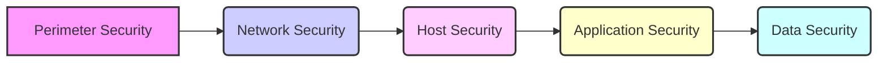

# 6.0 Security and Protection: A Comprehensive Guide

## 1. Introduction

This tutorial provides a comprehensive overview of Security and Protection concepts, focusing on practical application and best practices.  Security and protection are paramount in today's digital landscape, where data breaches, malware attacks, and other security threats are increasingly prevalent. This guide will equip you with the knowledge and skills necessary to understand and implement robust security measures in various environments.

**Why it's Important:** Security is no longer an optional add-on but a fundamental requirement. Protecting data, systems, and users from unauthorized access, modification, and destruction is crucial for maintaining trust, ensuring business continuity, and complying with regulations. A strong security posture mitigates risks, prevents financial losses, and safeguards reputation.

**Prerequisites:**  A basic understanding of computer networks, operating systems, and software development principles is helpful, but not strictly required. This tutorial is designed to be accessible to beginners while also offering valuable insights for experienced professionals. Familiarity with basic programming concepts will be beneficial for some practical examples.

**Learning Objectives:** Upon completion of this tutorial, you will be able to:

- Understand core security concepts and principles.
- Identify common security threats and vulnerabilities.
- Implement basic security measures to protect systems and data.
- Apply best practices for secure coding and system administration.
- Troubleshoot common security issues.
- Stay informed about emerging security trends and technologies.

## 2. Core Concepts

This section explores the fundamental concepts underpinning security and protection.

### 2.1 Confidentiality, Integrity, and Availability (CIA Triad)

The **CIA triad** is a cornerstone of information security. It represents three essential components of a secure system:

*   **Confidentiality:** Ensuring that information is accessible only to authorized individuals. Mechanisms include encryption, access controls, and data masking.
*   **Integrity:** Maintaining the accuracy and completeness of information. Techniques include hashing, digital signatures, and version control.
*   **Availability:** Ensuring that authorized users have reliable and timely access to information and resources. Strategies include redundancy, backups, and disaster recovery planning.

### 2.2 Authentication and Authorization

*   **Authentication:** Verifying the identity of a user or system. Common methods include passwords, multi-factor authentication (MFA), and biometric authentication.
*   **Authorization:** Determining what actions an authenticated user or system is allowed to perform. Examples include role-based access control (RBAC) and attribute-based access control (ABAC).

### 2.3 Threats and Vulnerabilities

*   **Threats:** Potential dangers that could exploit vulnerabilities and cause harm to a system or organization. Examples include malware, phishing attacks, and denial-of-service (DoS) attacks.
*   **Vulnerabilities:** Weaknesses or flaws in a system that can be exploited by a threat. Examples include software bugs, misconfigurations, and weak passwords.

### 2.4 Security Principles

*   **Least Privilege:** Granting users only the minimum level of access necessary to perform their duties.
*   **Defense in Depth:** Implementing multiple layers of security controls to protect against a wide range of threats.
*   **Fail Securely:** Designing systems to fail in a way that minimizes damage and protects sensitive information.
*   **Keep Security Simple:** Avoiding unnecessary complexity in security design and implementation.  Complex systems are often harder to secure.

### 2.5 Visual Explanation - Security Layers



> This diagram illustrates the concept of defense in depth.  Each layer provides protection, and if one layer is breached, others remain in place to defend the system.

## 3. Practical Implementation

This section demonstrates how to apply security principles in practice.

### 3.1 Password Management

*   **Example:** Implementing password policies that enforce strong passwords (e.g., minimum length, character diversity) and regular password changes.

```
# Example password policy using PAM (Pluggable Authentication Modules) on Linux
# /etc/pam.d/common-password

password        requisite                       pam_pwquality.so retry=3 minlen=12 lcredit=-1 ucredit=-1 dcredit=-1 ocredit=-1
password        sufficient                      pam_unix.so sha512 shadow nullok
```

*   **Explanation:** The `pam_pwquality.so` module enforces password complexity rules. `minlen=12` requires a minimum password length of 12 characters. The `lcredit`, `ucredit`, `dcredit`, and `ocredit` options specify the minimum number of lowercase, uppercase, digit, and other characters required, respectively. `-1` means at least one of each.  The `pam_unix.so` module then updates the user's password using SHA512 hashing and stores it securely in the shadow file.

### 3.2 File Permissions

*   **Example:** Setting appropriate file permissions to prevent unauthorized access to sensitive files.

```bash
# Example: Changing file permissions using chmod
chmod 600 sensitive_file.txt  # Owner: read/write, Group/Others: no access
chmod 755 script.sh          # Owner: read/write/execute, Group/Others: read/execute
```

*   **Explanation:** `chmod` is a command-line utility for changing file permissions on Unix-like systems. The numeric representation (e.g., 600, 755) represents the permissions for the owner, group, and others, respectively.  For example, `600` grants read and write access to the owner only, while `755` grants read, write, and execute access to the owner and read/execute access to the group and others.

### 3.3 Firewall Configuration

*   **Example:** Configuring a firewall to restrict network traffic to only necessary ports and protocols.

```
# Example firewall rules using iptables on Linux

# Allow SSH traffic (port 22)
iptables -A INPUT -p tcp --dport 22 -j ACCEPT

# Allow HTTP traffic (port 80)
iptables -A INPUT -p tcp --dport 80 -j ACCEPT

# Allow HTTPS traffic (port 443)
iptables -A INPUT -p tcp --dport 443 -j ACCEPT

# Drop all other incoming traffic
iptables -A INPUT -j DROP
```

*   **Explanation:** `iptables` is a command-line firewall utility on Linux. The `-A` option appends a new rule to the specified chain (e.g., INPUT). The `-p` option specifies the protocol (e.g., tcp). The `--dport` option specifies the destination port.  The `-j` option specifies the action to take (e.g., ACCEPT, DROP). These rules allow incoming SSH, HTTP, and HTTPS traffic while dropping all other traffic.  Tools like `ufw` can be used for simpler firewall management.

### 3.4 Secure Coding Practices

*   **Example:** Preventing SQL injection vulnerabilities by using parameterized queries.

```python
# Example: Preventing SQL injection using parameterized queries in Python

import sqlite3

db_path = "mydatabase.db"

def get_user(username):
    conn = sqlite3.connect(db_path)
    cursor = conn.cursor()
    # IMPORTANT: Use parameterized queries!
    query = "SELECT * FROM users WHERE username = ?"
    cursor.execute(query, (username,))
    user = cursor.fetchone()
    conn.close()
    return user

# Vulnerable code (DO NOT USE):
# query = "SELECT * FROM users WHERE username = '" + username + "'"

# Safe usage:
username = input("Enter username: ")
user = get_user(username)

if user:
    print("User found:", user)
else:
    print("User not found.")
```

*   **Explanation:** Parameterized queries prevent SQL injection by treating user input as data, not as part of the SQL command.  The `?` placeholder is replaced with the user input, which is properly escaped and sanitized by the database driver.  Avoid concatenating user input directly into SQL queries.

### 3.5 Common Use Cases

*   **Protecting Web Servers:** Implementing firewalls, intrusion detection systems (IDS), and web application firewalls (WAFs) to protect web servers from attacks such as SQL injection, cross-site scripting (XSS), and DDoS attacks.
*   **Securing Databases:** Encrypting sensitive data at rest and in transit, implementing access controls, and monitoring database activity to prevent unauthorized access and data breaches.
*   **Endpoint Security:** Deploying antivirus software, endpoint detection and response (EDR) solutions, and enforcing security policies on laptops, desktops, and mobile devices.

### 3.6 Best Practices

*   **Regular Security Audits:** Conducting regular security audits to identify vulnerabilities and weaknesses in systems and applications.
*   **Patch Management:** Keeping software and operating systems up-to-date with the latest security patches to address known vulnerabilities.
*   **Incident Response Planning:** Developing and testing incident response plans to effectively respond to security incidents and minimize damage.
*   **Security Awareness Training:** Providing security awareness training to employees to educate them about security threats and best practices.

## 4. Advanced Topics

This section delves into more advanced security techniques and concepts.

### 4.1 Penetration Testing

*   **Description:**  Simulating real-world attacks to identify vulnerabilities and weaknesses in a system. This involves ethical hacking techniques to assess the effectiveness of security controls.
*   **Tools:** Metasploit, Nmap, Burp Suite.
*   **Types:** Black box testing (no prior knowledge), white box testing (full knowledge), gray box testing (partial knowledge).

### 4.2 Intrusion Detection and Prevention Systems (IDPS)

*   **Description:** Monitoring network traffic and system activity for malicious behavior. IDPS can detect and prevent attacks in real time.
*   **Types:** Network-based IDPS (NIDS), host-based IDPS (HIDS).
*   **Techniques:** Signature-based detection, anomaly-based detection, behavior-based detection.
*   **Example:** Snort, Suricata.

### 4.3 Cryptography

*   **Description:** The science of encrypting and decrypting information. Essential for protecting sensitive data in transit and at rest.
*   **Types:** Symmetric-key cryptography (e.g., AES), asymmetric-key cryptography (e.g., RSA), hashing algorithms (e.g., SHA-256).
*   **Applications:** Secure communication (e.g., TLS/SSL), data encryption, digital signatures.

### 4.4 Security Information and Event Management (SIEM)

*   **Description:** Centralized platform for collecting, analyzing, and correlating security logs and events from various sources.  SIEM systems provide real-time visibility into security threats and incidents.
*   **Examples:** Splunk, QRadar, ELK Stack (Elasticsearch, Logstash, Kibana).

### 4.5 Real-World Applications

*   **Financial Industry:** Protecting sensitive financial data, preventing fraud, and complying with regulations such as PCI DSS.
*   **Healthcare Industry:** Protecting patient data, complying with HIPAA regulations, and preventing data breaches.
*   **Government Sector:** Protecting classified information, securing critical infrastructure, and preventing cyber espionage.

### 4.6 Common Challenges and Solutions

*   **Complexity:** Security systems can be complex and difficult to manage.  Solutions include using automation tools, simplifying security configurations, and outsourcing security tasks to managed security service providers (MSSPs).
*   **Evolving Threats:**  Security threats are constantly evolving.  Solutions include staying informed about emerging threats, regularly updating security systems, and conducting penetration testing.
*   **Human Error:**  Human error is a major cause of security breaches.  Solutions include providing security awareness training, enforcing security policies, and using multi-factor authentication.

### 4.7 Performance Considerations

*   **Impact on System Performance:** Security measures can sometimes impact system performance.  Solutions include optimizing security configurations, using efficient algorithms, and deploying security appliances.
*   **Load Balancing:**  Distributing traffic across multiple servers to prevent overload and ensure availability.
*   **Caching:**  Storing frequently accessed data in a cache to reduce latency and improve performance.

## 5. Advanced Topics - Cutting Edge

This section covers cutting-edge security topics and advanced techniques.

### 5.1 Zero Trust Architecture

*   **Description:** A security model based on the principle of "never trust, always verify."  Zero Trust assumes that no user or device is trusted by default, and all access requests are strictly authenticated and authorized.
*   **Key Components:** Microsegmentation, multi-factor authentication, endpoint security, data encryption, continuous monitoring.
*   **Benefits:** Reduced attack surface, improved visibility, enhanced security posture.

### 5.2 Security Orchestration, Automation, and Response (SOAR)

*   **Description:** Automating security tasks and incident response processes to improve efficiency and effectiveness.
*   **Capabilities:** Incident response automation, threat intelligence integration, security orchestration, playbook execution.
*   **Benefits:** Faster incident response, reduced manual effort, improved security operations.

### 5.3 Threat Intelligence

*   **Description:** Gathering and analyzing information about current and emerging threats to proactively defend against attacks.
*   **Sources:** Threat feeds, security blogs, vulnerability databases, security communities.
*   **Benefits:** Improved threat detection, proactive defense, better incident response.

### 5.4 Cloud Security

*   **Description:** Protecting data and applications in cloud environments.
*   **Considerations:** Data encryption, access control, network security, compliance.
*   **Tools:** Cloud security posture management (CSPM), cloud workload protection platforms (CWPP).

### 5.5 DevSecOps

*   **Description:** Integrating security into the software development lifecycle.
*   **Practices:** Security automation, continuous security testing, threat modeling, vulnerability management.
*   **Benefits:** Reduced security risks, faster development cycles, improved security posture.

### 5.6 System Design Considerations

*   **Secure Architecture:** Designing systems with security in mind from the beginning.
*   **Principle of Least Privilege:** Granting users only the minimum level of access necessary to perform their duties.
*   **Defense in Depth:** Implementing multiple layers of security controls to protect against a wide range of threats.

### 5.7 Scalability and Performance Optimization

*   **Load Balancing:** Distributing traffic across multiple servers to prevent overload and ensure availability.
*   **Caching:** Storing frequently accessed data in a cache to reduce latency and improve performance.
*   **Content Delivery Networks (CDNs):** Distributing content across multiple servers around the world to improve performance and availability.

### 5.8 Security Considerations

*   **Authentication and Authorization:** Verifying the identity of users and systems and controlling their access to resources.
*   **Data Encryption:** Protecting sensitive data at rest and in transit.
*   **Vulnerability Management:** Identifying and remediating vulnerabilities in systems and applications.

### 5.9 Integration with Other Technologies

*   **Integration with SIEM:** Integrating security tools with SIEM systems to provide centralized visibility and analysis.
*   **Integration with SOAR:** Integrating security tools with SOAR platforms to automate security tasks and incident response processes.
*   **Integration with Threat Intelligence:** Integrating security tools with threat intelligence feeds to proactively defend against attacks.

### 5.10 Advanced Patterns and Architectures

*   **Microservices Security:** Securing microservices-based applications.
*   **Serverless Security:** Securing serverless applications.
*   **Container Security:** Securing containerized applications.

### 5.11 Industry-Specific Applications

*   **Financial Services:** Protecting sensitive financial data and preventing fraud.
*   **Healthcare:** Protecting patient data and complying with HIPAA regulations.
*   **Government:** Protecting classified information and securing critical infrastructure.

## 6. Hands-on Exercises

This section provides practical exercises to reinforce your understanding of security concepts.

### 6.1 Basic Password Security

**Difficulty:** Easy

**Scenario:** You need to create a secure password for your new online banking account.

**Steps:**

1.  Choose a password that is at least 12 characters long.
2.  Include a mix of uppercase letters, lowercase letters, numbers, and symbols.
3.  Avoid using personal information such as your name, birthday, or address.
4.  Do not reuse passwords from other accounts.

**Challenge:** Generate a password that meets the following criteria using a password generator tool (e.g., [https://passwordsgenerator.net/](https://passwordsgenerator.net/)): 16 characters, includes uppercase, lowercase, numbers, and symbols.

**Sample Solution:** A password generated using the tool could be: `x9L$mR2!pZ7#jKt4`

**Common Mistakes to Watch For:**

*   Using weak passwords that are easy to guess.
*   Reusing passwords across multiple accounts.
*   Storing passwords in plain text.

### 6.2 File Permissions on Linux

**Difficulty:** Medium

**Scenario:** You have a sensitive file that contains confidential information. You want to ensure that only you can read and write the file.

**Steps:**

1.  Create a new file named `sensitive_data.txt`.
2.  Change the file permissions to `600` using the `chmod` command: `chmod 600 sensitive_data.txt`.
3.  Verify the file permissions using the `ls -l` command.

**Challenge:**  Create a script that can only be executed by the owner, read and executed by the group, and not accessible to others.

**Hints:**  Consider the correct `chmod` setting for the script.

**Sample Solution:**

```bash
# Create a simple script
echo '#!/bin/bash\necho "Hello, world!"' > my_script.sh
chmod 750 my_script.sh
ls -l my_script.sh
```

**Explanation:** `chmod 750 my_script.sh` sets the following permissions:
* Owner: Read, Write, Execute (7)
* Group: Read, Execute (5)
* Others: No access (0)

**Common Mistakes to Watch For:**

*   Setting incorrect file permissions.
*   Not understanding the meaning of different permission values.
*   Overly permissive permissions.

### 6.3 Configuring a Basic Firewall

**Difficulty:** Medium

**Scenario:** You want to configure a basic firewall on your Linux server to allow only SSH, HTTP, and HTTPS traffic.

**Steps:**

1.  Install a firewall tool such as `ufw`: `sudo apt-get install ufw` (on Debian/Ubuntu).
2.  Enable the firewall: `sudo ufw enable`
3.  Allow SSH traffic: `sudo ufw allow ssh`
4.  Allow HTTP traffic: `sudo ufw allow http`
5.  Allow HTTPS traffic: `sudo ufw allow https`
6.  Deny all other incoming traffic: `sudo ufw default deny incoming`
7.  Verify the firewall rules: `sudo ufw status`

**Challenge:** Configure `ufw` to only accept traffic from a specific IP address on port 22 (SSH).

**Hint:** Use the `ufw allow from <IP Address> to any port 22` command.

**Sample Solution:**  `sudo ufw allow from 192.168.1.100 to any port 22`

**Common Mistakes to Watch For:**

*   Not enabling the firewall after configuring the rules.
*   Allowing all traffic by default.
*   Not specifying the correct ports and protocols.

### 6.4 SQL Injection Prevention

**Difficulty:** Hard

**Scenario:**  You are building a web application that retrieves user data from a database.  You want to protect against SQL injection vulnerabilities.

**Steps:**

1.  Use a parameterized query instead of concatenating user input directly into the SQL query (as shown in Section 3.4).
2.  Sanitize user input to remove any potentially malicious characters.
3.  Enforce input validation to ensure that user input matches the expected format.

**Challenge:** Modify the Python code from Section 3.4 to include input validation.  Ensure that the username only contains alphanumeric characters.

**Hint:** Use regular expressions to validate the username.

**Sample Solution:**

```python
import sqlite3
import re

db_path = "mydatabase.db"

def get_user(username):
    conn = sqlite3.connect(db_path)
    cursor = conn.cursor()
    query = "SELECT * FROM users WHERE username = ?"
    cursor.execute(query, (username,))
    user = cursor.fetchone()
    conn.close()
    return user

username = input("Enter username: ")

# Input validation using regular expressions
if not re.match("^[a-zA-Z0-9]+$", username):
    print("Invalid username.  Only alphanumeric characters are allowed.")
else:
    user = get_user(username)

    if user:
        print("User found:", user)
    else:
        print("User not found.")
```

**Common Mistakes to Watch For:**

*   Concatenating user input directly into SQL queries.
*   Not sanitizing or validating user input.
*   Using weak database credentials.

### 6.5 Project Ideas for Practice

1.  **Secure Web Server:** Set up a web server (e.g., Apache or Nginx) and configure it with SSL/TLS, a firewall, and intrusion detection system.
2.  **Vulnerability Scanner:** Develop a simple vulnerability scanner that can identify common vulnerabilities in web applications.
3.  **Password Manager:** Create a password manager that securely stores and manages passwords.
4.  **Intrusion Detection System:** Build a basic intrusion detection system that can detect malicious activity on a network.

## 7. Best Practices and Guidelines

This section outlines best practices for maintaining a secure environment.

*   **Industry-Standard Conventions:** Adhere to industry-standard security conventions such as the OWASP Top Ten for web application security and the NIST Cybersecurity Framework.
*   **Code Quality and Maintainability:** Write clean, well-documented code that is easy to understand and maintain. This reduces the likelihood of introducing vulnerabilities.
*   **Performance Optimization Guidelines:** Optimize security configurations and algorithms to minimize the impact on system performance.
*   **Security Best Practices:**
    *   Implement the principle of least privilege.
    *   Use strong passwords and multi-factor authentication.
    *   Regularly update software and operating systems.
    *   Monitor system activity for suspicious behavior.
    *   Conduct regular security audits and penetration testing.
*   **Scalability Considerations:** Design security systems that can scale to meet the growing demands of the organization.
*   **Testing and Documentation:** Thoroughly test security controls and document security policies and procedures.
*   **Team Collaboration Aspects:** Foster a culture of security awareness and collaboration among all team members.

## 8. Troubleshooting and Common Issues

This section provides guidance on troubleshooting common security issues.

*   **Common Problems and Solutions:**
    *   **Weak Passwords:** Enforce strong password policies and provide password management tools.
    *   **Unpatched Systems:** Implement a patch management process to keep systems up-to-date.
    *   **Malware Infections:** Deploy antivirus software and intrusion detection systems.
    *   **Data Breaches:** Implement data encryption and access controls.
*   **Debugging Strategies:**
    *   Review security logs for error messages and suspicious activity.
    *   Use network analysis tools to monitor network traffic.
    *   Use debugging tools to analyze code and identify vulnerabilities.
*   **Performance Bottlenecks:**
    *   Identify performance bottlenecks by monitoring system resources.
    *   Optimize security configurations and algorithms.
    *   Upgrade hardware resources.
*   **Error Messages and Their Meaning:**
    *   Understand the meaning of common error messages related to security issues.
    *   Consult documentation and online resources for help.
*   **Edge Cases to Consider:**
    *   Consider edge cases when designing and implementing security controls.
    *   Test security controls under different scenarios.
*   **Tools and Techniques for Diagnosis:**
    *   Use vulnerability scanners to identify vulnerabilities.
    *   Use penetration testing tools to simulate attacks.
    *   Use log analysis tools to analyze security logs.

## 9. Conclusion and Next Steps

This tutorial has provided a comprehensive overview of security and protection concepts, practical implementation techniques, and best practices.  By understanding these concepts and applying them in practice, you can significantly improve the security posture of your systems and data.

*   **Comprehensive Summary of Key Concepts:** Remember the CIA triad, authentication and authorization, threats and vulnerabilities, and core security principles. Defense in depth is critical.
*   **Practical Application Guidelines:** Implement strong password policies, configure firewalls, secure file permissions, and use parameterized queries.
*   **Advanced Learning Resources:**
    *   OWASP (Open Web Application Security Project): [https://owasp.org/](https://owasp.org/)
    *   SANS Institute: [https://www.sans.org/](https://www.sans.org/)
    *   NIST (National Institute of Standards and Technology): [https://www.nist.gov/](https://www.nist.gov/)
*   **Related Topics to Explore:**
    *   Network Security
    *   Cloud Security
    *   Cryptography
    *   Ethical Hacking
*   **Community Resources and Forums:**
    *   Stack Overflow: [https://stackoverflow.com/](https://stackoverflow.com/)
    *   Reddit: r/security, r/netsec
*   **Latest Trends and Future Directions:** Stay informed about emerging security trends such as artificial intelligence (AI) in security, blockchain security, and quantum cryptography.
*   **Career Opportunities and Applications:** Security professionals are in high demand. Consider pursuing careers in cybersecurity, ethical hacking, penetration testing, and security engineering. Understanding these concepts is crucial for roles in software development, system administration, and IT management.
