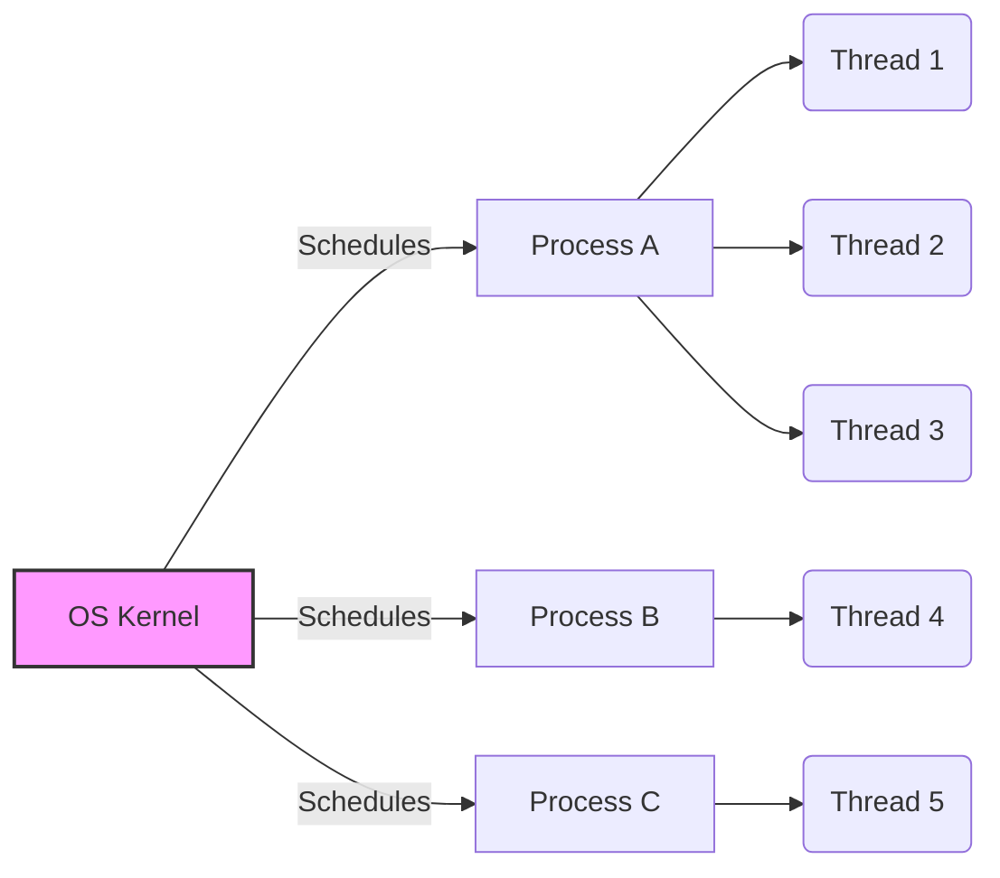

# 3.1 Processes and Threads: A Comprehensive Tutorial

## 1. Introduction

This tutorial provides a comprehensive overview of **processes** and **threads**, fundamental concepts in operating systems and concurrent programming. Understanding these concepts is crucial for developing efficient, responsive, and scalable applications, especially in today's multi-core processor environments.

**Why it's important:**

*   **Concurrency:** Enables multiple tasks to appear to run simultaneously, improving responsiveness and throughput.
*   **Resource utilization:** Allows better utilization of CPU and other system resources.
*   **Scalability:** Provides a foundation for building applications that can scale to handle increasing workloads.
*   **Responsiveness:** Keeps applications responsive by offloading long-running tasks to separate execution units.

**Prerequisites:**

*   Basic understanding of operating system concepts.
*   Familiarity with at least one programming language (e.g., C, C++, Java, Python).

**Learning objectives:**

*   Understand the differences between processes and threads.
*   Learn how to create and manage processes and threads.
*   Grasp the concepts of concurrency and parallelism.
*   Identify common concurrency issues like race conditions and deadlocks.
*   Implement synchronization mechanisms to avoid these issues.
*   Optimize application performance using multi-threading and multi-processing.

## 2. Core Concepts

### 2.1 Processes

A **process** is an instance of a program in execution. It is a self-contained execution environment with its own address space, resources (e.g., memory, file handles), and security context. Each process has its own set of instructions, data, and stack.

**Key terminology:**

*   **Process ID (PID):** A unique identifier for each process in the system.
*   **Process Control Block (PCB):** A data structure maintained by the operating system that stores information about a process, such as its state, PID, priority, and resource allocation.
*   **Context switching:** The process of saving the state of one process and restoring the state of another process so that execution can continue from the same point later.

**Fundamental principles:**

*   Processes provide **isolation**. One process cannot directly access the memory or resources of another process without explicit mechanisms like inter-process communication (IPC).
*   Processes are **heavyweight**. Creating and managing processes is relatively expensive in terms of time and resources compared to threads.
*   Processes can be in various states, such as: `New`, `Ready`, `Running`, `Waiting`, and `Terminated`.

### 2.2 Threads

A **thread** is a lightweight unit of execution within a process. Multiple threads can exist within a single process, sharing the same address space, code, and data. Threads are often referred to as lightweight processes.

**Key terminology:**

*   **Thread ID (TID):** A unique identifier for each thread within a process.
*   **Thread Control Block (TCB):** A data structure similar to PCB, but for threads. It stores thread-specific information like its state, TID, and stack pointer.
*   **Context switching (between threads):**  Switching execution between threads within the same process is faster than switching between processes because threads share the same address space.

**Fundamental principles:**

*   Threads provide **concurrency**. Multiple threads within a process can execute concurrently, potentially improving performance and responsiveness.
*   Threads are **lightweight**. Creating and managing threads is less expensive than creating and managing processes.
*   Threads share the same memory space, which can lead to **concurrency issues** if not properly synchronized.
*   Threads can also be in various states similar to Processes: `New`, `Ready`, `Running`, `Waiting`, and `Terminated`.

### 2.3 Visual Explanation



The above diagram shows three processes (A, B, C) each containing one or more threads.  The Operating System Kernel is responsible for scheduling the execution of these processes.

### 2.4 Relationship

Threads are a subset of Processes.  A process *contains* one or more threads. Processes provide resource isolation, while threads within a process share resources.

## 3. Practical Implementation

This section demonstrates how to create and manage processes and threads using code examples in Python.

### 3.1 Processes in Python

Python's `multiprocessing` module provides a way to create and manage processes.

```python
import multiprocessing
import time

def worker(num):
    """worker function"""
    print('Worker:', num)
    time.sleep(2) # Simulate a long running task
    print('Worker Done:', num)


if __name__ == '__main__':
    jobs = []
    for i in range(5):
        p = multiprocessing.Process(target=worker, args=(i,))
        jobs.append(p)
        p.start()

    for job in jobs:
        job.join()  # Wait for all processes to complete

    print("Done")
```

**Explanation:**

1.  `import multiprocessing`: Imports the necessary module.
2.  `worker(num)`: A function that represents the task to be executed by each process.
3.  `multiprocessing.Process(target=worker, args=(i,))`: Creates a new process that will execute the `worker` function with the argument `i`.
4.  `p.start()`: Starts the process.
5.  `p.join()`: Waits for the process to complete before continuing.

**Common use cases:**

*   CPU-bound tasks: Tasks that require a lot of processing power, such as image processing, scientific computations, and data analysis.
*   Parallel processing: Distributing tasks across multiple cores to improve performance.

**Best practices:**

*   Use the `if __name__ == '__main__':` guard to prevent recursive process creation on some operating systems.
*   Consider using a process pool for managing a large number of processes.
*   Be aware of the overhead of creating and managing processes.

### 3.2 Threads in Python

Python's `threading` module provides a way to create and manage threads.

```python
import threading
import time

def worker(num):
    """worker function"""
    print('Thread:', num)
    time.sleep(2) # Simulate a long running task
    print('Thread Done:', num)

if __name__ == "__main__":
    threads = []
    for i in range(5):
        t = threading.Thread(target=worker, args=(i,))
        threads.append(t)
        t.start()

    for t in threads:
        t.join()

    print("Done")
```

**Explanation:**

1.  `import threading`: Imports the necessary module.
2.  `worker(num)`: A function that represents the task to be executed by each thread.
3.  `threading.Thread(target=worker, args=(i,))`: Creates a new thread that will execute the `worker` function with the argument `i`.
4.  `t.start()`: Starts the thread.
5.  `t.join()`: Waits for the thread to complete before continuing.

**Common use cases:**

*   I/O-bound tasks: Tasks that spend a lot of time waiting for input/output operations, such as network requests, file reads/writes, and user input.
*   GUI applications: Keeping the user interface responsive while performing background tasks.

**Best practices:**

*   Use synchronization mechanisms like locks and semaphores to protect shared resources.
*   Avoid long-running computations in the main thread to prevent the application from becoming unresponsive.
*   Be aware of the Global Interpreter Lock (GIL) in Python's CPython implementation, which can limit the true parallelism of threads for CPU-bound tasks.

### 3.3 Synchronization

When multiple threads access shared resources, it's crucial to use synchronization mechanisms to prevent race conditions and other concurrency issues. Python's `threading` module provides several synchronization primitives.

```python
import threading
import time

# Shared resource
counter = 0
lock = threading.Lock()  # Create a lock

def increment_counter():
    global counter
    for _ in range(100000):
        with lock: # Acquire lock before modifying shared resource and release after
            counter += 1

if __name__ == "__main__":
    threads = []
    for _ in range(5):
        t = threading.Thread(target=increment_counter)
        threads.append(t)
        t.start()

    for t in threads:
        t.join()

    print("Final counter value:", counter)
```

**Explanation:**

1.  `threading.Lock()`: Creates a lock object.
2.  `lock.acquire()`: Acquires the lock, blocking other threads from accessing the shared resource until the lock is released.
3.  `lock.release()`: Releases the lock, allowing other threads to acquire it.
4.  `with lock:`:  A `context manager` is used for more readable code. It automatically acquires the lock at the beginning of the block and releases it at the end, even if exceptions occur.

**Other synchronization primitives:**

*   **Semaphore:** Controls access to a shared resource by limiting the number of threads that can access it concurrently.
*   **Condition:** Allows threads to wait for a specific condition to be met before proceeding.
*   **Event:** Allows one thread to signal an event to other waiting threads.

## 4. Advanced Topics

### 4.1 Advanced Techniques

*   **Process Pools:**  Using `multiprocessing.Pool` to manage a group of worker processes.  This simplifies task distribution and result collection.
*   **Thread Pools:** Using `concurrent.futures.ThreadPoolExecutor` to manage a pool of threads, similar to process pools.
*   **Asynchronous Programming (asyncio):** A single-threaded concurrency model that uses coroutines to achieve concurrency.  Useful for I/O-bound operations where blocking can be avoided.  While not strictly threading, it is often used in a similar fashion to threads.
*   **Inter-Process Communication (IPC):**  Mechanisms for processes to communicate with each other, such as pipes, queues, shared memory, and sockets.

### 4.2 Real-World Applications

*   **Web servers:** Handling multiple client requests concurrently using threads or processes.
*   **Database systems:**  Processing multiple queries concurrently using threads or processes.
*   **Game development:**  Using threads for tasks such as rendering, physics simulation, and AI.
*   **Image and video processing:**  Parallelizing image and video processing tasks across multiple cores.
*   **Machine learning:** Training machine learning models in parallel using multiple GPUs.

### 4.3 Common Challenges and Solutions

*   **Race conditions:** Occur when multiple threads access and modify shared data concurrently, leading to unpredictable results.  **Solution:** Use synchronization mechanisms like locks to protect shared resources.
*   **Deadlocks:** Occur when two or more threads are blocked indefinitely, waiting for each other to release resources.  **Solution:** Avoid circular dependencies in resource acquisition.
*   **Starvation:** Occurs when a thread is repeatedly denied access to a resource. **Solution:** Use fair scheduling algorithms and priority inversion techniques.

### 4.4 Performance Considerations

*   **Overhead of context switching:**  Switching between processes or threads has overhead.  Minimize context switching by optimizing task granularity.
*   **False sharing:** Occurs when threads access different data items that reside in the same cache line, leading to unnecessary cache invalidations.  **Solution:**  Ensure that threads access data items that are located in different cache lines.
*   **GIL limitations (Python):** The Global Interpreter Lock (GIL) in CPython limits true parallelism for CPU-bound tasks.  **Solution:** Use multi-processing instead of multi-threading for CPU-bound tasks or use alternative Python implementations without a GIL (e.g., Jython, IronPython).

## 5. Advanced System Design Considerations

### 5.1 Cutting-Edge Techniques and Approaches

*   **Actor Model:** A concurrency model where actors (lightweight processes) communicate by passing messages. This simplifies concurrency management and reduces the risk of race conditions. Examples include Akka and Erlang.
*   **Reactive Programming:** A programming paradigm that focuses on asynchronous data streams and the propagation of change. It can be used to build highly responsive and scalable systems. Examples include RxJava and Reactor.
*   **Fiber/Coroutine-based concurrency:** Fibers (also known as coroutines or green threads) are even lighter-weight than threads and can be implemented in user space. This allows for very high concurrency with minimal overhead. Examples include Go's goroutines and Kotlin's coroutines.

### 5.2 Complex Real-World Applications

*   **Massively parallel data processing:** Using frameworks like Apache Spark and Hadoop to process large datasets in parallel across a cluster of machines.
*   **High-frequency trading systems:** Developing low-latency, high-throughput systems that can handle thousands of transactions per second using concurrent programming techniques.
*   **Distributed systems:** Building fault-tolerant, scalable systems that can run across multiple machines using distributed concurrency models.

### 5.3 System Design Considerations

*   **Choosing between processes and threads:**  Consider the trade-offs between isolation, resource sharing, and overhead.  Processes provide better isolation but have higher overhead. Threads offer lower overhead but require careful synchronization.
*   **Concurrency design patterns:**  Use established concurrency design patterns like the producer-consumer pattern, the reader-writer pattern, and the monitor pattern to simplify concurrency management.
*   **Fault tolerance:** Design systems to be resilient to failures. Use techniques like replication, redundancy, and failover to ensure that the system remains available even when some components fail.

### 5.4 Scalability and Performance Optimization

*   **Load balancing:** Distribute workload evenly across multiple processes or threads to improve performance and scalability.
*   **Caching:** Use caching to reduce the load on backend systems and improve response times.
*   **Asynchronous operations:** Use asynchronous operations to avoid blocking the main thread and improve responsiveness.
*   **Profiling and performance monitoring:** Use profiling tools to identify performance bottlenecks and optimize code.

### 5.5 Security Considerations

*   **Data races:** Protect shared data from race conditions using appropriate synchronization mechanisms.
*   **Deadlocks:** Avoid deadlocks by carefully designing resource acquisition strategies.
*   **Security vulnerabilities:** Be aware of security vulnerabilities that can arise from concurrent programming, such as buffer overflows and format string vulnerabilities.

### 5.6 Integration with Other Technologies

*   **Databases:** Integrate concurrent applications with databases using connection pooling and transaction management techniques.
*   **Message queues:** Use message queues like RabbitMQ and Kafka to decouple components and enable asynchronous communication.
*   **Cloud platforms:** Deploy concurrent applications to cloud platforms like AWS, Azure, and Google Cloud to take advantage of scalability and elasticity.

### 5.7 Advanced Patterns and Architectures

*   **Microservices architecture:** Building applications as a collection of small, independent services that communicate with each other over a network.
*   **Event-driven architecture:** Building applications that respond to events in real-time.
*   **CQRS (Command Query Responsibility Segregation):** Separating read and write operations to optimize performance and scalability.

### 5.8 Industry-Specific Applications

*   **Financial services:** Developing high-frequency trading systems, risk management systems, and payment processing systems using concurrent programming techniques.
*   **Telecommunications:** Building scalable and reliable communication systems using concurrent programming techniques.
*   **Healthcare:** Developing medical imaging systems, electronic health record systems, and telemedicine applications using concurrent programming techniques.

## 6. Hands-on Exercises

These exercises are designed to progressively build your understanding of processes and threads.

### 6.1 Basic Thread Creation (Easy)

**Problem:** Create a program that creates and starts 3 threads. Each thread should print its ID and sleep for 1 second.

**Hints:** Use the `threading` module. Remember to use `t.join()` to wait for the threads to finish.

### 6.2 Shared Resource (Medium)

**Problem:** Create a program with two threads. Both threads should increment a shared counter variable 100,000 times. Without synchronization, the final counter value will likely be incorrect. Implement a lock to protect the counter and ensure the final value is 200,000.

**Hints:** Use `threading.Lock()` to create a lock and `with lock:` to acquire and release the lock.

### 6.3 Process Communication (Hard)

**Problem:** Create two processes. One process should send a message to the other process using a `multiprocessing.Queue`. The receiving process should print the message.

**Hints:** Use `multiprocessing.Queue` to create a queue for inter-process communication. Use `q.put()` to send a message and `q.get()` to receive a message.

### 6.4 Challenge Exercise: Producer-Consumer

**Problem:** Implement a producer-consumer problem using threads and a queue. The producer thread should generate random numbers and add them to the queue. The consumer thread should consume numbers from the queue and print them. Use a `threading.Condition` to synchronize the producer and consumer threads.

**Hints:**

*   Use `threading.Condition` to signal the consumer when there are items in the queue and to signal the producer when there is space in the queue.
*   Use `condition.wait()` to wait for a signal and `condition.notify()` to send a signal.

### 6.5 Project Ideas

*   **Web scraper:** Create a multi-threaded web scraper to download data from multiple websites concurrently.
*   **Image processor:** Create a multi-process image processor to perform image transformations in parallel.
*   **Chat server:** Create a multi-threaded chat server that can handle multiple client connections concurrently.

### 6.6 Sample Solutions (Available upon Request)

Contact me for sample solutions to the above exercises.

### 6.7 Common Mistakes to Watch For

*   **Forgetting to use synchronization:**  Failing to protect shared resources with locks or other synchronization mechanisms can lead to race conditions.
*   **Deadlocks:** Creating circular dependencies in resource acquisition can lead to deadlocks.
*   **Incorrect queue usage:** Not handling queue exceptions or using the wrong queue methods can lead to errors.
*   **Ignoring the GIL:** In Python, not being aware of the GIL and using multi-threading for CPU-bound tasks when multi-processing would be more effective.

## 7. Best Practices and Guidelines

### 7.1 Industry-Standard Conventions

*   Follow PEP 8 style guide for Python code.
*   Use descriptive variable names and comments.
*   Use consistent naming conventions for threads and processes.

### 7.2 Code Quality and Maintainability

*   Write modular and reusable code.
*   Use appropriate data structures and algorithms.
*   Keep functions short and focused.
*   Write unit tests to verify the correctness of your code.

### 7.3 Performance Optimization Guidelines

*   Profile your code to identify performance bottlenecks.
*   Use appropriate data structures and algorithms.
*   Minimize context switching.
*   Use caching to reduce the load on backend systems.
*   Use asynchronous operations to avoid blocking the main thread.

### 7.4 Security Best Practices

*   Protect shared data from race conditions using appropriate synchronization mechanisms.
*   Avoid deadlocks by carefully designing resource acquisition strategies.
*   Be aware of security vulnerabilities that can arise from concurrent programming.

### 7.5 Scalability Considerations

*   Design systems to be scalable by distributing workload across multiple processes or threads.
*   Use load balancing to distribute workload evenly across multiple servers.
*   Use caching to reduce the load on backend systems.
*   Use asynchronous operations to avoid blocking the main thread.

### 7.6 Testing and Documentation

*   Write unit tests to verify the correctness of your code.
*   Write integration tests to verify that different components of your system work together correctly.
*   Write clear and concise documentation.

### 7.7 Team Collaboration Aspects

*   Use version control to manage your code.
*   Use code reviews to ensure code quality.
*   Communicate effectively with your team members.

## 8. Troubleshooting and Common Issues

### 8.1 Common Problems and Solutions

*   **Race conditions:** Use locks or other synchronization mechanisms to protect shared resources.
*   **Deadlocks:** Avoid circular dependencies in resource acquisition.
*   **Starvation:** Use fair scheduling algorithms and priority inversion techniques.
*   **Performance bottlenecks:** Profile your code to identify performance bottlenecks and optimize code.

### 8.2 Debugging Strategies

*   Use a debugger to step through your code and inspect variables.
*   Use logging to track the execution of your code.
*   Use assertions to verify that your code is behaving as expected.
*   Use profiling tools to identify performance bottlenecks.

### 8.3 Performance Bottlenecks

*   I/O-bound tasks: Use asynchronous operations to avoid blocking the main thread.
*   CPU-bound tasks: Use multi-processing to parallelize tasks across multiple cores.
*   Memory-bound tasks: Optimize memory usage to reduce the load on the memory system.

### 8.4 Error Messages and Their Meaning

Consult the documentation for your programming language and operating system for information about error messages and their meaning.

### 8.5 Edge Cases to Consider

*   **Empty queues:** Handle the case where a queue is empty when a thread tries to consume an item.
*   **Full queues:** Handle the case where a queue is full when a thread tries to add an item.
*   **Thread termination:** Handle the case where a thread is terminated unexpectedly.

### 8.6 Tools and Techniques for Diagnosis

*   **Profilers:** Tools like `cProfile` (Python) to identify performance bottlenecks.
*   **Debuggers:** Tools like `pdb` (Python) to step through code and inspect variables.
*   **System monitoring tools:** Tools like `top` (Linux) and `Activity Monitor` (macOS) to monitor system resource usage.

## 9. Conclusion and Next Steps

### 9.1 Comprehensive Summary of Key Concepts

This tutorial covered the fundamental concepts of processes and threads, including their definitions, differences, creation, management, synchronization, and common issues.

### 9.2 Practical Application Guidelines

*   Use processes for CPU-bound tasks that require isolation.
*   Use threads for I/O-bound tasks that benefit from shared memory.
*   Use synchronization mechanisms to protect shared resources.
*   Avoid deadlocks by carefully designing resource acquisition strategies.
*   Profile your code to identify performance bottlenecks and optimize code.

### 9.3 Advanced Learning Resources

*   Operating System Concepts by Silberschatz, Galvin, and Gagne
*   Concurrent Programming in Java: Design Principles and Patterns by Doug Lea
*   The Art of Concurrency: A Handbook of System Programming by Clay Breshears

### 9.4 Related Topics to Explore

*   Concurrency control
*   Distributed systems
*   Parallel computing
*   Real-time operating systems

### 9.5 Community Resources and Forums

*   Stack Overflow
*   Reddit (r/programming, r/learnprogramming)
*   Online forums for specific programming languages and libraries.

### 9.6 Latest Trends and Future Directions

*   **Asynchronous programming:** The increasing popularity of asynchronous programming models like `asyncio` in Python.
*   **Actor model:** The growing adoption of the actor model for building concurrent and distributed systems.
*   **Reactive programming:** The rise of reactive programming for building highly responsive and scalable systems.

### 9.7 Career Opportunities and Applications

Understanding processes and threads is essential for a wide range of software engineering roles, including:

*   Operating systems developers
*   Systems programmers
*   Application developers
*   Database administrators
*   Cloud engineers
*   Embedded systems engineers
