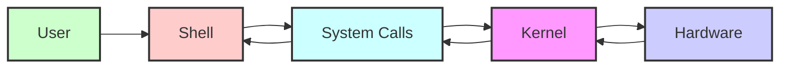

# 2.1 What is an Operating System?

## 1. Introduction

This tutorial will delve into the foundational concept of an **Operating System (OS)**. We will explore what an OS is, its crucial role in modern computing, and how it interacts with both hardware and software. Understanding the OS is fundamental for anyone involved in software development, system administration, or even general computer use.

**Why it's important:** The OS is the bedrock upon which all applications run. A solid understanding of its functions and limitations empowers you to write more efficient code, troubleshoot system issues, and make informed decisions about hardware and software choices.

**Prerequisites:** Basic computer literacy and familiarity with fundamental computing concepts like hardware, software, and file systems are helpful.

**Learning objectives:** By the end of this tutorial, you will be able to:

*   Define what an Operating System is.
*   Identify the core functions of an OS.
*   Understand the relationship between the OS, hardware, and applications.
*   Differentiate between various types of Operating Systems.
*   Recognize the importance of the OS in overall system performance and security.

## 2. Core Concepts

### Key Theoretical Foundations

An **Operating System (OS)** is system software that manages computer hardware, software resources, and provides common services for computer programs.  It acts as an intermediary between the user and the computer hardware.  Without an OS, application programs would have to directly manage all hardware resources, a complex and error-prone task.

Think of the OS as the conductor of an orchestra. The orchestra represents the computer's hardware (CPU, memory, storage, etc.), and the musicians are the applications. The conductor ensures each instrument (application) plays its part in harmony, avoiding conflicts and maximizing overall performance.

### Important Terminology

*   **Kernel:** The core of the OS, responsible for managing system resources and providing low-level services.
*   **Shell:** A user interface that allows users to interact with the OS, typically through a command-line interface (CLI) or a graphical user interface (GUI).
*   **System Calls:**  The programming interface through which applications request services from the OS kernel.
*   **Process:** An instance of a computer program that is being executed.
*   **Thread:** A lightweight unit of execution within a process.
*   **Memory Management:** The OS's responsibility for allocating and managing computer memory.
*   **File System:** The hierarchical structure used to organize and store files on a storage device.
*   **Device Drivers:** Software that enables the OS to communicate with specific hardware devices.
*   **Virtualization:** Creating a virtual (rather than actual) version of something, such as a hardware platform, operating system, storage device, or network resources.
*   **Multitasking:** The ability of an OS to execute multiple processes concurrently.

### Fundamental Principles

The OS operates based on several fundamental principles:

*   **Resource Management:**  The OS allocates and manages system resources such as CPU time, memory, and storage space among competing processes.
*   **Abstraction:** The OS provides a simplified interface to complex hardware, allowing applications to interact with hardware without needing to know the intricate details of its operation.
*   **Protection:** The OS protects system resources and user data from unauthorized access and interference.
*   **Fault Tolerance:** The OS attempts to handle errors and exceptions gracefully, preventing system crashes and data loss.
*   **Concurrency:**  The OS allows multiple processes to execute seemingly simultaneously, improving system throughput.

### Visual Explanation



This diagram illustrates the basic interaction flow: a user interacts with the `Shell`, which uses `System Calls` to request services from the `Kernel`. The `Kernel` then interacts directly with the `Hardware`.

## 3. Practical Implementation

While we cannot "implement" an entire OS in this tutorial due to its complexity, we can demonstrate how applications interact with the OS through system calls. We will use Python for these examples, leveraging the `os` module, which provides access to operating system functionalities.

### Step-by-step Examples

**Example 1: Getting the Process ID (PID)**

```python
import os

pid = os.getpid()
print(f"The process ID is: {pid}")
```

**Explanation:** This code snippet uses the `os.getpid()` function, a system call wrapper, to retrieve the current process's ID.  The OS kernel provides this information.

**Example 2: Listing Files in a Directory**

```python
import os

directory_path = "."  # Current directory
files = os.listdir(directory_path)

print(f"Files in directory '{directory_path}':")
for file in files:
    print(file)
```

**Explanation:** The `os.listdir()` function returns a list of files and directories within the specified path.  This function interacts with the file system, which is managed by the OS.

**Example 3: Creating a Directory**

```python
import os

new_directory = "new_folder"

try:
    os.mkdir(new_directory)
    print(f"Directory '{new_directory}' created successfully.")
except FileExistsError:
    print(f"Directory '{new_directory}' already exists.")
```

**Explanation:** `os.mkdir()` attempts to create a new directory.  The OS handles the allocation of storage space and updates the file system metadata. The `try...except` block demonstrates handling a common error condition.

### Common Use Cases

*   **File Management:** Creating, deleting, renaming, and organizing files and directories.
*   **Process Management:** Launching, terminating, and monitoring processes.
*   **Networking:** Sending and receiving data over a network.
*   **Security:** Controlling access to system resources and protecting against malware.

### Best Practices

*   **Error Handling:** Always handle potential errors that can occur when interacting with the OS (e.g., file not found, permission denied).
*   **Resource Management:**  Release resources (e.g., file handles, network connections) when they are no longer needed to prevent resource leaks.
*   **Security Awareness:** Be mindful of security vulnerabilities when using OS functionalities, especially when handling user input or network data.

## 4. Advanced Topics

### Advanced Techniques

*   **Inter-Process Communication (IPC):** Mechanisms for processes to communicate and synchronize with each other (e.g., pipes, shared memory, message queues).
*   **Virtual Memory:**  A memory management technique that allows processes to use more memory than is physically available by swapping portions of memory to disk.
*   **Scheduling Algorithms:**  Algorithms used by the OS to determine which process should be executed at any given time (e.g., First-Come, First-Served, Shortest Job First, Priority Scheduling, Round Robin).

### Real-World Applications

*   **Real-time Operating Systems (RTOS):** Used in embedded systems where timing constraints are critical (e.g., industrial control systems, robotics, medical devices). These systems guarantee response within strict deadlines.
*   **Cloud Computing:** Cloud platforms rely heavily on virtualization and OS-level resource management to provide scalable and reliable services.
*   **Mobile Operating Systems:**  Mobile OSes like Android and iOS are designed to be resource-efficient and user-friendly.

### Common Challenges and Solutions

*   **Deadlock:** A situation where two or more processes are blocked indefinitely, waiting for each other to release resources.  Solutions include deadlock prevention, avoidance, detection, and recovery.
*   **Memory Leaks:**  Occur when memory is allocated but never freed, leading to performance degradation.  Using memory profiling tools and proper memory management techniques can mitigate this.
*   **Security Vulnerabilities:** Exploitable weaknesses in the OS or applications that can be used by attackers. Regular security updates and penetration testing are crucial.

### Performance Considerations

*   **Context Switching:** The overhead associated with switching between processes. Minimizing context switching can improve performance.
*   **Memory Allocation:** Efficient memory allocation and deallocation algorithms can reduce memory fragmentation and improve performance.
*   **Disk I/O:**  Optimizing disk I/O operations can significantly improve performance, especially for I/O-bound applications.
*   **CPU Utilization:**  Monitor CPU utilization to identify performance bottlenecks. Use profiling tools to pinpoint CPU-intensive code.

## 5. Advanced Topics

### Cutting-edge techniques and approaches

*   **Microkernels:**  A minimal kernel design where most OS services are implemented as user-level processes.  This improves modularity and security.
*   **Unikernels:**  Specialized OS kernels that are built specifically for a single application.  They are highly optimized and secure but lack the flexibility of general-purpose OSes.
*   **Containerization (Docker, Kubernetes):** A form of operating system virtualization, through which applications are run in isolated *containers* using a shared operating system kernel.
*   **Serverless Computing (AWS Lambda, Azure Functions):** Cloud computing execution model in which the cloud provider dynamically manages the allocation of machine resources.

### Complex real-world applications

*   **High-Performance Computing (HPC):** Operating systems for supercomputers, often requiring specialized scheduling and resource management techniques.
*   **Big Data Processing:** Operating systems optimized for handling massive datasets, often used in conjunction with distributed computing frameworks like Hadoop and Spark.
*   **Cybersecurity:** Operating systems hardened against attacks, used in security-sensitive environments.

### System design considerations

*   **Modularity:** Designing the OS as a collection of independent modules makes it easier to maintain and extend.
*   **Scalability:**  Designing the OS to handle increasing workloads and user demands.
*   **Portability:**  Designing the OS to run on different hardware platforms.

### Scalability and performance optimization

*   **Load Balancing:** Distributing workloads across multiple servers to prevent overload.
*   **Caching:** Storing frequently accessed data in memory to reduce disk I/O.
*   **Concurrency Control:**  Mechanisms for managing concurrent access to shared resources, such as locks and semaphores.

### Security considerations

*   **Access Control:** Controlling who can access system resources.
*   **Authentication:** Verifying the identity of users and processes.
*   **Encryption:** Protecting data from unauthorized access.
*   **Intrusion Detection:** Detecting and responding to security threats.

### Integration with other technologies

*   **Databases:** Operating systems must efficiently manage database workloads.
*   **Networking:** Operating systems provide networking capabilities and must integrate with network protocols.
*   **Virtualization:** Operating systems are often used to host virtual machines.
*   **Cloud Computing:** Modern operating systems are designed to be deployed in cloud environments.

### Advanced patterns and architectures

*   **Event-driven architectures:**  Systems that respond to events, such as user input or sensor data.
*   **Service-oriented architectures (SOA):** Systems built as a collection of loosely coupled services.
*   **Microservices architectures:**  A more granular form of SOA where applications are built as a collection of small, independent services.

### Industry-specific applications

*   **Aerospace:**  Operating systems used in aircraft and spacecraft.
*   **Automotive:**  Operating systems used in cars and trucks.
*   **Healthcare:**  Operating systems used in medical devices.
*   **Financial Services:** Operating systems used in trading platforms and banking systems.

## 6. Hands-on Exercises

### Progressive difficulty levels

**Beginner:**

1.  **List Environment Variables:** Write a Python script to list all the environment variables available in your system.  Use the `os.environ` dictionary.
2.  **Check File Existence:** Write a Python script to check if a file exists at a given path. Use `os.path.exists()`.

**Intermediate:**

1.  **Rename a File:** Write a Python script to rename a file from one name to another. Use `os.rename()`. Handle potential errors (e.g., file not found, permission denied).
2.  **Get File Metadata:** Write a Python script to get file metadata (e.g., size, modification time).  Use `os.stat()`.

**Advanced:**

1.  **Create a Process:** Write a Python script that creates a new process using `os.fork()` (Unix-like systems) or `subprocess.Popen()` (cross-platform).
2.  **Implement Simple File Locking:**  Implement a simple file locking mechanism using `fcntl` (Unix-like) or `msvcrt` (Windows) modules to prevent concurrent access to a file.

### Real-world scenario-based problems

Imagine you are building a log analysis tool. You need to:

1.  **Read Log Files:** Open and read the content of log files.
2.  **Search for Patterns:** Search for specific patterns (e.g., error messages) within the log files.
3.  **Write Results:** Write the results (e.g., lines containing error messages) to a new file.

### Step-by-step guided exercises

**Exercise: Read a Log File and Search for Errors**

1.  **Create a Sample Log File:** Create a text file named `sample.log` with some sample log entries, including some lines with the word "ERROR".
2.  **Write the Python Script:**

```python
import os

log_file_path = "sample.log"
error_log_path = "error.log"

try:
    with open(log_file_path, "r") as log_file, open(error_log_path, "w") as error_log:
        for line in log_file:
            if "ERROR" in line:
                error_log.write(line)
    print(f"Error messages written to '{error_log_path}'")

except FileNotFoundError:
    print(f"Error: Log file '{log_file_path}' not found.")
except Exception as e:
    print(f"An error occurred: {e}")
```

3.  **Run the Script:** Execute the script. It will read the `sample.log` file, search for lines containing "ERROR", and write those lines to `error.log`.

### Challenge exercises with hints

1.  **Modify the Log Analysis Tool:** Enhance the log analysis tool to:
    *   Take the log file path and the error keyword as command-line arguments.  (Hint: Use the `argparse` module).
    *   Implement error handling for invalid command-line arguments.
    *   Add a timestamp to each error message written to the error log. (Hint: Use the `datetime` module).

### Project ideas for practice

1.  **Simple Task Manager:** Create a simple task manager that lists running processes and allows you to terminate them.
2.  **File Backup Tool:** Develop a file backup tool that copies files from one directory to another, optionally compressing them.
3.  **System Monitoring Tool:** Build a system monitoring tool that displays CPU usage, memory usage, and disk I/O statistics.

### Sample solutions and explanations

(Solutions for the above exercises will be provided separately due to space constraints.  They will include explanations of the code and the underlying OS concepts.)

### Common mistakes to watch for

*   **Not Handling Errors:**  Failing to handle potential errors when interacting with the OS (e.g., file not found, permission denied) can lead to unexpected program crashes.
*   **Resource Leaks:**  Not releasing resources (e.g., file handles, network connections) when they are no longer needed can lead to resource exhaustion and performance degradation.
*   **Security Vulnerabilities:**  Using OS functionalities in an insecure way can create security vulnerabilities that can be exploited by attackers.
*   **Hardcoding Paths:** Avoid hardcoding file paths; use relative paths or configuration files to make your code more portable.

## 7. Best Practices and Guidelines

### Industry-standard conventions

*   **POSIX Compliance:** Adhering to the POSIX standard ensures portability across different Unix-like operating systems.
*   **Security Hardening:** Following industry best practices for security hardening (e.g., disabling unnecessary services, using strong passwords, keeping software up-to-date).

### Code quality and maintainability

*   **Modular Design:** Break down complex tasks into smaller, reusable modules.
*   **Code Comments:**  Add clear and concise comments to explain the purpose of your code.
*   **Consistent Naming Conventions:** Use consistent naming conventions for variables, functions, and classes.
*   **Version Control:** Use a version control system (e.g., Git) to track changes to your code.

### Performance optimization guidelines

*   **Profiling:** Use profiling tools to identify performance bottlenecks.
*   **Caching:** Cache frequently accessed data to reduce I/O operations.
*   **Concurrency:** Use concurrency to improve performance on multi-core systems.
*   **Minimize System Calls:**  Reduce the number of system calls by buffering data or using more efficient algorithms.

### Security best practices

*   **Principle of Least Privilege:** Grant users and processes only the minimum necessary privileges.
*   **Input Validation:** Validate all user input to prevent injection attacks.
*   **Regular Security Audits:** Conduct regular security audits to identify and fix vulnerabilities.
*   **Keep Software Up-to-Date:** Install security updates promptly to patch known vulnerabilities.

### Scalability considerations

*   **Horizontal Scaling:**  Distribute workloads across multiple servers.
*   **Load Balancing:** Use a load balancer to distribute traffic evenly across servers.
*   **Stateless Applications:** Design applications to be stateless so that they can be easily scaled.

### Testing and documentation

*   **Unit Testing:** Write unit tests to verify the correctness of individual modules.
*   **Integration Testing:** Write integration tests to verify that different modules work together correctly.
*   **User Documentation:** Provide clear and concise user documentation to explain how to use your software.
*   **API Documentation:** Document the APIs of your software so that other developers can use them.

### Team collaboration aspects

*   **Code Reviews:** Conduct code reviews to improve code quality and identify potential problems.
*   **Collaboration Tools:** Use collaboration tools (e.g., Slack, Microsoft Teams) to communicate with your team.
*   **Agile Development:** Use an agile development methodology to manage your project.

## 8. Troubleshooting and Common Issues

### Common problems and solutions

*   **"Permission Denied" Error:**  This error occurs when a process does not have the necessary permissions to access a file or directory.  Solution: Check the file permissions and ensure that the process has the necessary rights.
*   **"File Not Found" Error:**  This error occurs when a file or directory does not exist. Solution: Verify that the file or directory path is correct and that the file or directory exists.
*   **"Resource Exhaustion" Error:**  This error occurs when the system has run out of resources, such as memory or disk space. Solution:  Close unnecessary applications, free up memory, or increase disk space.
*   **Process Hanging:** If a program or process seems unresponsive or stuck, it may be "hanging." This is often due to a deadlock, infinite loop, or blocking I/O operation. Try to identify the cause (debugging or process monitoring) and, if necessary, terminate the process gracefully or forcefully.

### Debugging strategies

*   **Print Statements:**  Insert print statements into your code to track the values of variables and the execution flow.
*   **Debuggers:** Use a debugger (e.g., pdb in Python) to step through your code line by line and inspect the state of the program.
*   **Logging:**  Use a logging framework to record events and errors.
*   **Profiling:** Use a profiler to identify performance bottlenecks.

### Performance bottlenecks

*   **Disk I/O:**  Slow disk I/O can be a major performance bottleneck.  Solution: Use caching, optimize disk access patterns, or use a faster storage device.
*   **Memory Allocation:**  Frequent memory allocation and deallocation can be expensive.  Solution:  Use memory pooling or pre-allocate memory.
*   **CPU-Bound Code:**  CPU-intensive code can limit performance.  Solution: Optimize algorithms, use concurrency, or use a faster CPU.
*   **Network I/O:** Slow network connections can also limit performance. Solution: optimize network code

### Error messages and their meaning

Understanding error messages is crucial for troubleshooting. Carefully read and analyze the error messages to identify the cause of the problem.  Search the internet for more information about the specific error message.

### Edge cases to consider

*   **Empty Files:**  Handle the case where a file is empty.
*   **Large Files:**  Handle the case where a file is very large.
*   **Special Characters:**  Handle the case where a file name or path contains special characters.
*   **Concurrent Access:** If multiple process might access a file, consider using file locking mechanisms.

### Tools and techniques for diagnosis

*   **Task Manager/Activity Monitor:** Use the task manager or activity monitor to monitor system resources and identify resource-intensive processes.
*   **System Logs:**  Examine system logs for error messages and other useful information.
*   **Performance Monitoring Tools:**  Use performance monitoring tools to track CPU usage, memory usage, disk I/O, and network I/O.
*   **strace/dtruss:** Tools for tracing system calls made by a process (Unix-like systems).

## 9. Conclusion and Next Steps

### Comprehensive summary of key concepts

We have explored the fundamental concept of an Operating System (OS), its core functions, and its role in managing computer hardware and software resources. We have also discussed various types of OSes, advanced techniques, common challenges, performance considerations, and best practices. The OS is an indispensable component of any computer system.

### Practical application guidelines

*   Understand the OS-level implications of your code.
*   Use OS functionalities responsibly and securely.
*   Handle errors gracefully and prevent resource leaks.
*   Optimize your code for performance.
*   Test your code thoroughly.

### Advanced learning resources

*   **Operating System Concepts** by Silberschatz, Galvin, and Gagne [https://www.os-book.com/](https://www.os-book.com/)
*   **Modern Operating Systems** by Andrew S. Tanenbaum and Herbert Bos
*   **The Linux Programming Interface** by Michael Kerrisk

### Related topics to explore

*   **Computer Architecture**
*   **Data Structures and Algorithms**
*   **Networking**
*   **Security**
*   **Cloud Computing**

### Community resources and forums

*   **Stack Overflow:** [https://stackoverflow.com/](https://stackoverflow.com/)
*   **Reddit:** Subreddits such as r/programming, r/linux, r/operatingsystems.
*   **Linux Foundation:** [https://www.linuxfoundation.org/](https://www.linuxfoundation.org/)

### Latest trends and future directions

*   **Containerization and Orchestration:** Container technologies like Docker and Kubernetes are revolutionizing software deployment and management.
*   **Serverless Computing:** Serverless computing platforms are simplifying application development and deployment.
*   **Edge Computing:** Edge computing is bringing computation closer to the data source, enabling faster and more responsive applications.
*   **Security-Focused OSes:** Increased focus on security in OS design and implementation.
*   **Specialized Operating Systems:** OSes optimized for specific hardware and application domains.

### Career opportunities and applications

*   **Software Engineer:** Develop applications that interact with the OS.
*   **System Administrator:** Manage and maintain computer systems and networks.
*   **DevOps Engineer:** Automate software deployment and infrastructure management.
*   **Security Engineer:** Protect computer systems and networks from security threats.
*   **Embedded Systems Engineer:** Develop software for embedded systems, which often use real-time operating systems.
