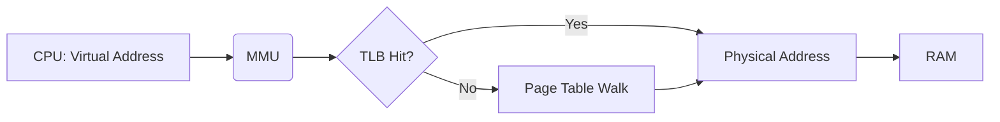

# Memory Management Unit (MMU) Tutorial

## 1. Introduction

This tutorial provides a comprehensive guide to the Memory Management Unit (MMU), a crucial component in modern computer systems. We'll explore its core concepts, practical implementations, and advanced topics, equipping you with the knowledge and skills necessary to understand and work with MMUs effectively.

**What is an MMU?**

The Memory Management Unit (MMU) is a hardware component responsible for translating virtual addresses used by a processor into physical addresses in main memory. It acts as an intermediary between the CPU and memory, providing memory protection, address translation, and memory management capabilities.

**Why is it Important?**

The MMU is essential for several reasons:

*   **Memory Protection:** Prevents processes from accessing memory allocated to other processes, enhancing system stability and security.
*   **Virtual Memory:** Enables processes to use more memory than physically available by swapping data between RAM and secondary storage (e.g., hard drive).
*   **Address Translation:** Allows processes to use a contiguous virtual address space, simplifying memory management for programmers, regardless of the physical memory layout.
*   **Memory Sharing:** Enables multiple processes to share physical memory regions, reducing memory footprint and improving efficiency.

**Prerequisites:**

*   Basic understanding of computer architecture, including CPUs and memory.
*   Familiarity with operating system concepts like processes and virtual memory.
*   Some knowledge of assembly language is helpful but not required.

**Learning Objectives:**

By the end of this tutorial, you will be able to:

*   Explain the role and function of the MMU.
*   Describe the key concepts of virtual memory, address translation, and memory protection.
*   Understand how page tables and Translation Lookaside Buffers (TLBs) work.
*   Implement basic memory management functions using MMU features.
*   Analyze the performance implications of different MMU configurations.
*   Troubleshoot common MMU-related issues.

## 2. Core Concepts

### Key Theoretical Foundations

The MMU relies on several key theoretical concepts:

*   **Virtual Memory:** A memory management technique that allows programs to address a logical address space that is larger than the available physical memory. The operating system manages this mapping.
*   **Address Translation:** The process of converting a virtual address generated by the CPU into a physical address used to access RAM. The MMU performs this translation.
*   **Paging:** A memory management scheme where memory is divided into fixed-size blocks called **pages** (virtual memory) and **frames** (physical memory). The MMU uses **page tables** to map virtual pages to physical frames.
*   **Segmentation:** A memory management scheme where memory is divided into variable-size blocks called **segments**. This is less common in modern systems than paging, often combined with paging.

### Important Terminology

*   **Virtual Address:** The logical address used by a process.
*   **Physical Address:** The actual address of a memory location in RAM.
*   **Page Table:** A data structure that maps virtual pages to physical frames.
*   **Translation Lookaside Buffer (TLB):** A cache that stores recent virtual-to-physical address translations, speeding up the address translation process.
*   **Page Fault:** An exception generated by the MMU when a virtual address is accessed that is not currently mapped to a physical frame.
*   **Page Walk:** The process of traversing the page table to find the physical address corresponding to a given virtual address.
*   **Swapping:** The process of moving pages between RAM and secondary storage (e.g., hard drive) to make room for other pages.

### Fundamental Principles

The MMU operates based on the following fundamental principles:

1.  **Address Space Separation:** Each process has its own virtual address space, preventing one process from accessing the memory of another.
2.  **On-Demand Loading:** Pages are only loaded into physical memory when they are actually needed, reducing memory usage.
3.  **Memory Protection:** Access permissions (read, write, execute) are associated with each page, preventing unauthorized access.
4.  **Efficient Address Translation:** The TLB is used to cache address translations, minimizing the overhead of page table lookups.

### Visual Explanations

Here's a simple diagram illustrating the address translation process:



This diagram shows how the CPU provides a virtual address to the MMU. The MMU first checks the TLB. If the translation is present (TLB Hit), it retrieves the physical address directly. Otherwise (TLB Miss), it performs a page table walk to find the physical address and stores it in the TLB for future use.  Finally, the physical address is used to access the RAM.

## 3. Practical Implementation

Practical implementation of MMU functionalities depends heavily on the specific processor architecture and operating system.  This section provides general concepts and examples that illustrate MMU usage.

### Step-by-Step Examples

Let's consider a simplified example of how address translation works.  Assume a 32-bit virtual address space and a 4KB page size.

1.  **Virtual Address Decomposition:** The virtual address is divided into two parts: the **virtual page number (VPN)** and the **page offset**.  With a 4KB page size (2<sup>12</sup> bytes), the lower 12 bits of the virtual address represent the page offset, and the remaining bits represent the VPN.

    Example:  Virtual address `0x12345678`

    *   Page Offset: `0x678` (lower 12 bits)
    *   VPN: `0x12345` (upper 20 bits)

2.  **Page Table Lookup:**  The VPN is used as an index into the page table. The page table entry (PTE) contains information about the corresponding physical frame number (PFN), as well as access permissions (read, write, execute).

3.  **Physical Address Construction:**  If the PTE is valid (i.e., the page is present in physical memory), the PFN is combined with the page offset to form the physical address.

    Physical Address = (PFN << 12) | Page Offset

    If the PTE is invalid (e.g., page fault), the MMU raises an exception, and the operating system handles the fault (e.g., by loading the page from disk).

### Code Snippets with Explanations

While direct MMU manipulation often occurs at the OS kernel level, here's a simplified pseudo-code example illustrating a page table walk:

```c
// Assume a simple page table structure
typedef struct {
    unsigned int physical_frame_number : 20; // PFN
    unsigned int present : 1;                // Page present in memory
    unsigned int read_only : 1;            // Read-only access
    // Other flags (e.g., dirty, accessed)
} PageTableEntry;

PageTableEntry page_table[/* Size of page table */];

// Function to translate a virtual address to a physical address
unsigned int translate_address(unsigned int virtual_address) {
    unsigned int page_offset = virtual_address & 0xFFF; // 4KB page size
    unsigned int vpn = virtual_address >> 12;

    PageTableEntry pte = page_table[vpn];

    if (!pte.present) {
        // Page fault! Handle it (e.g., load page from disk)
        return 0; // Indicate error
    }

    if (/* Check access permissions based on pte.read_only */) {
        // Access violation!
        return 0; // Indicate error
    }

    unsigned int physical_address = (pte.physical_frame_number << 12) | page_offset;
    return physical_address;
}
```

**Explanation:**

*   The `translate_address` function takes a virtual address as input.
*   It extracts the page offset and VPN.
*   It looks up the corresponding PTE in the `page_table`.
*   It checks if the page is present and if the access is permitted.
*   If all checks pass, it constructs and returns the physical address.

**Note:** This is a highly simplified example. Real-world implementations are significantly more complex, involving multi-level page tables, TLB management, and hardware-specific details.

### Common Use Cases

*   **Virtual Memory Management:** Implementing virtual memory systems with swapping.
*   **Memory Protection:** Enforcing access control and preventing unauthorized memory access.
*   **Shared Memory:** Allowing multiple processes to share memory regions for inter-process communication.
*   **Demand Paging:** Loading pages into memory only when they are needed.
*   **Memory Allocation:**  Assisting memory allocation schemes (e.g., malloc/free) by providing a virtualized address space.

### Best Practices

*   **Minimize TLB Misses:** Design memory access patterns to maximize TLB hits. This can involve spatial locality (accessing nearby memory locations) and temporal locality (accessing the same memory locations repeatedly).
*   **Use Large Pages (if supported):** Using larger page sizes (e.g., 2MB or 1GB) can reduce the number of page table entries and improve TLB hit rates.  However, larger pages can also lead to internal fragmentation.
*   **Avoid Excessive Swapping:** Excessive swapping can significantly degrade performance. Monitor swapping activity and optimize memory usage to minimize it.
*   **Properly Handle Page Faults:** Implement robust page fault handling mechanisms in the operating system to ensure system stability.
*   **Secure Memory:**  Implement measures to protect memory from unauthorized access and modification, such as address space layout randomization (ASLR).

## 4. Advanced Topics

### Advanced Techniques

*   **Multi-Level Page Tables:** Used to reduce the memory overhead of page tables, especially with large virtual address spaces. A hierarchical structure allows for only mapping pages that are actually in use.
*   **Inverted Page Tables:** An alternative page table design where the table is indexed by physical frame number rather than virtual page number.  This can reduce memory usage but introduces complexity in searching for translations.
*   **Extended Page Tables (EPT):** Used in virtualization environments to provide an additional layer of address translation, allowing the hypervisor to control the memory access of virtual machines.
*   **Address Space Layout Randomization (ASLR):**  Randomizes the location of key memory regions (e.g., code, stack, heap) to make it harder for attackers to exploit memory-related vulnerabilities.

### Real-World Applications

*   **Operating Systems:**  Essential component for managing memory, protecting processes, and supporting virtual memory.
*   **Virtualization:** Used by hypervisors to isolate virtual machines and manage their memory access.
*   **Embedded Systems:** Used in embedded systems with complex memory requirements.
*   **High-Performance Computing:**  Used in HPC environments to optimize memory access and improve performance.

### Common Challenges and Solutions

*   **TLB Misses:** Can significantly impact performance. Solutions include:
    *   Increasing TLB size (hardware limitation).
    *   Optimizing memory access patterns.
    *   Using larger page sizes.
*   **Page Table Overhead:** Can consume a significant amount of memory. Solutions include:
    *   Using multi-level page tables.
    *   Using inverted page tables.
    *   Using larger page sizes.
*   **Page Fault Handling:** Can be complex and time-consuming. Solutions include:
    *   Optimizing page replacement algorithms.
    *   Using prefetching techniques.
    *   Minimizing swapping.
*   **Memory Fragmentation:** Can reduce memory utilization. Solutions include:
    *   Using memory compaction techniques.
    *   Using memory allocators that minimize fragmentation.

### Performance Considerations

*   **TLB Hit Rate:** A higher TLB hit rate translates to faster address translations and improved performance.
*   **Page Fault Rate:** A lower page fault rate translates to less swapping and improved performance.
*   **Page Table Walk Time:** The time it takes to traverse the page table should be minimized.
*   **Memory Latency:** The time it takes to access memory should be minimized.
*   **Context Switching Overhead:** Switching between processes can be expensive due to TLB invalidation.

## 5. Advanced Topics (Continued)

### Cutting-Edge Techniques and Approaches

*   **Persistent Memory Management:** Managing persistent memory (e.g., NVMe DIMMs) using the MMU. This involves new address translation schemes and cache coherence protocols.
*   **Heterogeneous Memory Management:** Managing different types of memory (e.g., DRAM, HBM) with varying performance characteristics using the MMU.
*   **Hardware-Assisted Memory Partitioning:** Using hardware features to create isolated memory partitions for security or performance reasons.
*   **Memory Disaggregation:** Separating memory from compute resources and accessing it remotely over a network, requiring advanced MMU techniques for address translation and protection.
*   **Data Compression in MMU:** Employing data compression and decompression within the MMU to increase effective memory capacity and reduce bandwidth requirements.

### Complex Real-World Applications

*   **Cloud Computing:** Managing massive amounts of memory across multiple virtual machines in a cloud environment.
*   **Artificial Intelligence:** Handling large datasets and complex memory access patterns in AI workloads.
*   **Database Systems:** Optimizing memory usage and access for large databases.
*   **Real-time Systems:** Ensuring predictable memory access times in real-time applications.
*   **Autonomous Vehicles:** Managing memory for sensor data processing and control algorithms in autonomous vehicles.

### System Design Considerations

*   **Page Size Selection:** Choosing an appropriate page size based on the workload and hardware architecture.
*   **TLB Design:** Optimizing TLB size and associativity for the target application.
*   **Page Replacement Algorithm:** Selecting an efficient page replacement algorithm (e.g., LRU, FIFO).
*   **Memory Allocation Strategy:** Choosing a memory allocation strategy that minimizes fragmentation and overhead.
*   **Hardware-Software Co-design:** Optimizing the MMU in conjunction with other hardware components and the operating system.

### Scalability and Performance Optimization

*   **Scalable Page Table Structures:** Designing page table structures that can scale to large virtual address spaces.
*   **Hardware Acceleration:** Using hardware accelerators to offload address translation and memory management tasks.
*   **Memory Partitioning:** Dividing memory into partitions to improve performance and isolation.
*   **Data Locality Optimization:** Optimizing data layout and access patterns to improve cache and TLB hit rates.
*   **Dynamic Memory Management:** Dynamically adjusting memory allocation and page replacement strategies based on workload characteristics.

### Security Considerations

*   **Memory Isolation:** Ensuring that processes cannot access each other's memory.
*   **Protection Against Buffer Overflows:** Preventing buffer overflows from overwriting critical memory regions.
*   **Defense Against Code Injection:** Preventing attackers from injecting and executing malicious code in memory.
*   **Address Space Layout Randomization (ASLR):** Randomizing the memory layout to make it harder for attackers to exploit vulnerabilities.
*   **Secure Boot:** Ensuring that the system boots into a trusted state and that the MMU is properly configured.
*   **Memory Encryption:** Encrypting memory contents to protect against unauthorized access.

### Integration with Other Technologies

*   **Cache Coherence Protocols:** Ensuring that multiple caches maintain consistent views of memory.
*   **Direct Memory Access (DMA):** Allowing devices to access memory directly without CPU intervention.
*   **Virtualization Technologies:** Integrating the MMU with virtualization technologies to manage memory for virtual machines.
*   **Hardware Security Modules (HSMs):** Using HSMs to protect sensitive data stored in memory.
*   **Trusted Execution Environments (TEEs):** Creating isolated execution environments for secure applications.

### Advanced Patterns and Architectures

*   **NUMA Architectures:** Managing memory in Non-Uniform Memory Access (NUMA) systems.
*   **Cache-Coherent Interconnects:** Using cache-coherent interconnects to improve memory performance in multi-processor systems.
*   **Memory-Centric Computing:** Architectures that prioritize memory performance and bandwidth.
*   **Processing-in-Memory (PIM):** Performing computations directly within memory to reduce data movement.
*   **Neuromorphic Computing:** Implementing memory and computation in a way that mimics the human brain.

### Industry-Specific Applications

*   **Automotive:** Managing memory for advanced driver-assistance systems (ADAS) and autonomous driving.
*   **Aerospace:** Ensuring reliable memory management in critical aerospace applications.
*   **Healthcare:** Protecting sensitive patient data in healthcare systems.
*   **Finance:** Managing memory for high-frequency trading and financial modeling.
*   **Telecommunications:** Optimizing memory usage in telecommunications infrastructure.

## 6. Hands-on Exercises

This section provides a series of hands-on exercises to reinforce your understanding of MMU concepts. These exercises are progressively more challenging, allowing you to build your skills gradually.

**Exercise 1: Simple Virtual Address Translation (Beginner)**

**Objective:** Understand the basic process of virtual to physical address translation.

**Scenario:** You are given a virtual address space of 16 bits and a physical address space of 12 bits.  The page size is 256 bytes (2<sup>8</sup>).

**Task:**

1.  Write a function in C to extract the virtual page number (VPN) and page offset from a given virtual address.
2.  Create a simple page table (an array) that maps some VPNs to physical frame numbers (PFNs).  Assume the page table has 16 entries.  Some entries should be marked as invalid (page not present).
3.  Write a function to translate a virtual address to a physical address using the page table.  Handle page faults (invalid PTEs).
4.  Test your code with different virtual addresses, including some that will cause page faults.

**Hints:**

*   Use bitwise operators to extract the VPN and page offset.
*   Represent the page table as an array of structures, where each structure contains the PFN, a valid flag, and potentially other permission bits.
*   For simplicity, assume the page table is always present in memory (no multi-level page tables).

**Code snippet template (C):**

```c
#include <stdio.h>
#include <stdint.h>

#define PAGE_SIZE 256
#define VIRTUAL_ADDRESS_BITS 16
#define PHYSICAL_ADDRESS_BITS 12
#define PAGE_TABLE_SIZE 16

typedef struct {
    uint8_t present;
    uint8_t pfn;
} PageTableEntry;

PageTableEntry page_table[PAGE_TABLE_SIZE];

// Function to extract VPN from a virtual address
uint16_t get_vpn(uint16_t virtual_address) {
    // Your code here
    return 0; // Placeholder
}

// Function to extract page offset from a virtual address
uint16_t get_offset(uint16_t virtual_address) {
    // Your code here
    return 0; // Placeholder
}

// Function to translate a virtual address to a physical address
uint16_t translate_address(uint16_t virtual_address) {
    // Your code here
    return 0; // Placeholder
}

int main() {
    // Initialize page table (example)
    page_table[0].present = 1;
    page_table[0].pfn = 10;
    page_table[1].present = 0; // Invalid page
    page_table[2].present = 1;
    page_table[2].pfn = 5;

    uint16_t virtual_address = 0x0123;
    uint16_t physical_address = translate_address(virtual_address);

    printf("Virtual address: 0x%04X\n", virtual_address);
    if (physical_address != 0) {
        printf("Physical address: 0x%04X\n", physical_address);
    } else {
        printf("Page fault!\n");
    }

    return 0;
}
```

**Sample Solution and Explanations:**

```c
#include <stdio.h>
#include <stdint.h>

#define PAGE_SIZE 256
#define VIRTUAL_ADDRESS_BITS 16
#define PHYSICAL_ADDRESS_BITS 12
#define PAGE_TABLE_SIZE 16

typedef struct {
    uint8_t present;
    uint8_t pfn;
} PageTableEntry;

PageTableEntry page_table[PAGE_TABLE_SIZE];

// Function to extract VPN from a virtual address
uint16_t get_vpn(uint16_t virtual_address) {
    return virtual_address >> 8; // Shift right by 8 bits (page offset is 8 bits)
}

// Function to extract page offset from a virtual address
uint16_t get_offset(uint16_t virtual_address) {
    return virtual_address & 0xFF; // Mask with 0xFF (lower 8 bits)
}

// Function to translate a virtual address to a physical address
uint16_t translate_address(uint16_t virtual_address) {
    uint16_t vpn = get_vpn(virtual_address);
    uint16_t offset = get_offset(virtual_address);

    if (vpn >= PAGE_TABLE_SIZE) {
        printf("VPN out of range!\n");
        return 0;
    }

    PageTableEntry pte = page_table[vpn];

    if (!pte.present) {
        printf("Page fault!\n");
        return 0;
    }

    uint16_t physical_address = (pte.pfn << 8) | offset; // PFN * PAGE_SIZE + offset
    return physical_address;
}

int main() {
    // Initialize page table (example)
    page_table[0].present = 1;
    page_table[0].pfn = 10;
    page_table[1].present = 0; // Invalid page
    page_table[2].present = 1;
    page_table[2].pfn = 5;

    uint16_t virtual_address = 0x0023; // Accessing virtual address within page 0
    uint16_t physical_address = translate_address(virtual_address);

    printf("Virtual address: 0x%04X\n", virtual_address);
    if (physical_address != 0) {
        printf("Physical address: 0x%04X\n", physical_address);
    } else {
        printf("Page fault!\n");
    }

    virtual_address = 0x0123; // Accessing virtual address within page 1 (invalid)
    physical_address = translate_address(virtual_address);

    printf("Virtual address: 0x%04X\n", virtual_address);
    if (physical_address != 0) {
        printf("Physical address: 0x%04X\n", physical_address);
    } else {
        printf("Page fault!\n");
    }

    return 0;
}
```

**Common Mistakes to Watch For:**

*   Incorrect bitwise operations for extracting VPN and offset.
*   Not handling page faults properly.
*   Incorrectly calculating the physical address.
*   Page table index out of bounds.

**Exercise 2: TLB Implementation (Intermediate)**

**Objective:** Implement a simplified TLB to cache address translations.

**Scenario:**  Extend the previous exercise by adding a TLB to speed up address translations.

**Task:**

1.  Implement a simple TLB (e.g., a direct-mapped cache) to store recently used virtual-to-physical address translations.
2.  Modify the `translate_address` function to first check the TLB for a translation.
3.  If the translation is found in the TLB (TLB hit), use it directly.
4.  If the translation is not found in the TLB (TLB miss), perform a page table walk as before, and then add the translation to the TLB.
5.  Measure the TLB hit rate by performing a sequence of memory accesses.

**Hints:**

*   A simple TLB can be implemented as an array of TLB entries.
*   Each TLB entry should store the VPN and the corresponding PFN.
*   Use a valid bit to indicate whether the TLB entry is valid.
*   For simplicity, you can use a direct-mapped TLB (each VPN maps to a specific TLB entry).
*   Consider implementing a simple TLB replacement policy (e.g., replace the oldest entry).

**Exercise 3: Page Replacement Algorithm (Advanced)**

**Objective:** Implement a page replacement algorithm to manage pages in physical memory.

**Scenario:**  Simulate a system with limited physical memory and a demand paging system.

**Task:**

1.  Implement a page replacement algorithm (e.g., Least Recently Used (LRU) or First-In, First-Out (FIFO)).
2.  Simulate a sequence of memory accesses that cause page faults.
3.  When a page fault occurs and there is no free frame available, use the page replacement algorithm to select a page to evict.
4.  Update the page table and any necessary data structures (e.g., LRU list) accordingly.
5.  Measure the page fault rate for different page replacement algorithms and memory access patterns.

**Hints:**

*   Use a linked list or array to track the order in which pages were accessed.
*   When a page fault occurs, select the page to evict based on the chosen replacement algorithm.
*   Update the page table to reflect the page eviction and the new page mapping.
*   Consider using a circular buffer to implement FIFO.
*   LRU is generally more complex to implement but can provide better performance than FIFO.

**Challenge Exercises:**

*   Implement a multi-level page table structure.
*   Implement a more sophisticated TLB replacement policy (e.g., LRU).
*   Simulate the effects of ASLR on memory security.

**Project Ideas for Practice:**

*   Build a simplified virtual memory manager for a small operating system.
*   Implement a memory allocator that uses the MMU for memory protection.
*   Develop a performance monitoring tool to track TLB hit rates and page fault rates.

## 7. Best Practices and Guidelines

*   **Industry-Standard Conventions:** Adhere to industry-standard conventions for memory management, such as using well-defined data structures and algorithms.
*   **Code Quality and Maintainability:** Write clean, well-documented code that is easy to understand and maintain.  Use meaningful variable names and comments.
*   **Performance Optimization Guidelines:** Follow performance optimization guidelines to minimize TLB misses, page faults, and memory latency.
*   **Security Best Practices:** Implement security best practices to protect memory from unauthorized access and modification.  Use ASLR and memory encryption where appropriate.
*   **Scalability Considerations:** Design memory management systems that can scale to large virtual address spaces and high workloads.
*   **Testing and Documentation:** Thoroughly test your memory management code and provide comprehensive documentation.
*   **Team Collaboration Aspects:** Collaborate effectively with other developers on memory management projects. Use version control and code review to ensure code quality and consistency.

## 8. Troubleshooting and Common Issues

*   **Common Problems and Solutions:**
    *   **Page Faults:**  Investigate the cause of page faults. Check for invalid memory accesses or insufficient physical memory.
    *   **TLB Misses:**  Analyze memory access patterns to identify opportunities to improve TLB hit rates.
    *   **Memory Leaks:**  Use memory leak detection tools to identify and fix memory leaks.
    *   **Segmentation Faults:**  Debug segmentation faults to identify the source of the invalid memory access.
*   **Debugging Strategies:**
    *   Use a debugger to step through your code and inspect memory contents.
    *   Use memory monitoring tools to track memory usage and identify performance bottlenecks.
    *   Use logging to track memory allocation and deallocation events.
*   **Performance Bottlenecks:**
    *   Identify performance bottlenecks by profiling your code and analyzing memory access patterns.
    *   Optimize memory access patterns to improve cache and TLB hit rates.
    *   Reduce swapping by increasing physical memory or optimizing memory usage.
*   **Error Messages and their Meaning:**
    *   Understand the meaning of common error messages related to memory management, such as "segmentation fault" or "out of memory."
    *   Use error messages to diagnose the cause of memory-related problems.
*   **Edge Cases to Consider:**
    *   Handle edge cases such as null pointers, invalid memory addresses, and out-of-memory conditions.
    *   Write unit tests to cover edge cases and ensure code robustness.
*   **Tools and Techniques for Diagnosis:**
    *   Use tools such as Valgrind, gdb, and perf to diagnose memory-related problems and performance bottlenecks.
    *   Use memory mapping tools to visualize memory usage and identify fragmentation.

## 9. Conclusion and Next Steps

**Comprehensive Summary of Key Concepts:**

This tutorial covered the core concepts of the Memory Management Unit (MMU), including virtual memory, address translation, paging, segmentation, TLBs, and page faults. You learned how the MMU protects memory, manages address spaces, and enables virtual memory systems.

**Practical Application Guidelines:**

Use the knowledge gained in this tutorial to design and implement efficient and secure memory management systems. Consider the performance implications of different MMU configurations and choose appropriate algorithms and data structures.

**Advanced Learning Resources:**

*   **Books:**
    *   "Operating System Concepts" by Silberschatz, Galvin, and Gagne
    *   "Computer Architecture: A Quantitative Approach" by Hennessy and Patterson
*   **Online Courses:**
    *   MIT OpenCourseWare: [https://ocw.mit.edu/](https://ocw.mit.edu/)
    *   Coursera: [https://www.coursera.org/](https://www.coursera.org/)
    *   edX: [https://www.edx.org/](https://www.edx.org/)
*   **Processor Manuals:** Intel Software Developer's Manuals, ARM Architecture Reference Manuals.

**Related Topics to Explore:**

*   Cache Coherence
*   Virtualization
*   Memory Security
*   Operating System Internals

**Community Resources and Forums:**

*   Stack Overflow: [https://stackoverflow.com/](https://stackoverflow.com/)
*   Reddit: r/programming, r/osdev
*   Operating System Development Communities: OSDev Wiki

**Latest Trends and Future Directions:**

*   Persistent Memory Management
*   Heterogeneous Memory Systems
*   Memory Disaggregation
*   Processing-in-Memory

**Career Opportunities and Applications:**

*   Operating System Developer
*   Kernel Engineer
*   Embedded Systems Engineer
*   Virtualization Engineer
*   Security Engineer
*   Computer Architect

By mastering the concepts presented in this tutorial, you will be well-equipped to tackle complex memory management challenges and contribute to the development of innovative computer systems.
