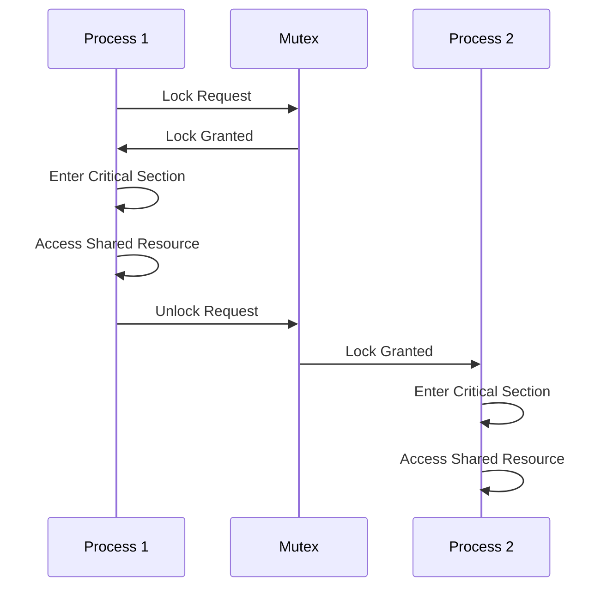

# 3.3 Process Synchronization

## 1. Introduction

Process synchronization is a fundamental concept in operating systems and concurrent programming. It deals with coordinating the execution of multiple processes or threads that share resources or data. Without proper synchronization mechanisms, concurrent access to shared resources can lead to data corruption, race conditions, and other undesirable outcomes.

**Why it's important:**

*   **Data Consistency:** Ensures that shared data remains consistent and accurate when accessed concurrently.
*   **Preventing Race Conditions:** Avoids situations where the outcome of a program depends on the unpredictable order of execution of multiple processes.
*   **Resource Management:** Allows processes to share resources safely and efficiently.
*   **Correctness of Concurrent Programs:**  Essential for building reliable and predictable concurrent systems.

**Prerequisites:**

*   Basic understanding of operating systems concepts (processes, threads, memory management).
*   Familiarity with concurrent programming principles.
*   Knowledge of at least one programming language (e.g., C, Java, Python).

**Learning Objectives:**

*   Understand the need for process synchronization.
*   Learn about different synchronization mechanisms like mutexes, semaphores, and monitors.
*   Implement and use synchronization techniques in practical examples.
*   Understand the challenges and trade-offs associated with process synchronization.
*   Apply synchronization techniques to solve real-world concurrency problems.

## 2. Core Concepts

### 2.1. Race Conditions

A **race condition** occurs when multiple processes or threads access and modify shared data concurrently, and the final outcome of the execution depends on the specific order in which these accesses take place.

```
// Example of a race condition in C
#include <stdio.h>
#include <pthread.h>

int counter = 0;

void* increment(void* arg) {
    for (int i = 0; i < 100000; i++) {
        counter++;
    }
    return NULL;
}

int main() {
    pthread_t thread1, thread2;
    pthread_create(&thread1, NULL, increment, NULL);
    pthread_create(&thread2, NULL, increment, NULL);

    pthread_join(thread1, NULL);
    pthread_join(thread2, NULL);

    printf("Counter value: %d\n", counter); // Expected: 200000, but often less due to race condition
    return 0;
}
```

In the example above, two threads increment a shared `counter` variable.  Due to the interleaved execution of the threads, the final value of `counter` is often less than the expected 200,000. This happens because increment operation `counter++`  is not atomic and can be broken down into three steps:

1.  Read the value of counter.
2.  Increment the value.
3.  Write the new value back to counter.

If one thread reads the value before the other thread writes back the incremented value, the increment will be lost.

### 2.2. Critical Section

A **critical section** is a code segment where a process or thread accesses shared resources or data.  Only one process or thread should be allowed to execute its critical section at any given time.

### 2.3. Mutual Exclusion

**Mutual exclusion** is a property that ensures that only one process or thread can access a shared resource or execute a critical section at a time. It prevents race conditions and data corruption.

### 2.4. Synchronization Mechanisms

Several mechanisms are used to achieve process synchronization and mutual exclusion:

*   **Mutexes (Mutual Exclusion Locks):** A mutex is a locking mechanism that allows only one thread to access a critical section at a time.  A thread acquires (locks) the mutex before entering the critical section and releases (unlocks) the mutex after exiting the critical section.
*   **Semaphores:** A semaphore is a more general synchronization tool than a mutex. It's an integer variable that can be decremented (wait operation) or incremented (signal operation). Semaphores can be used to control access to multiple instances of a resource.
*   **Monitors:** A monitor is a high-level synchronization construct that provides mutual exclusion and condition variables. It encapsulates shared data and the operations that manipulate it, ensuring that only one thread can be active within the monitor at any given time.
*   **Condition Variables:** Condition variables are used within monitors to allow threads to wait for a specific condition to become true. When a thread waits on a condition variable, it releases the monitor lock and goes to sleep. Another thread can signal the condition variable to wake up the waiting thread.
*   **Spinlocks:** A spinlock is a type of lock where a thread repeatedly checks if the lock is available, rather than blocking and yielding the CPU. Spinlocks are useful for short-duration critical sections where the overhead of blocking and unblocking a thread would be higher than the cost of spinning.

### 2.5. Visual Explanation: Mutex Lock



This diagram illustrates how a mutex protects a critical section. Process 1 acquires the lock, enters the critical section, and releases the lock. Only then can Process 2 acquire the lock and enter the critical section.

## 3. Practical Implementation

### 3.1. Using Mutexes in C (pthread library)

```c
#include <stdio.h>
#include <pthread.h>

pthread_mutex_t mutex;
int counter = 0;

void* increment(void* arg) {
    for (int i = 0; i < 100000; i++) {
        pthread_mutex_lock(&mutex); // Acquire the mutex
        counter++;
        pthread_mutex_unlock(&mutex); // Release the mutex
    }
    return NULL;
}

int main() {
    pthread_t thread1, thread2;

    pthread_mutex_init(&mutex, NULL); // Initialize the mutex

    pthread_create(&thread1, NULL, increment, NULL);
    pthread_create(&thread2, NULL, increment, NULL);

    pthread_join(thread1, NULL);
    pthread_join(thread2, NULL);

    printf("Counter value: %d\n", counter); // Expected: 200000
    pthread_mutex_destroy(&mutex); // Destroy the mutex
    return 0;
}
```

**Explanation:**

1.  `pthread_mutex_t mutex;`:  Declares a mutex variable.
2.  `pthread_mutex_init(&mutex, NULL);`: Initializes the mutex.
3.  `pthread_mutex_lock(&mutex);`: Attempts to acquire the mutex. If the mutex is already locked by another thread, the calling thread blocks until the mutex becomes available.
4.  `pthread_mutex_unlock(&mutex);`: Releases the mutex, allowing another thread to acquire it.
5.  `pthread_mutex_destroy(&mutex);`: Destroys the mutex when it is no longer needed.  This is good practice to release resources.

### 3.2. Using Semaphores in C (POSIX semaphores)

```c
#include <stdio.h>
#include <stdlib.h>
#include <pthread.h>
#include <semaphore.h>

sem_t semaphore;
int counter = 0;

void* increment(void* arg) {
    for (int i = 0; i < 100000; i++) {
        sem_wait(&semaphore); // Decrement the semaphore (wait)
        counter++;
        sem_post(&semaphore); // Increment the semaphore (signal)
    }
    return NULL;
}

int main() {
    pthread_t thread1, thread2;

    sem_init(&semaphore, 0, 1); // Initialize the semaphore with an initial value of 1 (binary semaphore)

    pthread_create(&thread1, NULL, increment, NULL);
    pthread_create(&thread2, NULL, increment, NULL);

    pthread_join(thread1, NULL);
    pthread_join(thread2, NULL);

    printf("Counter value: %d\n", counter); // Expected: 200000
    sem_destroy(&semaphore); // Destroy the semaphore
    return 0;
}
```

**Explanation:**

1.  `sem_t semaphore;`: Declares a semaphore variable.
2.  `sem_init(&semaphore, 0, 1);`: Initializes the semaphore. The second argument is `0` for process-shared semaphores (used between threads within the same process).  The third argument is the initial value of the semaphore. A value of 1 makes it act like a mutex (binary semaphore).
3.  `sem_wait(&semaphore);`: Decrements the semaphore. If the semaphore's value is greater than 0, the decrement proceeds immediately. If the value is 0, the calling thread blocks until another thread increments the semaphore.
4.  `sem_post(&semaphore);`: Increments the semaphore, potentially waking up a waiting thread.
5.  `sem_destroy(&semaphore);`: Destroys the semaphore when it's no longer needed.

### 3.3. Common Use Cases

*   **Producer-Consumer Problem:**  A classic concurrency problem where one or more producers generate data and one or more consumers consume data.  Synchronization is needed to ensure that producers don't overwrite data before consumers consume it, and consumers don't try to consume data that hasn't been produced yet.  Semaphores or monitors are often used to implement the producer-consumer problem.
*   **Reader-Writer Problem:**  Multiple readers can access a shared resource concurrently, but only one writer can access it at a time.  Synchronization is needed to prevent writers from interfering with readers and to ensure that writers have exclusive access when writing. Mutexes and condition variables can be used to solve the reader-writer problem.
*   **Dining Philosophers Problem:** A classic problem illustrating the challenges of deadlock and starvation in concurrent systems.  Five philosophers are sitting around a table with one chopstick between each pair of philosophers. Each philosopher needs two chopsticks to eat. The challenge is to design a system where the philosophers can eat without creating a deadlock.

### 3.4. Best Practices

*   **Minimize Critical Sections:** Keep critical sections as short as possible to reduce contention and improve performance.
*   **Avoid Deadlocks:** Design your synchronization logic carefully to avoid deadlocks.
*   **Use Appropriate Synchronization Mechanisms:** Choose the most appropriate synchronization mechanism for the specific problem.  Mutexes are suitable for simple mutual exclusion, while semaphores are more general and can be used for more complex synchronization scenarios.
*   **Proper Error Handling:**  Always handle potential errors when acquiring and releasing locks or using other synchronization primitives.
*   **Document Synchronization Logic:**  Clearly document the synchronization logic in your code to make it easier to understand and maintain.

## 4. Advanced Topics

### 4.1. Deadlock

**Deadlock** occurs when two or more processes are blocked indefinitely, waiting for each other to release resources.

**Example:**

Process A holds resource X and is waiting for resource Y.
Process B holds resource Y and is waiting for resource X.

Neither process can proceed, resulting in a deadlock.

**Deadlock Prevention:**  Strategies to prevent deadlocks by eliminating one or more of the necessary conditions for deadlock to occur:

*   **Mutual Exclusion:** Make resources shareable (not always possible).
*   **Hold and Wait:** Require processes to request all necessary resources at once.
*   **No Preemption:** Allow resources to be preempted from processes.
*   **Circular Wait:** Impose a total ordering on resource types and require processes to request resources in increasing order.

**Deadlock Detection and Recovery:**  Allow deadlocks to occur and then detect and recover from them.

*   **Detection:**  Use algorithms to detect cycles in the resource allocation graph.
*   **Recovery:**  Terminate one or more processes involved in the deadlock, or preempt resources from processes.

### 4.2. Livelock

**Livelock** is similar to deadlock in that processes are unable to make progress. However, in livelock, the processes are not blocked; instead, they are continuously reacting to each other's state in a way that prevents either process from completing its task.

**Example:**

Two threads attempting to acquire the same lock. If both detect contention and back off for a random amount of time, they might repeatedly back off at the same time, never acquiring the lock.

**Solutions:**

*   Introduce randomness in the backoff algorithm to reduce the likelihood of repeated collisions.
*   Implement a fairness mechanism to ensure that all threads eventually get a chance to acquire the lock.

### 4.3. Starvation

**Starvation** occurs when a process is repeatedly denied access to a resource, even though the resource is available.

**Example:**

In a reader-writer problem, if there are always readers present, a writer might never get a chance to write.

**Solutions:**

*   Implement a fairness policy to ensure that all processes eventually get access to the resource.
*   Use priority-based scheduling to give higher priority to processes that have been waiting for a long time.

### 4.4. Performance Considerations

*   **Lock Contention:** High lock contention can significantly degrade performance. Minimize critical sections and use appropriate locking strategies to reduce contention.
*   **Context Switching:** Excessive context switching can also impact performance. Avoid unnecessary blocking and use non-blocking synchronization techniques where possible.
*   **Cache Coherence:** In multi-core systems, cache coherence can be a performance bottleneck.  Minimize shared data and use techniques like lock-free data structures to reduce cache coherence overhead.

## 5. Advanced Topics

This section will delve into more sophisticated aspects of process synchronization, focusing on real-world application, system design, scalability, security and integration with other technologies.

### 5.1 Cutting-Edge Techniques and Approaches
*   **Lock-Free Data Structures:** These data structures rely on atomic operations (e.g., compare-and-swap, fetch-and-add) to ensure thread safety without using explicit locks.  This reduces the overhead of locking and unlocking, and can improve performance in highly concurrent systems. [Lock-Free Programming](https://en.wikipedia.org/wiki/Non-blocking_algorithm)
*   **Read-Copy-Update (RCU):**  RCU is a synchronization mechanism that allows readers to access shared data without acquiring locks, while writers update the data by creating a new copy and then atomically switching to the new copy.  RCU is commonly used in operating system kernels and other high-performance systems. [RCU Explained](https://lwn.net/Articles/262464/)
*   **Transactional Memory:** A programming model that allows multiple operations on shared data to be grouped into a single atomic transaction.  If the transaction completes successfully, all of the operations are committed.  If the transaction fails, all of the operations are rolled back.  Transactional memory simplifies concurrent programming by providing a higher-level abstraction for managing concurrency. [Transactional Memory](https://en.wikipedia.org/wiki/Transactional_memory)
*   **Software Transactional Memory (STM):** A software implementation of transactional memory.
*   **Hardware Transactional Memory (HTM):** A hardware implementation of transactional memory, offering better performance than STM.

### 5.2. Complex Real-World Applications
*   **Database Management Systems (DBMS):** DBMSs use complex synchronization techniques to manage concurrent access to data.  These techniques include locking, concurrency control, and transaction management.  They balance concurrency and data consistency.
*   **Web Servers:** Web servers handle a large number of concurrent requests. They use threading or asynchronous programming models to handle requests efficiently, and synchronization mechanisms to protect shared resources like caches and connection pools.
*   **Distributed Systems:**  Distributed systems require sophisticated synchronization mechanisms to coordinate the actions of multiple nodes.  These mechanisms include consensus algorithms, distributed locks, and distributed transactions. [Distributed Consensus](https://en.wikipedia.org/wiki/Consensus_(computer_science))
*   **Real-time Systems:** Real-time systems often have strict timing requirements. They use priority-based scheduling and synchronization mechanisms that guarantee bounded execution times.
*   **Financial Trading Systems:** Low-latency, high-throughput are crucial. Advanced sync techniques + optimized hardware are commonplace.

### 5.3. System Design Considerations
*   **Granularity of Locking:** The granularity of locking refers to the size of the data or resource that is protected by a lock.  Fine-grained locking (e.g., locking individual elements of an array) can improve concurrency but also increases the overhead of locking and unlocking.  Coarse-grained locking (e.g., locking the entire array) reduces overhead but also reduces concurrency.
*   **Locking Strategies:**
    *   **Optimistic Locking:** Assumes that contention is rare and allows multiple threads to read shared data without acquiring locks.  When a thread wants to write to the data, it first checks if the data has been modified by another thread.  If the data has been modified, the write fails and the thread must retry.
    *   **Pessimistic Locking:** Assumes that contention is common and acquires a lock before reading or writing to shared data.
*   **Cache-Aware Synchronization:** Design synchronization mechanisms to take advantage of CPU caches and minimize cache coherence overhead.
*   **NUMA-Awareness:** In Non-Uniform Memory Access (NUMA) systems, memory access times vary depending on the location of the memory relative to the CPU. Design synchronization mechanisms to minimize remote memory accesses.

### 5.4. Scalability and Performance Optimization
*   **Amdahl's Law:**  Amdahl's Law states that the maximum speedup achievable by parallelizing a program is limited by the fraction of the program that cannot be parallelized.
*   **Gustafson's Law:** Gustafson's Law states that the speedup achievable by parallelizing a program increases linearly with the number of processors, assuming that the problem size can be scaled up proportionally.
*   **Load Balancing:** Distribute work evenly across multiple threads or processes to maximize performance.
*   **Asynchronous Programming:** Use asynchronous programming models to avoid blocking threads and improve responsiveness.

### 5.5. Security Considerations
*   **Race Conditions and Security Vulnerabilities:** Race conditions can lead to security vulnerabilities, such as privilege escalation or denial of service.
*   **Deadlocks and Denial of Service:** Deadlocks can cause programs to hang, leading to denial of service.
*   **Synchronization and Information Leakage:** Improper synchronization can lead to information leakage, where sensitive data is exposed to unauthorized parties.

### 5.6. Integration with Other Technologies
*   **Integration with Databases:**  Integrate synchronization mechanisms with database transaction management systems.
*   **Integration with Message Queues:** Use message queues to decouple producers and consumers and improve scalability.
*   **Integration with Distributed Caching Systems:**  Use distributed caching systems to reduce load on databases and improve performance.

### 5.7. Advanced Patterns and Architectures
*   **Actor Model:** A concurrency model where actors are independent entities that communicate with each other through message passing. [Actor Model](https://en.wikipedia.org/wiki/Actor_model)
*   **Communicating Sequential Processes (CSP):** A formal language for describing concurrent systems.
*   **Microservices Architecture:** An architectural style where an application is composed of a collection of small, independent services that communicate with each other over a network. Microservices rely heavily on asynchronous communication and distributed synchronization.

### 5.8. Industry-Specific Applications
*   **High-Frequency Trading (HFT):** HFT systems require extremely low-latency synchronization to execute trades quickly.
*   **Autonomous Vehicles:** Autonomous vehicles use complex synchronization algorithms to coordinate the actions of multiple sensors and actuators.
*   **Cloud Computing:** Cloud computing platforms use virtualization and containerization to isolate applications and provide resource isolation.  Synchronization mechanisms are needed to manage access to shared resources in the cloud.
*   **Big Data Processing:** Big data processing frameworks like Hadoop and Spark use distributed synchronization techniques to process large datasets in parallel.

## 6. Hands-on Exercises

These exercises progress in difficulty, starting with basic mutex and semaphore usage and culminating in more complex problems like the Producer-Consumer and Dining Philosophers scenarios.

### 6.1. Basic Mutex Usage (Easy)

**Scenario:** Two threads need to increment a shared counter a large number of times. Use a mutex to protect the counter from race conditions.

**Steps:**

1.  Create a shared counter variable.
2.  Create two threads that will increment the counter.
3.  Initialize a mutex.
4.  In each thread, acquire the mutex before incrementing the counter and release the mutex after incrementing the counter.
5.  Join the threads and print the final value of the counter.
6.  Destroy the mutex.

**Challenge:** Modify the code to increment the counter a different number of times in each thread.

**Hint:**  Ensure proper initialization and destruction of the mutex.

**Sample Solution:** (See 3.1 for an example)

**Common Mistakes:**

*   Forgetting to initialize or destroy the mutex.
*   Forgetting to release the mutex after acquiring it.
*   Trying to unlock a mutex that is not locked.

### 6.2. Basic Semaphore Usage (Easy)

**Scenario:**  Use a semaphore to control access to a shared resource, such as a file.  Only one thread should be allowed to access the file at a time.

**Steps:**

1. Create a semaphore initialized to 1 (binary semaphore).
2. Create two threads that will attempt to access the shared file.
3. In each thread, wait on the semaphore before accessing the file, and post to the semaphore after accessing the file.
4. Include a sleep or delay to simulate file access time.
5. Join the threads.
6. Destroy the semaphore.

**Challenge:** Extend this exercise to allow a certain number of threads (greater than 1) to access the file concurrently.

**Hint:** Initialize the semaphore to the maximum number of concurrent accesses allowed.

**Sample Solution:** (See 3.2 for an example)

**Common Mistakes:**

*   Forgetting to initialize or destroy the semaphore.
*   Waiting on or posting to the semaphore in the wrong order.
*   Using the wrong initial value for the semaphore.

### 6.3. Producer-Consumer Problem (Medium)

**Scenario:** Implement the Producer-Consumer problem using a shared buffer, mutexes, and condition variables.  One or more producer threads generate data and add it to the buffer, while one or more consumer threads remove data from the buffer and process it.

**Steps:**

1.  Create a shared buffer (e.g., an array or a linked list).
2.  Create producer and consumer threads.
3.  Implement the producer thread to generate data and add it to the buffer.  If the buffer is full, the producer thread should wait on a condition variable.
4.  Implement the consumer thread to remove data from the buffer and process it.  If the buffer is empty, the consumer thread should wait on a condition variable.
5.  Use a mutex to protect the buffer from concurrent access.
6.  Use condition variables to signal the producer when the buffer is no longer full and to signal the consumer when the buffer is no longer empty.

**Challenge:** Add multiple producer and consumer threads.

**Hint:** Make sure to handle the case where the buffer is both full and empty.  Use separate condition variables for signaling when the buffer is full and when it is empty.

**Project Ideas:**

*   Implement a producer-consumer system for processing images or audio files.
*   Build a multithreaded web server that uses a producer-consumer pattern to handle incoming requests.

### 6.4. Dining Philosophers Problem (Hard)

**Scenario:** Implement the Dining Philosophers problem using mutexes.

**Steps:**

1.  Create five philosopher threads and five chopstick mutexes.
2.  Each philosopher needs two chopsticks to eat.
3.  Each philosopher attempts to acquire the left chopstick first, then the right chopstick.
4.  After eating, each philosopher releases both chopsticks.
5.  Use a strategy to avoid deadlock, such as only allowing four philosophers to try to pick up chopsticks at the same time, or imposing an ordering on the chopsticks.

**Challenge:** Implement a deadlock detection and recovery mechanism.

**Hint:** Break the circular wait condition by ordering the acquisition of chopsticks or introducing a resource hierarchy.

**Project Ideas:**

*   Visualize the state of the philosophers and chopsticks using a graphical interface.
*   Implement different deadlock prevention and recovery strategies.

### 6.5. Readers-Writers Problem (Medium)

**Scenario:** Implement the Readers-Writers problem using mutexes and condition variables.

**Steps:**

1. Define a shared resource (e.g., a data structure).
2. Create multiple reader threads and writer threads.
3. Readers can read the resource concurrently, but writers require exclusive access.
4. Use a mutex to protect the read count.
5. Use a condition variable to signal when a writer is finished.
6. Implement the reader and writer threads to acquire the necessary locks and condition variables before accessing the resource.
7. Ensure that no writer can access the resource while readers are present, and no reader or writer can access the resource while a writer is present.

**Challenge:** Prioritize writers over readers (writer-preference).

**Hint:** Introduce a waiting writers count to the readers to check. Readers will not read if there are waiting writers.

## 7. Best Practices and Guidelines

### 7.1. Industry-Standard Conventions

*   **Naming Conventions:** Use descriptive names for mutexes, semaphores, and condition variables to clearly indicate their purpose.
*   **RAII (Resource Acquisition Is Initialization):** Use RAII techniques (e.g., smart pointers in C++) to automatically acquire and release resources, ensuring that locks are always released even in the presence of exceptions.
*   **Use Standard Libraries:** Use the synchronization primitives provided by standard libraries (e.g., `pthread` in C, `java.util.concurrent` in Java) rather than implementing your own.

### 7.2. Code Quality and Maintainability

*   **Comments:** Add comments to explain the purpose of synchronization code and the reasoning behind specific synchronization strategies.
*   **Code Style:** Follow a consistent code style to improve readability and maintainability.
*   **Modular Design:** Encapsulate synchronization logic within well-defined modules or classes to improve code organization and reusability.

### 7.3. Performance Optimization Guidelines

*   **Minimize Lock Contention:** Use techniques like lock striping, lock-free data structures, and read-copy-update to reduce lock contention.
*   **Avoid Long-Holding Locks:** Keep critical sections as short as possible to minimize the time that locks are held.
*   **Use Non-Blocking Synchronization Techniques:** Use non-blocking synchronization techniques like compare-and-swap (CAS) operations to avoid blocking threads.
*   **Profile Your Code:** Use profiling tools to identify performance bottlenecks and optimize synchronization code accordingly.

### 7.4. Security Best Practices

*   **Validate Inputs:** Validate all inputs to prevent race conditions and other security vulnerabilities.
*   **Use Secure Random Number Generators:** Use secure random number generators for generating keys and other security-sensitive data.
*   **Protect Against Denial of Service:** Implement rate limiting and other techniques to protect against denial of service attacks.

### 7.5. Scalability Considerations

*   **Design for Concurrency:** Design your application to be inherently concurrent, allowing it to scale to multiple processors or machines.
*   **Use Distributed Synchronization Techniques:** Use distributed synchronization techniques like distributed locks and consensus algorithms to coordinate the actions of multiple nodes in a distributed system.
*   **Partition Data:** Partition data across multiple nodes to reduce contention and improve scalability.

### 7.6. Testing and Documentation

*   **Unit Tests:** Write unit tests to verify the correctness of synchronization code.
*   **Integration Tests:** Write integration tests to verify that synchronization code works correctly in the context of the larger application.
*   **Stress Tests:** Perform stress tests to evaluate the performance and stability of synchronization code under heavy load.
*   **Documentation:** Document the design, implementation, and usage of synchronization code.

### 7.7. Team Collaboration Aspects

*   **Code Reviews:** Conduct code reviews to ensure that synchronization code is correct, secure, and maintainable.
*   **Pair Programming:** Use pair programming to develop synchronization code collaboratively.
*   **Shared Understanding:** Ensure that all team members have a shared understanding of synchronization concepts and best practices.
*   **Communication:** Communicate clearly and effectively about synchronization-related issues.

## 8. Troubleshooting and Common Issues

### 8.1. Common Problems and Solutions

*   **Deadlock:** Use deadlock prevention or detection techniques to avoid or recover from deadlocks.
*   **Livelock:** Introduce randomness or fairness mechanisms to avoid livelock.
*   **Starvation:** Use fairness policies or priority-based scheduling to prevent starvation.
*   **Race Conditions:** Use appropriate synchronization mechanisms to protect shared data from race conditions.
*   **Performance Bottlenecks:** Profile your code and optimize synchronization code to improve performance.

### 8.2. Debugging Strategies

*   **Logging:** Add logging statements to track the execution flow and the state of synchronization primitives.
*   **Debuggers:** Use debuggers to step through code and inspect the values of variables.
*   **Thread Analyzers:** Use thread analyzers to detect race conditions, deadlocks, and other concurrency problems.
*   **Assertions:** Use assertions to check for unexpected conditions and detect errors early.

### 8.3. Performance Bottlenecks

*   **Lock Contention:** Identify and reduce lock contention using techniques like lock striping and lock-free data structures.
*   **Context Switching:** Minimize context switching by avoiding unnecessary blocking.
*   **Cache Coherence:** Optimize memory access patterns to improve cache coherence.

### 8.4. Error Messages and Their Meaning

*   **"Mutex already locked"**:  Indicates that a thread is trying to lock a mutex that is already locked by another thread.
*   **"Semaphore value negative"**:  Indicates that a thread is trying to decrement a semaphore that has a value of 0.
*   **"Condition variable not signaled"**: Indicates that a thread is waiting on a condition variable that has not been signaled.

### 8.5. Edge Cases to Consider

*   **Zero-sized buffers** in producer-consumer problems.
*   **Spurious wakeups** from condition variables (always check the condition after waking up).
*   **Signal handling** in multithreaded programs (signals are delivered to a single thread, which can lead to unexpected behavior).

### 8.6. Tools and Techniques for Diagnosis

*   **Valgrind (Helgrind):** A memory debugger that can detect race conditions and other concurrency problems.
*   **Intel Inspector:** A static and dynamic analysis tool for detecting memory errors and concurrency problems.
*   **Performance Monitoring Tools:** Tools like `perf` (Linux) or Instruments (macOS) can be used to profile code and identify performance bottlenecks.

## 9. Conclusion and Next Steps

### 9.1. Comprehensive Summary of Key Concepts

Process synchronization is crucial for managing concurrent access to shared resources and ensuring data consistency in multi-threaded and multi-process systems. Key concepts include race conditions, critical sections, mutual exclusion, and various synchronization mechanisms such as mutexes, semaphores, and condition variables. Understanding and applying these concepts is essential for building robust and reliable concurrent applications.

### 9.2. Practical Application Guidelines

When implementing process synchronization, remember to:

*   Identify critical sections that require protection.
*   Choose the appropriate synchronization mechanism based on the specific needs of the application.
*   Minimize the duration of critical sections to reduce lock contention.
*   Design synchronization logic carefully to avoid deadlocks, livelocks, and starvation.
*   Thoroughly test and debug synchronization code to ensure its correctness and performance.

### 9.3. Advanced Learning Resources

*   **Books:**
    *   "Operating System Concepts" by Silberschatz, Galvin, and Gagne
    *   "The Art of Multiprocessor Programming" by Maurice Herlihy and Nir Shavit
    *   "Programming Concurrency on the JVM" by Venkat Subramaniam

*   **Online Courses:**
    *   [MIT 6.828: Operating System Engineering](https://pdos.csail.mit.edu/6.828/2018/)
    *   [University of Washington's Operating Systems and Systems Programming](https://courses.cs.washington.edu/courses/cse451/18au/)

### 9.4. Related Topics to Explore

*   **Concurrency Control in Databases**
*   **Distributed Systems Synchronization**
*   **Real-time Operating Systems**
*   **Parallel Programming Models**
*   **Fault Tolerance**

### 9.5. Community Resources and Forums

*   **Stack Overflow:** A question and answer website for programmers.
*   **Reddit:** Subreddits like r/programming and r/operatingsystems.
*   **Mailing Lists:** Mailing lists for specific programming languages or operating systems.

### 9.6. Latest Trends and Future Directions

*   **Increased Use of Lock-Free Data Structures:** As processors become more complex and core counts increase, lock-free data structures will become increasingly important for building scalable and high-performance concurrent applications.
*   **Hardware Transactional Memory (HTM):** HTM is becoming more prevalent in modern processors, offering the potential for significant performance improvements in concurrent applications.
*   **Asynchronous Programming:** Asynchronous programming models are becoming more popular, enabling developers to write more responsive and scalable applications.

### 9.7. Career Opportunities and Applications

Proficiency in process synchronization is valuable in numerous fields, including:

*   **Operating Systems Development**
*   **Database Management Systems**
*   **Web Server Development**
*   **Cloud Computing**
*   **High-Performance Computing**
*   **Embedded Systems**
*   **Financial Engineering**

A solid understanding of synchronization mechanisms and concurrency principles is a highly sought-after skill for software engineers and system architects.
