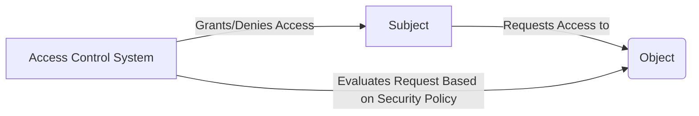

# 6.3 Security Policies and Models: A Comprehensive Guide

## 1. Introduction

This tutorial dives deep into the world of **Security Policies and Models**, a critical component of computer security. Security policies define the rules and regulations governing access to and usage of information and resources. Security models provide a framework for implementing and enforcing these policies. Understanding these concepts is fundamental for building secure systems and protecting sensitive data.

**Why it's important:**

In today's interconnected world, data breaches and cyberattacks are increasingly common. Robust security policies and models are essential for mitigating risks, ensuring data confidentiality, integrity, and availability, and complying with regulatory requirements. A weak or poorly implemented security policy can lead to significant financial losses, reputational damage, and legal liabilities.

**Prerequisites:**

A basic understanding of computer security concepts, such as authentication, authorization, and access control, is helpful. Familiarity with operating systems and network fundamentals is also beneficial.

**Learning objectives:**

Upon completion of this tutorial, you will be able to:

*   Define and differentiate between security policies and security models.
*   Understand the key principles and theoretical foundations of various security models.
*   Implement and enforce security policies using different access control mechanisms.
*   Analyze and evaluate the effectiveness of security policies and models in different scenarios.
*   Apply best practices for designing and implementing secure systems.
*   Troubleshoot common security issues related to policy enforcement.

## 2. Core Concepts

This section lays the foundation by exploring the fundamental concepts, terminology, and principles related to security policies and models.

### 2.1. Security Policy vs. Security Model

*   **Security Policy:** A high-level statement of security goals and objectives. It defines what is allowed and what is not allowed within a system. It expresses the organization's security requirements.  Examples include "Only authorized personnel can access sensitive data" or "All data must be encrypted in transit."
*   **Security Model:** A representation of the security policy, defining how it will be implemented and enforced. It translates the high-level policy into concrete rules and mechanisms. Models often formalize access control rules, authentication mechanisms, and data protection measures.

>   **Note:** A security policy outlines the *what*, while a security model specifies the *how*.

### 2.2. Key Terminology

*   **Subject:** An active entity that requests access to resources (e.g., a user, process, or program).
*   **Object:** A passive entity that contains information or resources (e.g., a file, database, or printer).
*   **Access Right:** The permission to perform a specific operation on an object (e.g., read, write, execute, delete).
*   **Access Control:** The mechanisms used to regulate access to objects based on subjects and their access rights.
*   **Least Privilege:** The principle that each subject should be granted only the minimum access rights necessary to perform its tasks.
*   **Separation of Duty:** The principle that no single individual should have complete control over a critical process or asset.
*   **Need-to-Know:** The principle that access to sensitive information should be restricted to those who require it to perform their job duties.

### 2.3. Fundamental Security Models

Several well-established security models provide frameworks for implementing and enforcing security policies. Here are some of the most important ones:

*   **Discretionary Access Control (DAC):** The owner of an object controls who has access to it.  Commonly found in file systems where users can set permissions on their files. Prone to Trojan Horse attacks.
*   **Mandatory Access Control (MAC):** Access control decisions are made by a central authority based on security labels assigned to subjects and objects. Provides stronger security than DAC but is less flexible. Used in high-security environments like government and military systems.  Examples include Bell-LaPadula and Biba.
*   **Role-Based Access Control (RBAC):** Access rights are assigned to roles, and users are assigned to roles. Simplifies access management and promotes least privilege.  Commonly used in enterprise applications.
*   **Attribute-Based Access Control (ABAC):** Access decisions are based on attributes of the subject, object, and the environment. Provides the most flexible and granular access control.

### 2.4. Visual Explanations

Consider the following diagram illustrating the relationship between subjects, objects, and access rights:



This diagram shows how a subject requests access to an object. The access control system evaluates the request based on the defined security policy and grants or denies access accordingly.

## 3. Practical Implementation

This section provides practical examples and code snippets to demonstrate how to implement security policies and models in real-world scenarios.

### 3.1. Discretionary Access Control (DAC) Example (Linux)

In Linux, DAC is implemented through file permissions. The `chmod` command is used to modify these permissions.

```bash
# Set read, write, and execute permissions for the owner,
# read and execute permissions for the group,
# and read and execute permissions for others.
chmod 755 myfile.txt

# Remove write permissions for the group.
chmod g-w myfile.txt
```

**Explanation:**

*   `chmod` is the command used to change file permissions.
*   `755` represents the permissions in octal notation (rwxr-xr-x).
*   `g-w` removes write permissions for the group.

### 3.2. Role-Based Access Control (RBAC) Example (Python)

This example demonstrates a simple RBAC implementation using Python.

```python
class User:
    def __init__(self, username, role):
        self.username = username
        self.role = role

class Role:
    def __init__(self, name, permissions):
        self.name = name
        self.permissions = permissions

# Define roles and their permissions
admin_role = Role("admin", ["read", "write", "delete"])
user_role = Role("user", ["read"])

# Create users and assign them to roles
user1 = User("john", user_role)
user2 = User("jane", admin_role)

def has_permission(user, permission):
    return permission in user.role.permissions

# Example usage
if has_permission(user2, "delete"):
    print(f"{user2.username} has permission to delete.")
else:
    print(f"{user2.username} does not have permission to delete.")

if has_permission(user1, "write"):
        print(f"{user1.username} has permission to write.")
else:
    print(f"{user1.username} does not have permission to write.")
```

**Explanation:**

*   The code defines `User` and `Role` classes.
*   Roles are assigned permissions.
*   Users are assigned to roles.
*   The `has_permission` function checks if a user has a specific permission based on their role.

### 3.3. Common Use Cases

*   **Web application security:** RBAC is commonly used to control access to different features and functionalities based on user roles (e.g., administrator, editor, viewer).
*   **Database security:** Access to database tables and views can be controlled based on user roles or attributes using SQL.
*   **Operating system security:** MAC is used in high-security operating systems to enforce strict access control policies.
*   **Cloud security:** ABAC is used to manage access to cloud resources based on attributes like user location, device type, and time of day.

### 3.4. Best Practices

*   **Principle of Least Privilege:** Always grant users only the minimum necessary permissions.
*   **Separation of Duties:** Distribute critical tasks among multiple users to prevent fraud and errors.
*   **Regular Audits:** Periodically review and update access control policies to ensure they are effective.
*   **Strong Authentication:** Implement strong authentication mechanisms like multi-factor authentication to verify user identities.
*   **Logging and Monitoring:** Track access attempts and security events to detect and respond to security breaches.

## 4. Advanced Topics

This section explores more advanced concepts and techniques related to security policies and models.

### 4.1. Advanced Access Control Mechanisms

*   **Context-Aware Access Control:**  Access decisions are based on the context of the request, such as the time of day, location of the user, or the device being used.
*   **Temporal Access Control:** Access rights are granted or revoked based on time constraints.
*   **Attribute-Based Encryption (ABE):**  Data is encrypted based on attributes, and only users who possess the matching attributes can decrypt it.

### 4.2. Real-World Applications

*   **Healthcare:**  Protecting patient data using RBAC and ABAC, ensuring that only authorized healthcare professionals can access sensitive medical records.
*   **Finance:**  Controlling access to financial data and preventing fraud using separation of duties and multi-factor authentication.
*   **Government:**  Enforcing strict security policies in classified environments using MAC and compartmented security.

### 4.3. Common Challenges and Solutions

*   **Policy complexity:** Managing complex security policies can be challenging.  Solutions include using policy management tools and adopting a layered approach to security.
*   **Policy enforcement:** Ensuring that security policies are consistently enforced across all systems and applications.  Solutions include using automated policy enforcement tools and regular security audits.
*   **User adoption:** Users may resist security policies that are perceived as too restrictive.  Solutions include providing user training and education and involving users in the policy development process.

### 4.4. Performance Considerations

Access control mechanisms can impact system performance.

*   **Minimize Access Control Overheads:** Optimize access control checks to minimize the performance impact.
*   **Caching:** Cache access control decisions to reduce the overhead of repeated checks.
*   **Load Balancing:** Distribute access control processing across multiple servers to improve scalability.

## 5. Advanced Topics

This section covers even more advanced and specialized areas within security policies and models.

### 5.1. Cutting-Edge Techniques and Approaches

*   **Blockchain-Based Access Control:** Using blockchain technology to create decentralized and tamper-proof access control systems.
*   **AI-Driven Security Policies:** Leveraging artificial intelligence and machine learning to automate policy creation, enforcement, and adaptation.
*   **Zero Trust Architecture:** A security model that assumes no implicit trust and requires continuous verification of every user and device before granting access to resources.

### 5.2. Complex Real-World Applications

*   **Critical Infrastructure Protection:** Securing critical infrastructure systems, such as power grids and water treatment plants, from cyberattacks using advanced access control mechanisms and intrusion detection systems.
*   **Supply Chain Security:** Managing security risks throughout the supply chain by implementing robust access control policies and monitoring supplier security practices.
*   **Internet of Things (IoT) Security:** Securing IoT devices and networks by implementing lightweight access control mechanisms and secure communication protocols.

### 5.3. System Design Considerations

*   **Defense in Depth:** Implementing multiple layers of security controls to protect against a variety of threats.
*   **Secure Development Lifecycle (SDLC):** Integrating security considerations into every stage of the software development process.
*   **Security Architecture:** Designing a secure system architecture that incorporates appropriate access control mechanisms and security policies.

### 5.4. Scalability and Performance Optimization

*   **Distributed Access Control:** Distributing access control processing across multiple servers to handle large workloads.
*   **Policy Optimization:** Optimizing security policies to reduce the overhead of access control checks.
*   **Hardware Acceleration:** Using hardware acceleration to speed up cryptographic operations and access control processing.

### 5.5. Security Considerations

*   **Vulnerability Management:** Identifying and mitigating security vulnerabilities in access control systems.
*   **Penetration Testing:** Simulating attacks to identify weaknesses in security policies and access control mechanisms.
*   **Incident Response:** Developing a plan to respond to security incidents and breaches.

### 5.6. Integration with Other Technologies

*   **Identity and Access Management (IAM):** Integrating security policies and models with IAM systems to manage user identities and access rights.
*   **Security Information and Event Management (SIEM):** Integrating security policies and models with SIEM systems to monitor security events and detect threats.
*   **Cloud Security Platforms:** Leveraging cloud security platforms to manage and enforce security policies in cloud environments.

### 5.7. Advanced Patterns and Architectures

*   **Microsegmentation:** Dividing a network into small, isolated segments and implementing granular access control policies to limit the impact of security breaches.
*   **Software-Defined Networking (SDN):** Using SDN to dynamically manage network access control policies and improve security.
*   **Service Mesh:** Using a service mesh to manage security and access control between microservices.

### 5.8. Industry-Specific Applications

*   **Financial Services:** PCI DSS compliance, KYC (Know Your Customer) and AML (Anti-Money Laundering) regulations.
*   **Healthcare:** HIPAA compliance, protecting patient privacy and data security.
*   **Government:** NIST cybersecurity framework, FedRAMP compliance.
*   **Education:** FERPA compliance, protecting student records.

## 6. Hands-on Exercises

This section provides a series of hands-on exercises to reinforce your understanding of security policies and models.

### 6.1. Exercise 1: Implementing DAC in Linux (Beginner)

**Scenario:** You want to create a private file that only you can read and write.

**Steps:**

1.  Create a new file using the `touch` command: `touch myfile.txt`
2.  Change the file permissions using the `chmod` command to allow only the owner to read and write: `chmod 600 myfile.txt`
3.  Verify the file permissions using the `ls -l` command.

**Sample Solution:**

```bash
touch myfile.txt
chmod 600 myfile.txt
ls -l myfile.txt
```

**Common Mistakes to Watch For:**

*   Using the wrong octal notation for file permissions.
*   Forgetting to verify the file permissions after changing them.

### 6.2. Exercise 2: Implementing RBAC in Python (Intermediate)

**Scenario:** You are building a web application with two roles: `administrator` and `user`. Administrators should have access to all features, while users should only have access to a limited set of features.

**Steps:**

1.  Create `User` and `Role` classes as shown in the earlier example.
2.  Define the roles `administrator` and `user` with appropriate permissions (e.g., `administrator` has "read", "write", "delete", "create", `user` has "read").
3.  Create users and assign them to roles.
4.  Implement a function `has_permission` that checks if a user has a specific permission based on their role.
5.  Test the implementation by checking if users have access to different features.

**Challenge Exercise (Hint: Use dictionaries to map permissions to roles):**

Extend the RBAC implementation to support multiple roles per user.

### 6.3. Exercise 3: Analyzing Security Policies (Advanced)

**Scenario:** You are given a security policy for a hospital. The policy states that:

*   Only doctors and nurses can access patient medical records.
*   Doctors can read and write patient medical records.
*   Nurses can only read patient medical records.
*   All access to patient medical records must be logged.

**Steps:**

1.  Identify the subjects, objects, and access rights defined in the security policy.
2.  Design a security model that implements the security policy.
3.  Identify potential vulnerabilities in the security model.
4.  Propose solutions to mitigate the vulnerabilities.

**Project Ideas for Practice:**

*   Build a simple access control system for a file sharing application.
*   Implement an RBAC system for a blog platform.
*   Develop a security policy for a small business.

## 7. Best Practices and Guidelines

This section provides best practices and guidelines for designing, implementing, and maintaining secure systems.

*   **Industry-Standard Conventions:** Follow industry-standard security frameworks and guidelines, such as NIST, ISO 27001, and OWASP.
*   **Code Quality and Maintainability:** Write clean, well-documented code that is easy to understand and maintain. Use meaningful variable names and comments.
*   **Performance Optimization Guidelines:** Optimize access control mechanisms to minimize the performance impact on the system.
*   **Security Best Practices:**
    *   Implement the principle of least privilege.
    *   Use strong authentication and authorization mechanisms.
    *   Regularly update and patch software to address security vulnerabilities.
    *   Implement intrusion detection and prevention systems.
    *   Conduct regular security audits and penetration tests.
*   **Scalability Considerations:** Design systems that can scale to meet future demands.
*   **Testing and Documentation:** Thoroughly test access control mechanisms and document security policies and procedures.
*   **Team Collaboration Aspects:** Promote collaboration among security, development, and operations teams to ensure that security is integrated into all aspects of the system.

## 8. Troubleshooting and Common Issues

This section provides guidance on troubleshooting common security issues and performance bottlenecks.

*   **Common Problems and Solutions:**
    *   **Access Denied Errors:** Verify that the user has the necessary permissions to access the resource.
    *   **Authentication Failures:** Check the user's credentials and authentication configuration.
    *   **Performance Bottlenecks:** Identify and optimize slow access control checks.
*   **Debugging Strategies:** Use debugging tools and techniques to identify and fix security vulnerabilities.
*   **Performance Bottlenecks:** Use performance monitoring tools to identify and address performance bottlenecks.
*   **Error Messages and Their Meaning:** Understand the meaning of common error messages and use them to diagnose problems.
*   **Edge Cases to Consider:** Test access control mechanisms with edge cases to ensure they handle unexpected input correctly.
*   **Tools and Techniques for Diagnosis:** Use tools like `tcpdump`, `wireshark`, and `auditd` to diagnose security issues.

## 9. Conclusion and Next Steps

This tutorial provided a comprehensive overview of security policies and models.

**Comprehensive summary of key concepts:**

You learned about the difference between security policies and security models, fundamental access control mechanisms (DAC, MAC, RBAC, ABAC), and best practices for implementing secure systems.

**Practical application guidelines:**

Remember to apply the principle of least privilege, separate duties, and regularly audit access control policies.

**Advanced learning resources:**

*   [NIST Cybersecurity Framework](https://www.nist.gov/cyberframework)
*   [OWASP Top Ten](https://owasp.org/Top10/)
*   [SANS Institute](https://www.sans.org/)

**Related topics to explore:**

*   Cryptography
*   Network security
*   Operating system security
*   Cloud security

**Community resources and forums:**

*   Stack Overflow (security tag)
*   Reddit (r/security)
*   Security-focused mailing lists

**Latest trends and future directions:**

*   AI-driven security
*   Zero Trust Architecture
*   Blockchain-based access control

**Career opportunities and applications:**

*   Security analyst
*   Security engineer
*   Security architect
*   Penetration tester
*   Cybersecurity consultant

By continuing to learn and practice, you can develop the skills necessary to build and maintain secure systems and protect sensitive data. Good luck!
