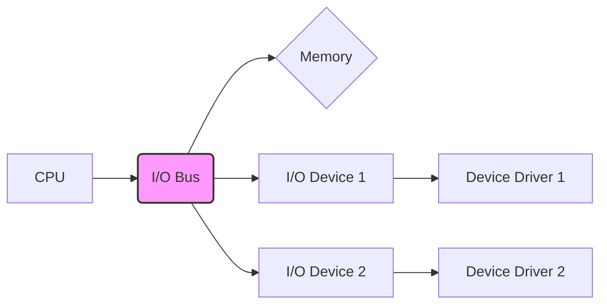

# 5.4 I/O Systems: A Comprehensive Guide

## 1. Introduction

This tutorial provides a deep dive into **Input/Output (I/O) Systems**, a crucial component of any computer architecture. I/O systems are responsible for managing the communication between the computer and the external world, including peripherals like keyboards, mice, monitors, storage devices, and network interfaces. Understanding I/O systems is essential for building efficient, reliable, and secure software and hardware systems.

**Why It's Important:**

*   **Communication:** Enables the computer to interact with users and other devices.
*   **Data Storage:** Facilitates reading and writing data to persistent storage.
*   **Networking:** Supports communication over networks, enabling distributed systems.
*   **Performance:** Efficient I/O is critical for overall system performance.
*   **Security:** Secure I/O mechanisms protect against malicious attacks.

**Prerequisites:**

*   Basic understanding of computer architecture.
*   Familiarity with operating systems concepts.
*   Basic knowledge of programming (C/C++ preferred for lower-level aspects).

**Learning Objectives:**

Upon completing this tutorial, you will be able to:

*   Understand the fundamental concepts of I/O systems.
*   Describe different I/O techniques, including programmed I/O, interrupt-driven I/O, and DMA.
*   Explain the role of device drivers in I/O management.
*   Discuss the challenges and solutions related to I/O performance and security.
*   Analyze and design I/O systems for specific applications.

## 2. Core Concepts

### 2.1 Key Theoretical Foundations

I/O systems are built upon several core theoretical concepts:

*   **Abstraction:** Hiding the complexity of hardware devices behind a simplified interface.
*   **Device Drivers:** Software modules that translate generic I/O requests into device-specific commands.
*   **I/O Bus:** A communication pathway connecting the CPU, memory, and I/O devices.
*   **Interrupts:** Signals that interrupt the CPU's normal execution to handle I/O events.
*   **Direct Memory Access (DMA):** A technique that allows I/O devices to transfer data directly to or from memory without CPU intervention.

### 2.2 Important Terminology

*   **I/O Port:** A specific address used by the CPU to communicate with an I/O device.
*   **Memory-Mapped I/O:** Mapping I/O devices to specific memory addresses, allowing the CPU to access them using regular memory access instructions.
*   **Programmed I/O (PIO):** The CPU directly controls the I/O device, reading and writing data to its registers.
*   **Interrupt Request (IRQ):** A signal from a device to the CPU indicating that it needs attention.
*   **DMA Controller:** A hardware component that manages DMA transfers.
*   **Buffer:** A temporary storage area used to hold data during I/O operations.
*   **Latency:** The delay between initiating an I/O operation and receiving the first data.
*   **Throughput:** The rate at which data can be transferred through the I/O system.

### 2.3 Fundamental Principles

1.  **Isolation:** Preventing I/O devices from directly accessing memory without proper authorization.
2.  **Abstraction:** Hiding the complexities of hardware from the operating system and applications.
3.  **Efficiency:** Optimizing I/O operations to minimize latency and maximize throughput.
4.  **Concurrency:** Allowing multiple I/O operations to proceed concurrently.
5.  **Security:** Protecting against unauthorized access to I/O devices and data.

### 2.4 Visual Explanations



This diagram shows a basic I/O system architecture. The CPU communicates with memory and I/O devices through the I/O bus.  Device drivers provide an interface between the operating system and the specific I/O devices.

## 3. Practical Implementation

### 3.1 Step-by-Step Examples

Let's consider a simple example of reading data from a serial port using programmed I/O in C (though direct PIO is rare in modern operating systems due to security concerns, this demonstrates the underlying principle).

```c
#include <stdio.h>
#include <stdint.h>

// Define the base address of the serial port
#define SERIAL_PORT_BASE 0x3F8

// Define the offset for the data register
#define SERIAL_DATA_REG (SERIAL_PORT_BASE + 0)

// Function to read a character from the serial port
char read_serial() {
  // Wait for data to be available (polling) - simplified for demonstration
  while (!(inb(SERIAL_PORT_BASE + 5) & 0x01));  // Check Line Status Register for data ready
  return inb(SERIAL_DATA_REG);
}

// Inline function to read a byte from an I/O port (implementation is OS-specific)
inline uint8_t inb(uint16_t port) {
  // This would typically use assembly instructions (e.g., "in al, dx" in x86)
  // but we'll use a placeholder for portability.
  uint8_t value;
  // WARNING: Direct port I/O requires special privileges and is usually handled
  // by device drivers within the operating system kernel.  This is unsafe
  // and won't work in most user-space environments without modification.
  // This is just to illustrate the concept.
  printf("Reading from port 0x%x\n", port); //Placeholder - would be an OS call
  value = 'A'; //Simulated value for demonstration. Replace with actual HW port read
  return value;
}


int main() {
  char c = read_serial();
  printf("Received character: %c\n", c);
  return 0;
}
```

**Explanation:**

1.  `SERIAL_PORT_BASE` defines the base address of the serial port.
2.  `SERIAL_DATA_REG` defines the address of the data register within the serial port.
3.  `read_serial()` function:
    *   Waits for data to be available by polling the `Line Status Register`.
    *   Reads the data from the `SERIAL_DATA_REG` using the `inb()` function (this example uses a placeholder OS function).
4.  The `main()` function calls `read_serial()` to receive a character and prints it to the console.
5.  `inb()` : This inline function **SHOULD NOT** be used directly in user-space applications. This example is for illustration purposes to show how the lower-level communication with the hardware works conceptually. Operating systems provide APIs for safe and controlled access to hardware resources via device drivers.

**Important Note:** Direct hardware access like this is typically restricted to the operating system kernel and device drivers. User-space applications must use operating system APIs to perform I/O operations safely.

### 3.2 Code Snippets with Explanations

Here's an example using interrupt-driven I/O (again, simplified and conceptual):

```c
#include <stdio.h>
#include <signal.h>
#include <unistd.h>
#include <stdint.h>

// Define I/O port and interrupt number (conceptual)
#define SERIAL_PORT_BASE 0x3F8
#define SERIAL_DATA_REG (SERIAL_PORT_BASE + 0)
#define SERIAL_INTERRUPT_NUMBER 4

// Global variable to store the received character
volatile char received_char;

// Interrupt handler function
void interrupt_handler(int signum) {
  // Read data from the serial port
  received_char = inb(SERIAL_DATA_REG); // OS API for port access would go here.
  printf("Interrupt received! Character: %c\n", received_char);

  // Re-enable the interrupt (implementation is OS-specific)
  // (This is typically done by sending an EOI (End of Interrupt) signal to the interrupt controller.)
}

// Inline function to read a byte from an I/O port (implementation is OS-specific)
inline uint8_t inb(uint16_t port) {
  // This would typically use assembly instructions (e.g., "in al, dx" in x86)
  // but we'll use a placeholder for portability.
  uint8_t value;
  // WARNING: Direct port I/O requires special privileges and is usually handled
  // by device drivers within the operating system kernel.  This is unsafe
  // and won't work in most user-space environments without modification.
  // This is just to illustrate the concept.
  printf("Reading from port 0x%x\n", port); //Placeholder - would be an OS call
  value = 'B'; //Simulated value for demonstration. Replace with actual HW port read
  return value;
}


int main() {
  // Set up the interrupt handler
  signal(SIGUSR1, interrupt_handler);  //Using a signal as a simplified interrupt.

  // Enable the serial port interrupt (implementation is OS-specific)
  // For example, request_irq in Linux Kernel

  printf("Waiting for interrupt...\n");

  // Simulate an interrupt using `kill -s SIGUSR1 <pid>` on Linux
  // In a real system, the hardware would trigger the interrupt.

  pause(); // Wait for an interrupt signal
  printf("Program finished.\n");
  return 0;
}
```

**Explanation:**

1.  `interrupt_handler()`:  This function is called when an interrupt occurs.  It reads the data from the serial port and prints it. It also would typically send an End-of-Interrupt (EOI) to the interrupt controller, which is an OS-level process.
2.  `signal(SIGUSR1, interrupt_handler);`: This line uses a standard *nix signal to mimic the triggering of an interrupt.  In a real kernel, this would be `request_irq`.
3.  The code simulates an interrupt using a signal (SIGUSR1) to trigger the `interrupt_handler`. **This is a simplification.** Real interrupts are triggered by hardware.
4.  The `pause()` function suspends the program until a signal is received (in this case, a simulated interrupt).

### 3.3 Common Use Cases

*   **File Systems:** Reading and writing data to storage devices (hard drives, SSDs).
*   **Networking:** Sending and receiving data over network interfaces.
*   **User Input:** Handling input from keyboards, mice, and other input devices.
*   **Graphics:** Displaying images and videos on monitors.
*   **Sound:** Playing audio through speakers and recording audio from microphones.

### 3.4 Best Practices

*   **Use Operating System APIs:**  Avoid direct hardware access and use the operating system's I/O APIs for portability, security, and performance.
*   **Buffering:** Use buffers to improve I/O performance by reducing the number of individual I/O operations.
*   **Asynchronous I/O:** Use asynchronous I/O to avoid blocking the calling thread while waiting for I/O operations to complete.  This greatly increases the responsiveness of the system.
*   **Error Handling:** Implement robust error handling to gracefully handle I/O errors.
*   **Resource Management:**  Properly manage I/O resources to prevent resource leaks and contention.

## 4. Advanced Topics

### 4.1 Advanced Techniques

*   **Memory-Mapped Files:** Mapping files directly into memory, allowing applications to access file data as if it were in memory.
*   **Scatter-Gather DMA:** A DMA technique that allows transferring data to or from multiple non-contiguous memory locations.
*   **Zero-Copy Networking:** Techniques that eliminate the need to copy data between kernel and user space during network communication.  Examples include `splice()` and `sendfile()`.
*   **I/O Multiplexing (e.g., select, poll, epoll):** Allows a single thread to monitor multiple file descriptors for I/O events. This enables efficient handling of multiple concurrent connections in network servers.

### 4.2 Real-World Applications

*   **High-Performance Databases:** Databases rely on efficient I/O to store and retrieve data quickly. Techniques like asynchronous I/O, memory-mapped files, and DMA are crucial for database performance.
*   **Web Servers:** Web servers use I/O multiplexing (e.g., epoll in Linux) to handle a large number of concurrent client connections efficiently.
*   **Multimedia Applications:** Applications that process audio and video data require high-throughput, low-latency I/O to ensure smooth playback and recording.
*   **Scientific Computing:** Large scientific simulations often involve reading and writing large amounts of data to and from storage devices.  Parallel I/O and high-performance file systems are essential.

### 4.3 Common Challenges and Solutions

*   **I/O Bottlenecks:** Identifying and resolving I/O bottlenecks is crucial for improving system performance. Tools like `iostat` and `vmstat` can help identify I/O bottlenecks. Solutions include using faster storage devices, optimizing file system settings, and using asynchronous I/O.
*   **Latency:** Minimizing I/O latency is important for interactive applications. Solutions include using SSDs, caching, and optimizing I/O scheduling.
*   **Security Vulnerabilities:** I/O systems can be vulnerable to security attacks, such as buffer overflows and denial-of-service attacks. Solutions include using secure coding practices, implementing input validation, and using access control mechanisms.

### 4.4 Performance Considerations

*   **Disk Scheduling Algorithms:** Algorithms like First-Come, First-Served (FCFS), Shortest Seek Time First (SSTF), SCAN, and C-SCAN are used to optimize disk access patterns and reduce seek time.
*   **Caching:** Caching frequently accessed data in memory can significantly improve I/O performance.
*   **RAID (Redundant Array of Independent Disks):**  RAID is a technology that combines multiple physical disks into a single logical unit to improve performance, reliability, or both.
*   **File System Optimization:**  File system parameters, such as block size and inode density, can be tuned to optimize I/O performance for specific workloads.

## 5. Advanced Topics (Continued)

### 5.1 Cutting-Edge Techniques and Approaches

*   **NVMe (Non-Volatile Memory Express):** A high-performance interface protocol for accessing solid-state drives (SSDs) that leverages the parallelism of NAND flash memory.
*   **Storage Class Memory (SCM):** A new class of memory technology that offers performance close to DRAM but with non-volatility, enabling persistent memory applications and faster I/O.  Examples include Intel Optane DC Persistent Memory.
*   **Computational Storage:**  Integrating processing capabilities directly into storage devices, allowing data processing to occur closer to the data source, reducing data transfer overhead.
*   **RDMA (Remote Direct Memory Access):** A technology that allows direct memory access between computers over a network without involving the operating system or CPU, enabling high-performance networking and distributed systems.

### 5.2 Complex Real-World Applications

*   **Data Analytics Pipelines:** Modern data analytics pipelines often involve processing massive datasets stored on distributed storage systems.  Efficient I/O is critical for these pipelines.
*   **Machine Learning Training:** Training large machine learning models requires reading and processing huge amounts of data. Optimizing I/O can significantly reduce training time.
*   **Cloud Storage Systems:** Cloud storage systems like Amazon S3 and Google Cloud Storage rely on distributed I/O architectures to provide scalable and reliable storage services.

### 5.3 System Design Considerations

*   **Scalability:** Designing I/O systems that can scale to handle increasing workloads and data volumes.
*   **Reliability:** Ensuring that I/O operations are reliable and data is protected from corruption.
*   **Availability:** Designing I/O systems that are highly available and can tolerate failures.
*   **Manageability:** Designing I/O systems that are easy to manage and monitor.

### 5.4 Scalability and Performance Optimization

*   **Sharding:** Dividing data into smaller partitions (shards) that can be stored and processed on multiple servers.
*   **Replication:** Creating multiple copies of data to improve availability and fault tolerance.
*   **Load Balancing:** Distributing I/O requests across multiple servers to prevent overload.

### 5.5 Security Considerations

*   **Data Encryption:** Encrypting data at rest and in transit to protect against unauthorized access.
*   **Access Control:** Implementing strong access control mechanisms to restrict access to I/O resources.
*   **Intrusion Detection:** Monitoring I/O systems for suspicious activity and detecting potential intrusions.

### 5.6 Integration with Other Technologies

*   **Cloud Computing:** I/O systems are fundamental to cloud computing, enabling virtualized storage and network services.
*   **Big Data:** I/O systems are essential for handling the massive datasets used in big data applications.
*   **Artificial Intelligence:** I/O systems play a crucial role in training and deploying machine learning models.

### 5.7 Advanced Patterns and Architectures

*   **Event-Driven Architectures:** Designing I/O systems that respond to events asynchronously, enabling highly responsive and scalable applications.
*   **Microservices Architectures:** Decomposing applications into small, independent services that communicate over a network, requiring efficient inter-service I/O.
*   **Data Streaming Architectures:** Designing I/O systems that can process continuous streams of data in real-time.

### 5.8 Industry-Specific Applications

*   **Financial Services:** High-performance I/O is critical for trading platforms and risk management systems.
*   **Healthcare:** I/O systems are used to store and manage electronic health records (EHRs) and medical images.
*   **Manufacturing:** I/O systems are used in industrial control systems and data acquisition systems.

## 6. Hands-on Exercises

### 6.1 Progressive Difficulty Levels

**Beginner:**

1.  **Simple File Reader:** Write a program that reads data from a text file and prints it to the console.
2.  **File Copy:** Write a program that copies the contents of one file to another.

**Intermediate:**

1.  **Asynchronous File Reader:** Modify the file reader program to use asynchronous I/O (e.g., using threads or asynchronous APIs) to read the file in the background.
2.  **Network Client/Server:** Create a simple network client and server that can exchange data over a socket.

**Advanced:**

1.  **Custom File System:** Design and implement a simplified file system that supports basic file operations (create, read, write, delete).
2.  **Device Driver (Conceptual):** Create a skeletal device driver for a virtual device. (Note: Real device driver development requires kernel-level programming knowledge).

### 6.2 Real-World Scenario-Based Problems

1.  **Log Analysis:** Write a program that reads log files and extracts specific information (e.g., error messages, timestamps).
2.  **Image Processing:** Write a program that reads an image file, performs a simple image processing operation (e.g., grayscale conversion), and saves the modified image to a file.
3.  **Database Interaction:** Write a program that connects to a database and retrieves data based on a specific query.

### 6.3 Step-by-Step Guided Exercises

**Exercise: Implementing a Simple File Reader (Beginner)**

1.  **Create a new file called `file_reader.c`.**
2.  **Include the necessary header files:**

    ```c
    #include <stdio.h>
    #include <stdlib.h>
    ```
3.  **Write the `main()` function:**

    ```c
    int main() {
      FILE *fp;
      char filename[100];
      char ch;

      printf("Enter the filename to read: ");
      scanf("%s", filename);

      fp = fopen(filename, "r"); // Open file in read mode

      if (fp == NULL) {
        perror("Error opening file");
        return EXIT_FAILURE;
      }

      printf("Contents of the file:\n");
      while ((ch = fgetc(fp)) != EOF) {
        printf("%c", ch);
      }

      fclose(fp);
      return 0;
    }
    ```

4.  **Compile the program:** `gcc file_reader.c -o file_reader`
5.  **Run the program:** `./file_reader`
6.  **Enter a filename (e.g., `test.txt`) and press Enter.**

### 6.4 Challenge Exercises with Hints

1.  **Improve File Copy Performance:** The basic file copy program might be slow for large files. Use buffering (e.g., `fread` and `fwrite` with a buffer) to improve performance.
    *   **Hint:** Allocate a buffer of a reasonable size (e.g., 4KB or 8KB) and read/write data in chunks.

2.  **Error Handling in Network Client/Server:** Implement robust error handling in the network client/server program to handle connection errors, data transmission errors, and other potential issues.
    *   **Hint:** Use `perror()` to print error messages and `errno` to identify the specific error.

### 6.5 Project Ideas for Practice

1.  **Simple Web Server:** Build a basic web server that can serve static HTML files.
2.  **Chat Application:** Create a chat application that allows users to send and receive messages over a network.
3.  **Data Compression/Decompression Tool:** Implement a simple data compression algorithm (e.g., Huffman coding) and create a tool that can compress and decompress files.

### 6.6 Sample Solutions and Explanations

Solutions to the exercises will depend on the specific requirements and language used.  For the "Simple File Reader" example above, the provided code is a complete solution.

### 6.7 Common Mistakes to Watch For

*   **Forgetting to close files:** Always close files after you are finished with them to release resources.
*   **Not handling errors:** Check the return values of I/O functions and handle errors appropriately.
*   **Buffer overflows:** Be careful when reading data into buffers to avoid buffer overflows.
*   **Blocking I/O:**  Avoid blocking I/O operations that can cause the program to freeze.  Use asynchronous I/O when appropriate.
*   **Incorrect file modes:**  Use the correct file mode (`"r"`, `"w"`, `"a"`, `"rb"`, `"wb"`, `"ab"`, etc.) when opening files.

## 7. Best Practices and Guidelines

### 7.1 Industry-Standard Conventions

*   **POSIX Standards:**  Follow the POSIX standards for I/O operations when developing portable applications.  These standards define a common set of APIs for interacting with files, sockets, and other I/O resources.
*   **Naming Conventions:** Use consistent and descriptive naming conventions for variables, functions, and file paths.

### 7.2 Code Quality and Maintainability

*   **Code Comments:** Add comments to explain the purpose and functionality of your code.
*   **Code Formatting:** Use consistent code formatting to improve readability.
*   **Modular Design:**  Break down complex tasks into smaller, modular functions.
*   **Error Handling:** Implement robust error handling to handle unexpected events.

### 7.3 Performance Optimization Guidelines

*   **Buffering:** Use buffers to reduce the number of I/O operations.
*   **Caching:** Cache frequently accessed data in memory.
*   **Asynchronous I/O:** Use asynchronous I/O to avoid blocking the calling thread.
*   **Minimize Context Switching:** Reduce the number of context switches between threads or processes.
*   **Profiling:** Use profiling tools to identify I/O bottlenecks.

### 7.4 Security Best Practices

*   **Input Validation:** Validate all input data to prevent injection attacks.
*   **Least Privilege:** Run programs with the least amount of privileges necessary.
*   **Secure File Permissions:**  Set appropriate file permissions to protect data from unauthorized access.
*   **Encryption:** Encrypt sensitive data at rest and in transit.

### 7.5 Scalability Considerations

*   **Horizontal Scaling:**  Design I/O systems that can be scaled horizontally by adding more servers or nodes.
*   **Load Balancing:** Use load balancing to distribute I/O requests across multiple servers.
*   **Sharding:** Partition data into smaller shards that can be stored and processed on multiple servers.

### 7.6 Testing and Documentation

*   **Unit Testing:** Write unit tests to verify the functionality of individual components.
*   **Integration Testing:**  Test the integration of different components.
*   **Documentation:**  Document the design, implementation, and usage of the I/O system.

### 7.7 Team Collaboration Aspects

*   **Version Control:** Use a version control system (e.g., Git) to track changes to the code.
*   **Code Reviews:** Conduct code reviews to ensure code quality and consistency.
*   **Communication:**  Communicate effectively with other team members to resolve issues and coordinate development efforts.

## 8. Troubleshooting and Common Issues

### 8.1 Common Problems and Solutions

*   **"File not found" error:**
    *   **Solution:** Verify that the file exists at the specified path. Check file permissions.
*   **"Permission denied" error:**
    *   **Solution:** Check file permissions. Ensure that the program has the necessary permissions to access the file.
*   **"Disk full" error:**
    *   **Solution:** Free up disk space. Consider using larger storage devices.
*   **"Connection refused" error (Networking):**
    *   **Solution:** Verify that the server is running and listening on the correct port. Check firewall settings.

### 8.2 Debugging Strategies

*   **Print statements:** Use `printf` (or equivalent) to print debugging information to the console.
*   **Debuggers (e.g., GDB):** Use a debugger to step through the code, inspect variables, and identify the source of the problem.
*   **Log files:**  Write debugging information to log files.

### 8.3 Performance Bottlenecks

*   **Slow storage devices:**  Replace slow storage devices with faster ones (e.g., SSDs).
*   **Inefficient algorithms:**  Optimize algorithms to reduce the number of I/O operations.
*   **Blocking I/O:** Use asynchronous I/O to avoid blocking the calling thread.

### 8.4 Error Messages and Their Meaning

*   `errno` in C/C++: Use `perror()` to get a human-readable description of the error. Consult the `errno` man page for more information.
*   Exception handling in other languages: Use `try...catch` blocks to handle exceptions.

### 8.5 Edge Cases to Consider

*   **Large files:**  Test I/O systems with very large files to ensure that they can handle them efficiently.
*   **Concurrent access:**  Test I/O systems with multiple concurrent users or processes to ensure that they can handle contention.
*   **Error conditions:**  Test I/O systems under various error conditions to ensure that they handle errors gracefully.

### 8.6 Tools and Techniques for Diagnosis

*   `iostat`:  A command-line utility that displays I/O statistics.
*   `vmstat`:  A command-line utility that displays virtual memory statistics.
*   `tcpdump` or `Wireshark`: Network packet analyzers for diagnosing network I/O problems.
*   Profiling tools: Tools that measure the performance of different parts of the code.

## 9. Conclusion and Next Steps

### 9.1 Comprehensive Summary of Key Concepts

This tutorial covered the fundamental concepts of I/O systems, including:

*   I/O techniques (programmed I/O, interrupt-driven I/O, DMA)
*   Device drivers
*   I/O performance and security
*   Advanced I/O techniques (memory-mapped files, scatter-gather DMA, zero-copy networking)
*   Scalability, reliability, and availability considerations

### 9.2 Practical Application Guidelines

*   Use operating system APIs for I/O operations.
*   Buffer I/O operations for better performance.
*   Use asynchronous I/O to avoid blocking the calling thread.
*   Implement robust error handling.
*   Follow security best practices to protect against vulnerabilities.

### 9.3 Advanced Learning Resources

*   **Operating Systems Concepts** by Abraham Silberschatz, Peter Baer Galvin, and Greg Gagne.
*   **Computer Architecture: A Quantitative Approach** by John L. Hennessy and David A. Patterson.
*   **Linux Device Drivers** by Jonathan Corbet, Alessandro Rubini, and Greg Kroah-Hartman.
*   **The Design and Implementation of the FreeBSD Operating System** by Marshall Kirk McKusick, George V. Neville-Neil, and Robert N.M. Watson.

### 9.4 Related Topics to Explore

*   File systems
*   Networking
*   Operating system kernels
*   Embedded systems
*   Real-time systems

### 9.5 Community Resources and Forums

*   Stack Overflow: A popular Q&A website for programmers.
*   Reddit: Subreddits such as /r/programming, /r/linux, and /r/computerscience.
*   Online forums: Many open-source projects have their own forums or mailing lists.

### 9.6 Latest Trends and Future Directions

*   Storage Class Memory (SCM)
*   Computational Storage
*   NVMe over Fabrics (NVMe-oF)
*   Disaggregated Storage

### 9.7 Career Opportunities and Applications

*   Operating system developers
*   Device driver developers
*   Embedded systems engineers
*   Storage engineers
*   Database administrators
*   Cloud engineers
*   Network engineers
